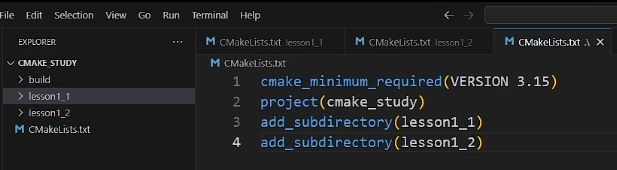
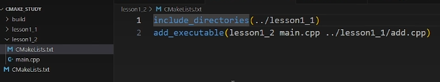
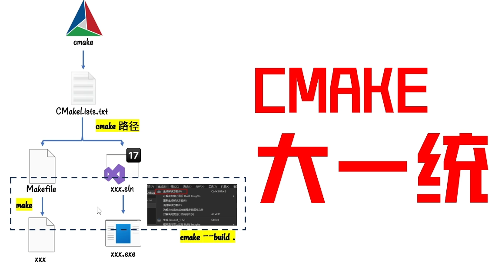

# CMake

## 1.项目中使用CMake
* 最外层的CMakeLists.txt中设置
  * 使用CMake的最小版本
  * 整个项目的名称
  * 需要递归编译的子目录，下图中有两个分别是lesson1_1, lesson1_2

## 2.内部子文件夹中的CMake
* 添加依赖的头文件目录
* 添加生成可执行文件需要的源文件：
  * 首先是生成可执行文件名
  * 之后添加所有生成该可执行文件的源文件

## 3.CMake大一统

