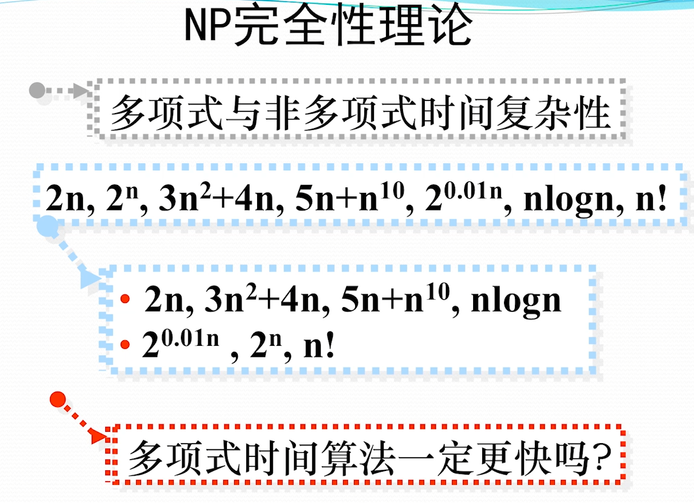
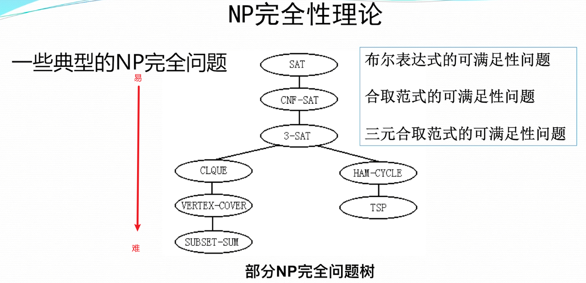

# <span id="0">NP完全性理论</span> 
* [1.NP完全性理论基础](#1)

## <span id="1">1.NP完全性理论基础</span> [back](#0)

### 1.1 多项式与非多项式时间复杂度



### 1.2 P问题
#### （1）P问题定义
```markdown
P问题：
    一类能够用（确定的）算法在多项式时间内求解的可判定问题

注：这种问题类型也称为多项式类型
```

### 1.3 NP问题
#### （1）NP问题定义
```markdown
NP问题：
    1.一类能够用不确定算法在多项式时间内求解的可判定问题
    
注1：上述等价于 => 在确定性计算模型下多项式时间可验证的可判定问题

注2：P ⊆ NP
```

### 1.4 NPC问题
#### （1）NPC问题定义
```markdown
NPC问题：
    可判定性问题D，满足：
    1.其属于NP问题
    2.NP中的任何问题都能够在多项式时间内规约为D
    满足上述两点，则D为NP完全问题
```

#### （2）NPC问题的意义
```markdown
    有一个NPC问题找到多项式时间的算法，则所有NPC问题都可以解决。
```

#### （3）注意点
```c
1.不要浪费时间去寻找有效算法
2.可以找近似算法或特例算法解决NPC问题
3.注意一些看似简单的问题也是NPC问题
```

### 1.5 NP难问题
#### （1）NP难问题定义
```markdown
NP难问题：
    问题L满足：
        1.NP中的任何问题都能够在多项式时间内规约为L
        2.L不一定属于NP问题

注：NPC = （NP ∩ NP难）
```

### 1.6 部分NP完全问题树



