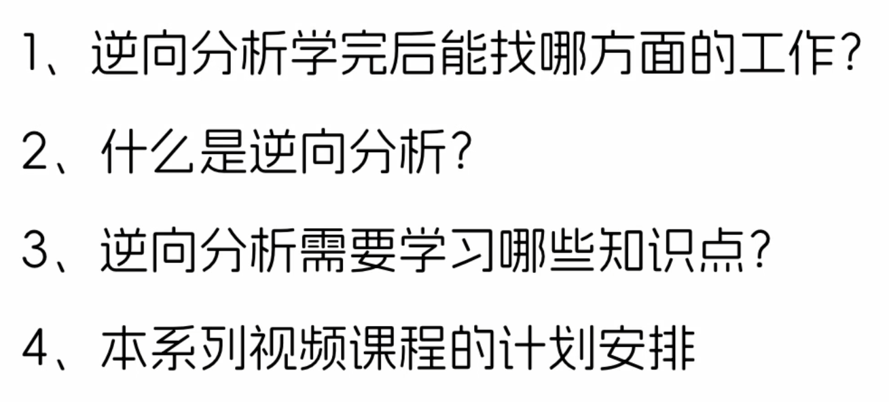
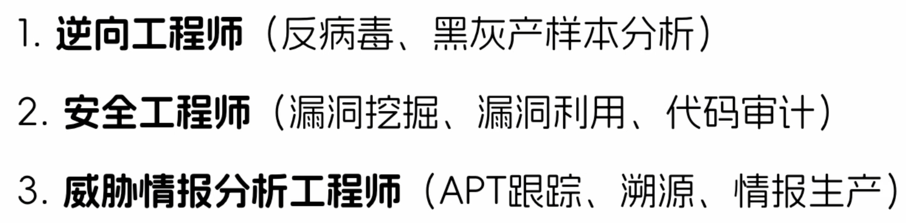
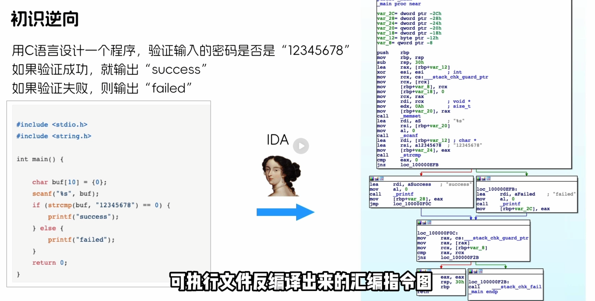
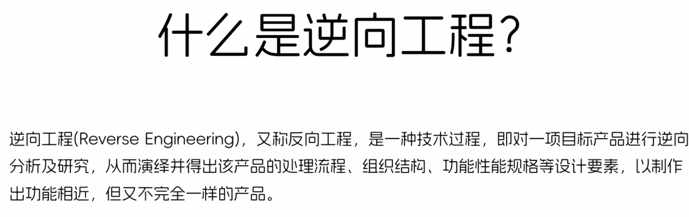
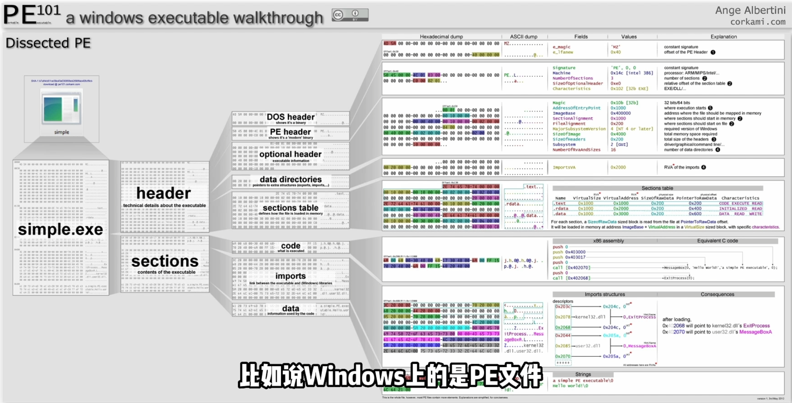
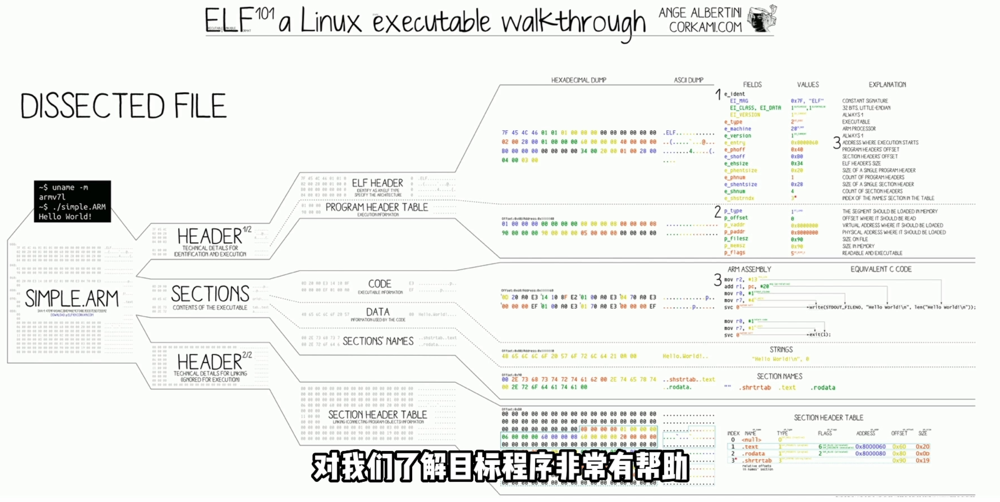
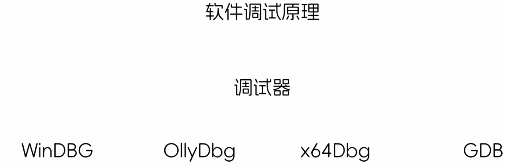
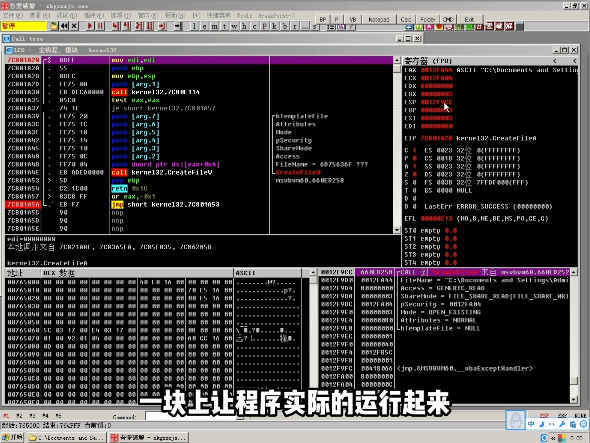

# 从零开始学逆向

## 1.简介
### 1.1 课程简介

### 1.2 就业方向

### 1.3 反编译案例
* IDA中反编译代码，可以看到密码

### 1.4 什么是逆向工程

### 1.5 反编译工具
* C/C++/Go:IDA
* Java:jd-gui
* C#:reflector

### 1.6 文件格式
#### （1）Windows文件格式

#### （2）Linux文件格式

### 1.7 需要使用动态调试工具

### 1.8 课程安排
