# 从零开始学逆向入门篇

## 1. 寄存器与实模式下的内存寻址

### 1.1 计算机存储体系
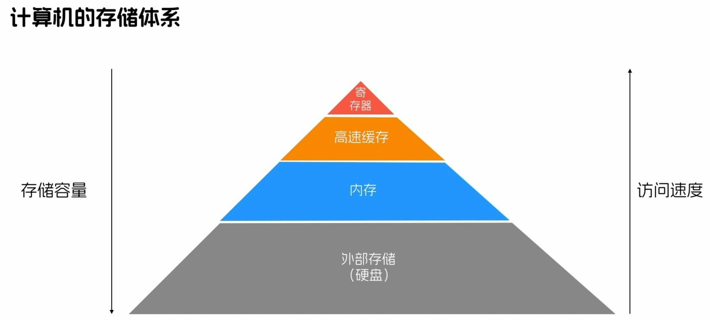

### 1.2 x86架构CPU（16位）
#### （1）x86架构CPU寄存器
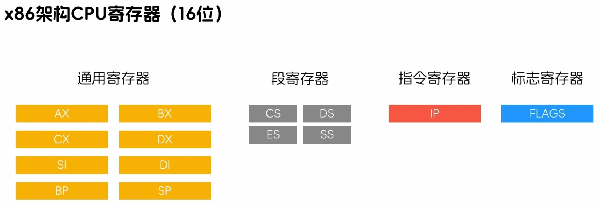

#### （2）x86架构CPU寻址范围（1MB）
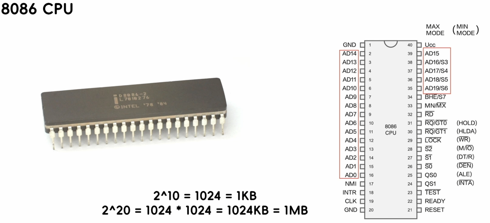

### 1.3 实模式寻址
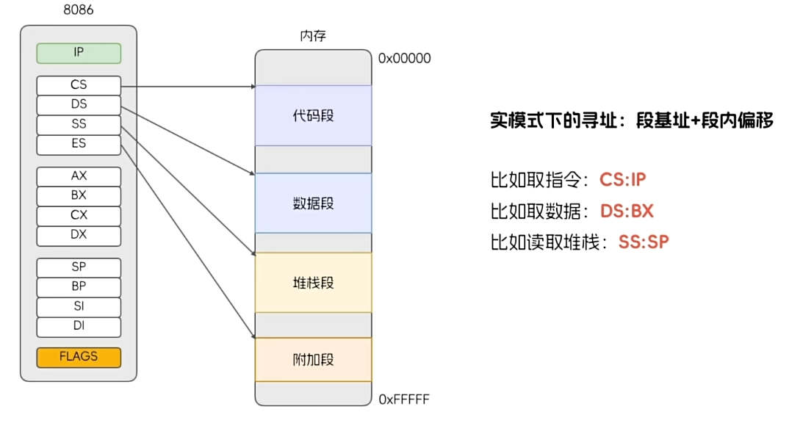

#### （1）模式寻址解决的问题
* 划分段，将代码、数据和堆栈都分离访问

#### （2）实模式寻址存在的问题
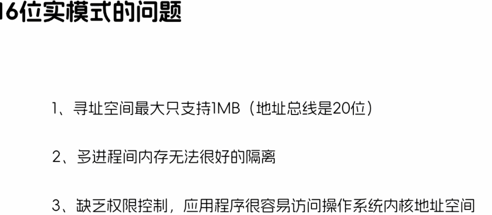

## 2. 保护模式下的分段式内存管理机制

### 2.1 80386 CPU（32位）
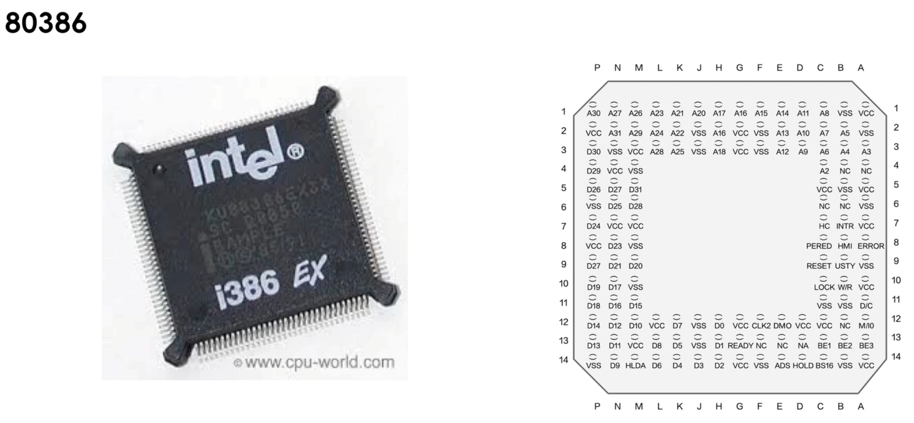

### 2.2 x86架构CPU寄存器（32位）
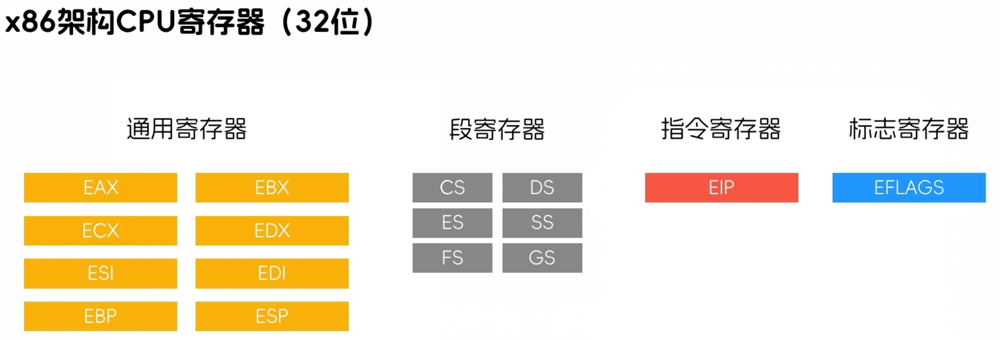

#### （1）x86架构CPU寄存器32位支持16位
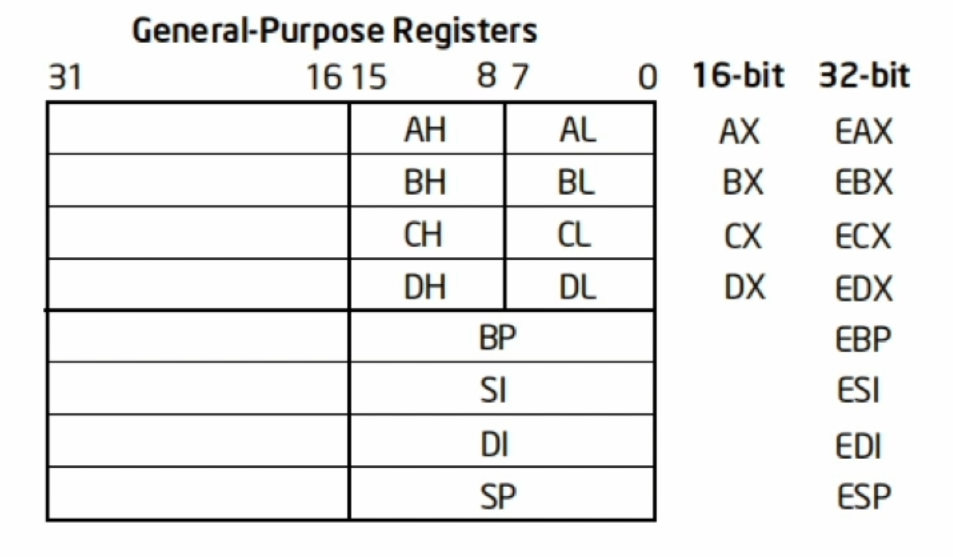

### 2.3 x86架构的CPU权限级别
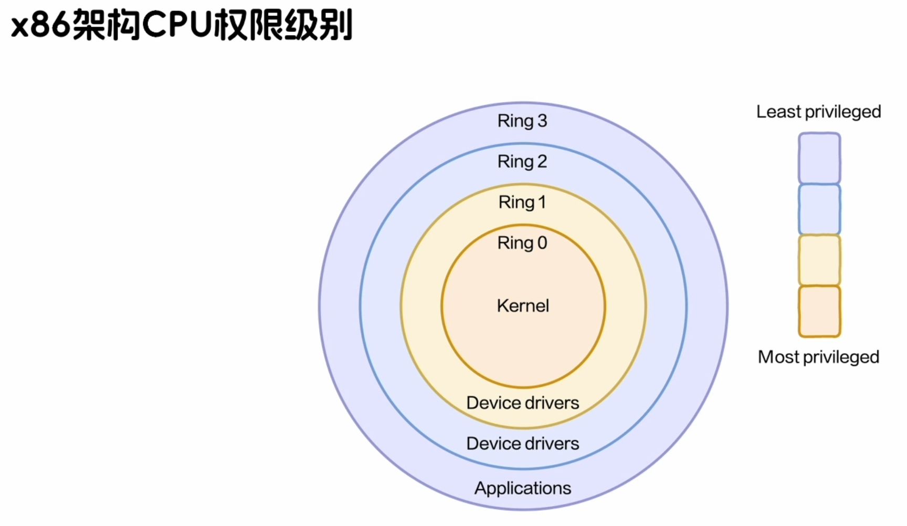

### 2.4 x86架构的CPU的段寄存器

#### （1）段访问权限控制
* 段描述符表中有段大小和描述符权限级别（DPL）
* 段寄存器中有当前权限级别（CPL）
* 这样控制访问权限

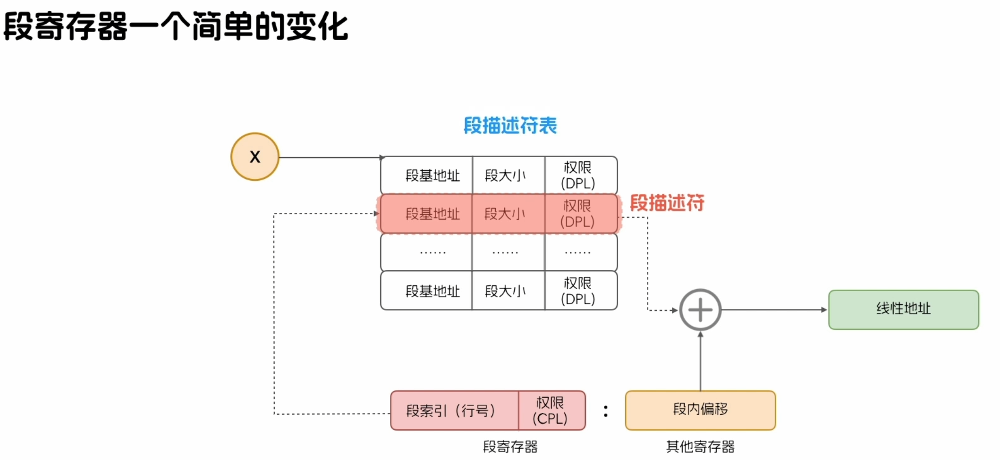

#### （2）段寄存器寻址过程
* 段寄存器寻址过程由硬件完成对操作系统和应用程序透明

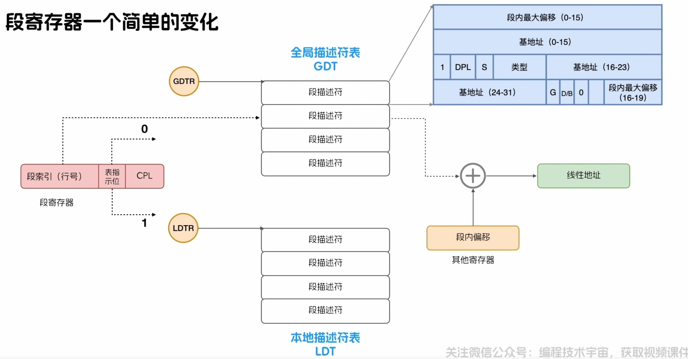

### 2.5 分段式内存管理解决问题
* 仅为权限问题，为解决多进程之间内存空间隔离问题

## 3. 保护模式下分页式内存管理机制
### 3.1 分页式内存寻址
* 分页式内存寻址由硬件完成
* 三次内存读写：
  * 1.查页目录
  * 2.查页表
  * 3.目的内存读写

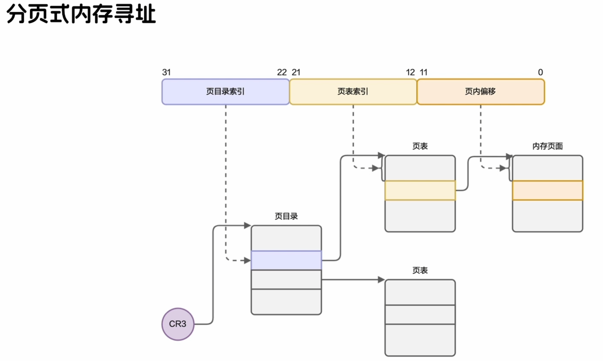

### 3.2 TLB快速查找物理地址
* TLB：Translation Lookaside Buffer，译为快表，直译可以翻译为旁路转换缓冲
* TLB中缓存部分虚拟页号（VPN）与页表项（PTE）对应关系
* 用于减少访存次数
* 具体见入门补充或链接
  * https://mp.weixin.qq.com/s/Sn6VzXIxmPWlbHu5k2tvaQ

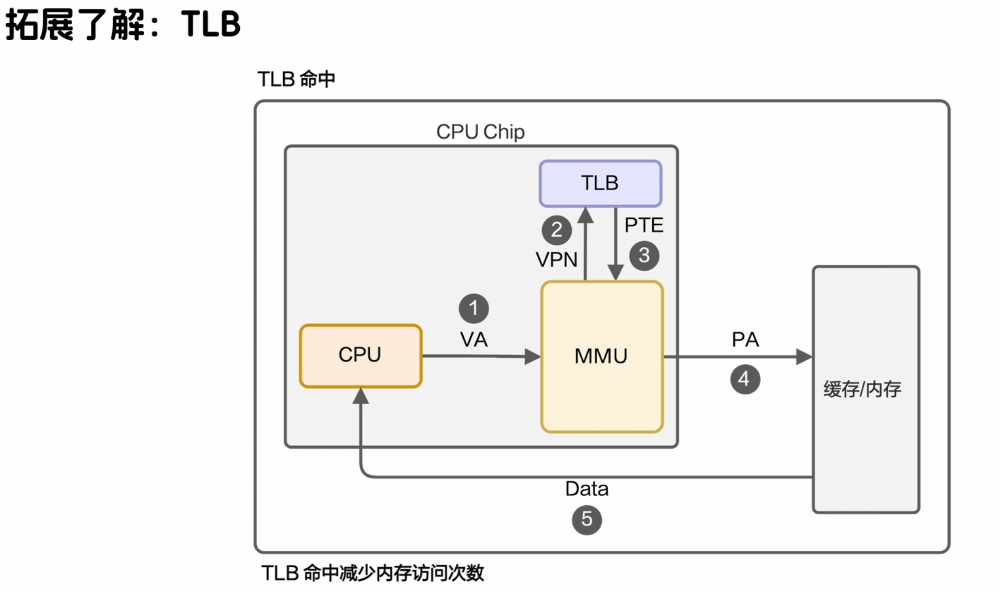

## 4. 段页式内存管理
* 段：由逻辑地址得到线性地址
  * 进程分为代码段、数据段、栈段等
* 页：由线性地址得到物理地址
  * 内存页大小4KB（12位）

### 4.1 段页式内存管理框架
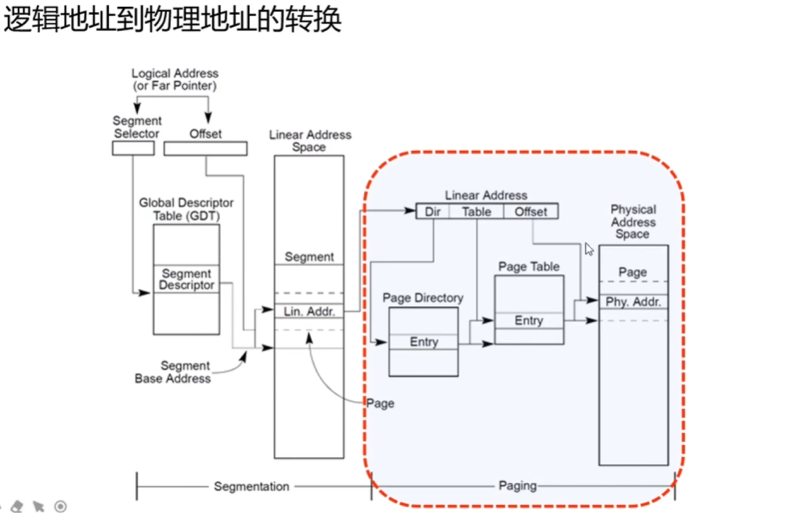

### 4.2 段页式内存管理转换流程

### 4.3 线性地址到物理地址的转换案例
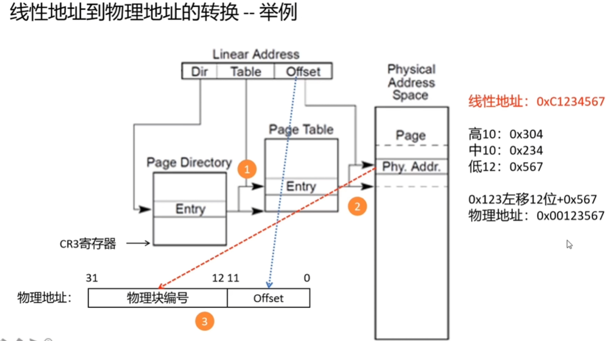

### 4.4 注意
* Linux中段选择子（Segment Selector）或段起始地址位0，让逻辑地址等于线性地址，这样方便运算处理。

## 5. x86汇编基础