# 从零开始学逆向入门篇补充

现代的操作系统将可执行文件加载后，创建了进程，进程中每一条指令和数据都被分配了一个虚拟地址，CPU获取到这个虚拟地址后，需要翻译成内存的物理地址后，才能访问指令和数据，本片文章阐述的重点就是虚拟地址翻译物理地址的流程和实践，因此分成2部分阐述

1.虚拟地址翻译物理地址的流程?

2.举一个例子实践下?

1、虚拟地址翻译物理地址的流程?
当CPU第一次访问虚拟地址时，虚拟地址所在的虚拟页不在内存中，虚拟页表项(PTE)也不在TLB中，因此需要执行的步骤比较多，如下图

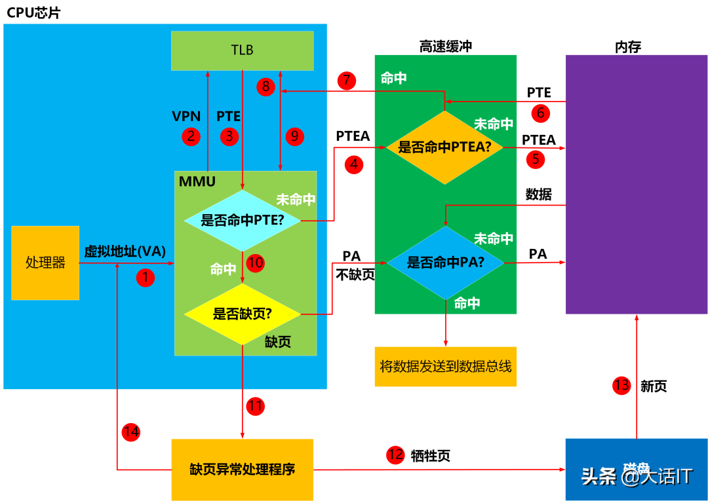

第一次访问虚拟地址

1.处理器将虚拟地址(VA)送往MMU(内存管理单元)

虚拟地址格式

如上图所示,虚拟地址长度为n,虚拟页偏移量长度为p。

2.MMU获取虚拟地址中的虚拟页号(VPN)，然后将虚拟页号发送给TLB(翻译后备缓冲器),TLB根据虚拟页号从TLB映射表中查询PTE(页表项即Page Table Entry)。

PTE(页表项)

3.TLB(翻译后备缓冲器)将查询结果返回给MMU(内存管理单元)

4.MMU(内存管理单元)分析查询结果是否有PTE(页表项)，发现PTE为空，没有命中,因此MMU根据页表基址寄存器(PTBR)中的页表起始地址加上虚拟页号(VPN)，得出虚拟页页表项的物理地址PTEA（即Page Table Entry Address），然后将这个物理地址送往高速缓冲(L1)。

5.高速缓冲(L1)根据PTEA查询内部的缓冲映射表，发现没有找到PTEA映射的内容即PTE（页表项），然后向内存请求PTEA下的内容。

6.内存将PTEA下的内容PTE，发送给高速缓冲(L1)，高速缓冲(L1)建立了PTEA和PTE的映射关系。

7.高速缓冲(L1)再次根据PTEA查询内部的缓冲映射表，这次找到了，然后将PTE发送给TLB。

8~9.TLB收到了PTE后，建立了虚拟页号(VPN)和PTE的映射（8），然后将PTE发送给MMU。

10.MMU收到了PTE后，检查PTE的有效位，看看虚拟页是否在内存中。

11.MMU检查PTE后，发现虚拟页不在内存中，因此发送缺页中断给CPU，CPU开始执行缺页中断处理程序。

12.缺页中断处理程序根据页面置换算法，选择出一个已经缓冲的虚拟页作为牺牲页（如果这个虚拟页发生了变化，则更新到磁盘中），将这个牺牲页的PTE的有效位设置为0，表明这个牺牲页不在内存了。

13.缺页中断处理程序将缺少的页，从磁盘换入到空闲的物理内存中，设置缺少的虚拟页的PTE的有效位为1，更新物理号。

14.缺页中断处理程序执行完毕，跳转到发生缺页的指令处，然后CPU重新执行该指令，重新发出虚拟地址到MMU,跳到了1，开启下一个循环。

当CPU第二次访问同一个虚拟地址时，虚拟地址所在的虚拟页已经内存中，虚拟页表项(PTE)也在TLB中了，因此需要执行的步骤少了很多，如下图

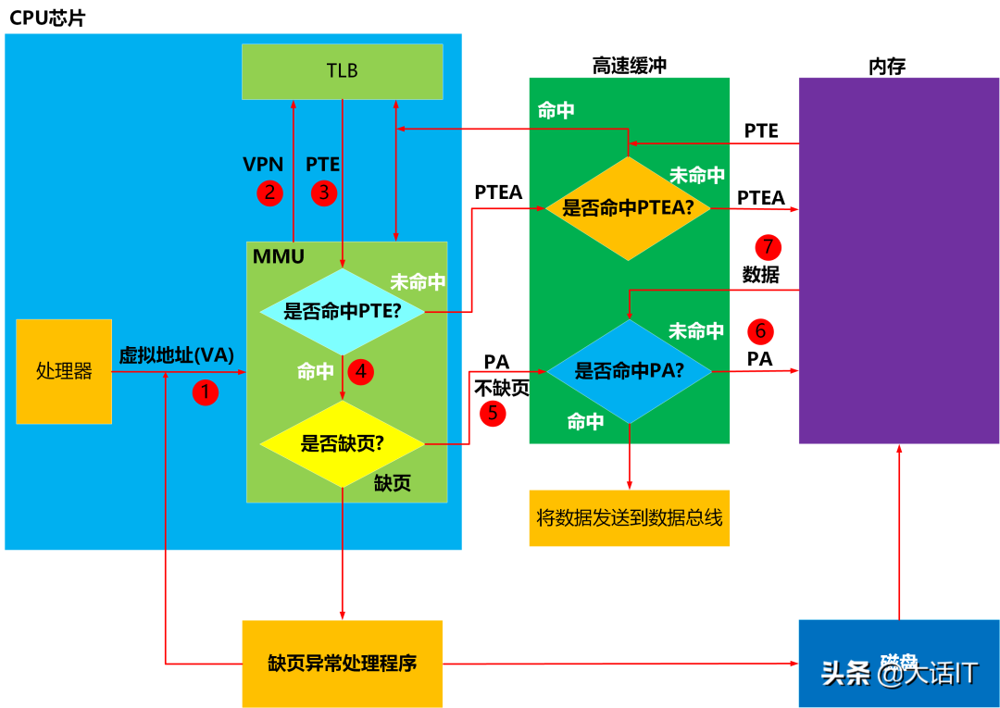

第二次访问虚拟地址

1.处理器将虚拟地址(VA)送往MMU(内存管理单元)

2.MMU获取虚拟地址中的虚拟页号(VPN)，然后将虚拟页号发送给TLB(翻译后备缓冲器),TLB根据虚拟页号从TLB映射表中查询PTE(页表项即Page Table Entry)。

3.TLB(翻译后备缓冲器)将查询结果返回给MMU(内存管理单元)

4.MMU(内存管理单元)分析查询结果是否有PTE(页表项)，发现PTE有值，命中了，然后检查PTE的有效位，发现有效位是1，因此不缺页，根据PTE中的物理号加上虚拟地址中的(VPO)计算出指令或者数据的物理地址PA,将PA发送到高速缓冲(L1)

5.高速缓冲(L1)根据PA查询内部的缓冲映射表，发现没有找到PA映射的内容即指令或者数据，然后向内存请求PA下的内容。

6.内存将PA下的内容，发送给高速缓冲(L1)，高速缓冲(L1)建立了PA和内容的映射关系。

7.高速缓冲(L1)再次根据PA查询内部的缓冲映射表，这次找到了，然后将代码或者指令发送到数据总线，CPU收到数据总线的数据后，感叹道，终于拿到数据了。

当CPU第三次访问同一个虚拟地址时，与第二次不同的是，因为虚拟地址对应的物理地址的数据，已经映射到高速缓冲(L1),所以不再从内存中查询。

好了，虚拟地址翻译物理地址的整个过程阐述完毕，下面来举个具体的例子来实践下！

2、举一个例子实践
上一节是虚拟地址翻译物理地址的过程，现在实践下，实践前先普及两个概念TLB和高速缓冲。

TLB

TLB全称叫做翻译后备缓冲器，这是一个映射表，它建立了虚拟页号（VPN）和页表项(PTE)的映射关系，每次访问虚拟地址时，都需要找这个虚拟地址对应的页表项，每次都去内存中查需要耗费几十个甚至上百个的时钟周期，虽然页表项缓冲在高速缓冲后，耗费的周期可以降到1-2个周期，但是缓冲在TLB后，几乎不用耗费时钟周期，它跟CPU几乎是同步的，类似于寄存器。

那么，虚拟地址怎么通过TLB映射页表项(PTE)呢,先来看看TLB，我们说TLB就是一个映射表，先来看看这个映射表长什么样,如下图
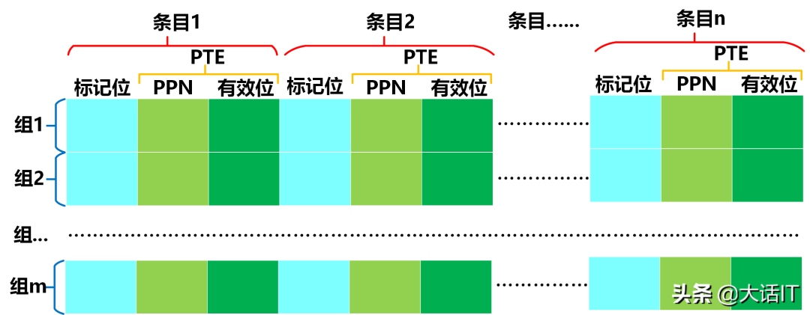

如上图所示,一个TLB由m个TLB组构成,每个TLB组下有个n个条目,每个条目里有PTE和标记位构成。

标记位是一个数字，每个TLB组的标记位不能重复，所以一个TLB组里，可以根据这个标记位定位到某个条目。

每个组都有一个唯一的编号叫做组号。

因此这么看，TLB就是一个二维数组，知道了组号和标记位就可以定位到唯一的PTE（页表项）。

虚拟地址中的虚拟页号(VPN)可以拆分成两部分即组号和标记位，假设一个n位长度的虚拟地址,如下图

虚拟地址中的TLB部分

由上图得知,VPN由标记位(TLBT)和组号又叫标记索引(TLBI)构成,组号占t位，标记位占了虚拟页号剩余的位。

假如一个TLB有4组，总共有64个条目，每组就有16个条目,那么VPN中的组号就占用2位（2的2次方=4），标记位就占用4位(2的4次方=16)。

高速缓冲

高速缓冲通常采用SRAM(静态随机访问存储器)进行存储,它比内存DRAM(动态随机访问存储器)快上几十甚至上百倍，因此为了加速CPU获取数据的速度，最近访问的数据存储在高速缓冲中。

高速缓冲内部有一张映射表，这张映射表建立内存物理地址PA和该内存物理地址下内容的映射关系，如下图所示

高速缓冲映射表

如上图所示，映射表分为m个组,每个组由标记位，有效位，和n个块组成，有效位为1表示该缓冲没过期，为0表示该缓冲过期了。

一个物理地址由组号+标记位+块号构成，如下图所示

物理地址的构成

由上图得知,物理地址为m位，块号占用p位，组号占用t为，剩下的位就是标记位占用的位数。

我们可以根据物理地址的组号定位到映射表的一个组，然后看看这个组下的有效位是不是为1，如果不为1，那么表示这一组的内容都无效了，没有必要比较下去了，因此缓冲没有命中，如果为1呢，那么比较这个组下的标记位和物理地址中标记位，如果不相等，那就是没有命中，如果相等呢，则继续根据物理地址中的块号去这个组相应的块号下找，如果找到数据，则表示命中了，否则缓冲没有命中。

假设一个高速缓冲有16个组，每个组有4个块，那么物理地址当中组号占用的空间就是4位(2的4次方等于16）,块号占用的位数就是2位（2的2次方等于4），剩余的位数就是标记位占用的位数。

好了，概念普及完了，下面正式开始举例

先假设

1.内存是按字节寻址，每个字是一个字节(通常对于32位的系统一个字是4个字节)。

2.虚拟地址长度为14位，假设页表有256个页表项，因此虚拟页号(VPN)占用位数为8，虚拟一偏移量（VPO）占用6位。

3.物理地址长度为12位。

4.页面大小为64个字节(P=64)

5.TLB有4个组，每个组4个条目，总共16个条目组成

6.高速缓冲(L1)有16个组，每个组有4个块。

7.采用一级页表(多级页表复杂些，但原理类似)。

先看看虚拟地址和物理地址的格式，如下图:

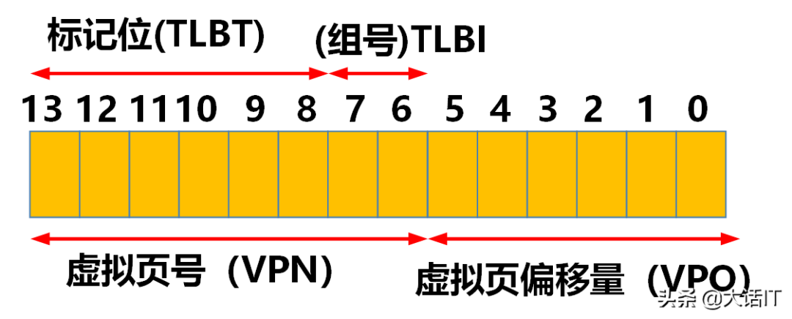

虚拟地址

由上图得知,组号(TLBI)占用2位，因为我们假设TLB有4个组，标记位占用6位。
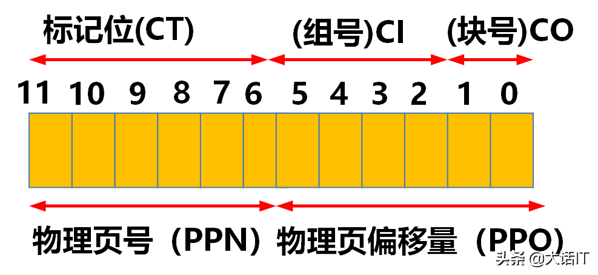

物理地址

由上图得知，组号（CI）占用4位，因为我们假设高速缓冲有16个组，每个组下有4个块，因此块号(CO)占用2位,剩下的6位就是标记位(CT)。

我们假定TLB,高速缓冲映射表如下图:

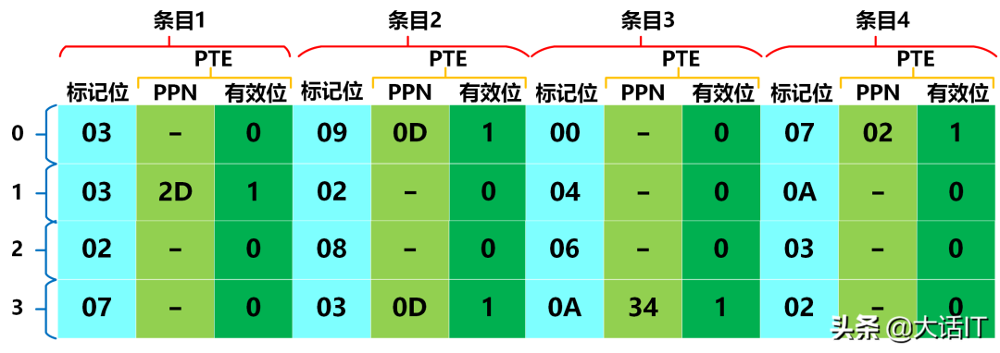

TLB映射表

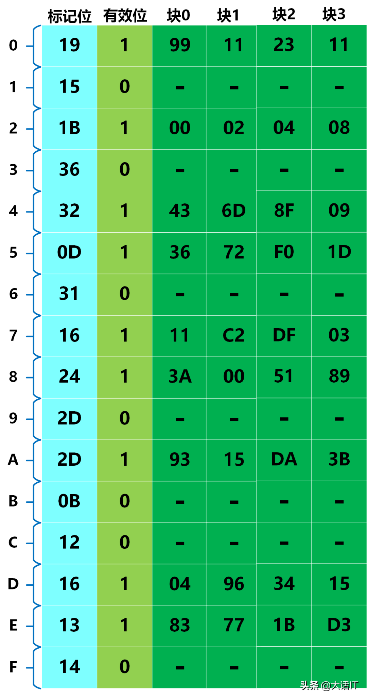

高速缓冲映射表

页表总共有256项，我们把前16项列出，如下图

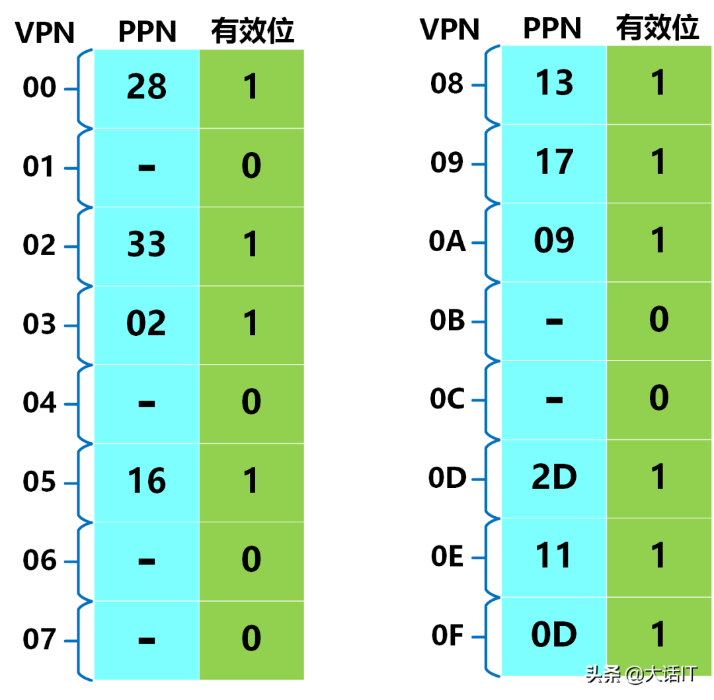

页表前16项

好了，一切就绪，假设CPU访问的虚拟地址是0x03d4,它的二进制是16位即00000011 11010100,而虚拟地址只有14位，所以高2位被抛弃，如下图

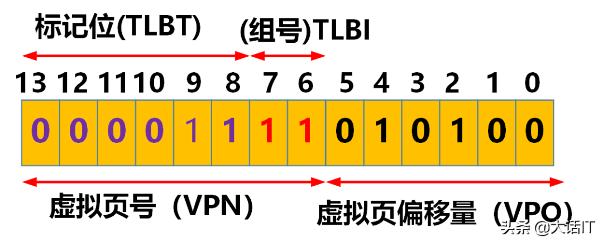

0x03d4虚拟地址分布图

由上图得知，组号(TLBI)为11即0x03,标记位(TLBT)为000011即0x03，从TLB映射表查找，发现命中了，如下图

TLB命中

由上图命中了红色部分的标记位,PTE中的PPN=0x0D,有效位为1，我们根据PPN然后在加上虚拟页偏移量,如下图

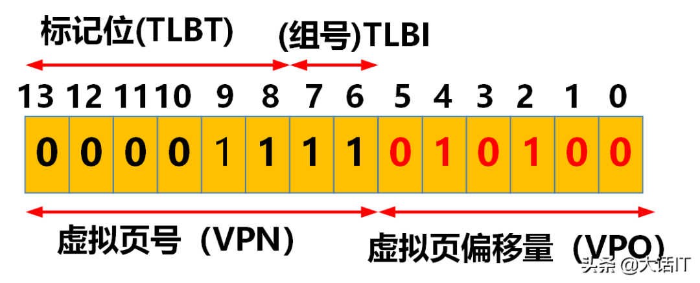
虚拟地址

由上图，我们得知虚拟页偏移量(VPO)为010100=0x14,虚拟页偏移量(VPO)=物理页偏移量(PPO),即PPO=0x14,PPN和PPO连接起来就是物理地址PA即001101010100=0x354,如下图

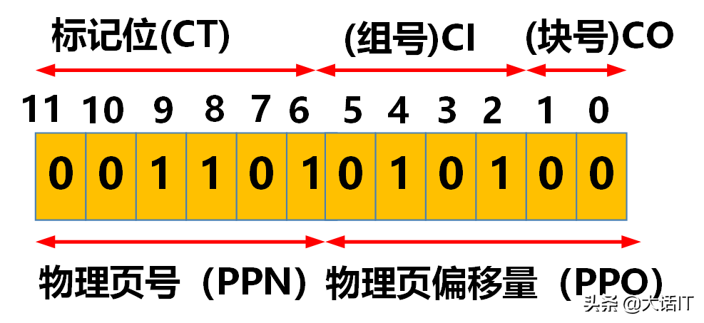

物理地址

由上图得知，组号是0101即0x05,块号(CO)为00即0x00,标记位为001101即0x0D,通过组号+标记位+块号，可以定位到高速缓冲的数据0x36,如下图所示

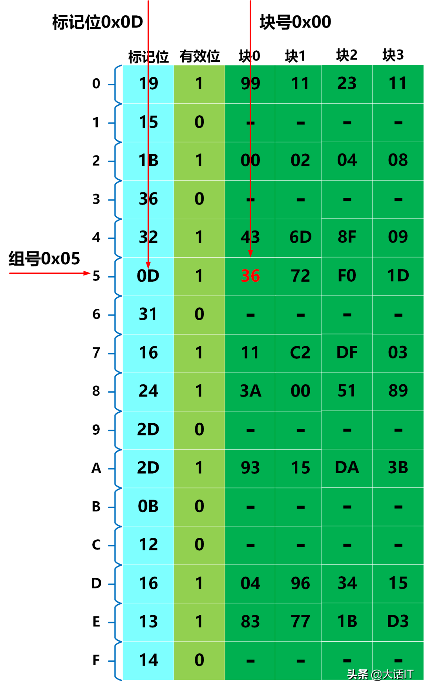

物理地址命中数据

物理地址对应的数据找到了，返回给了CPU，当然也可能发生其他的情况，如TLB未命中，高速缓冲未命中，缺页等，这些读者可以自行实践。