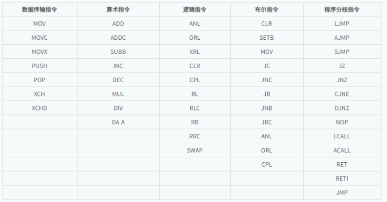

# 80C51指令集学习

## 1. 基础知识补充
### 1.1 相关学习文档
* 8051微控制器指令集和寻址模式：https://www.elecfans.com/emb/danpianji/202210111903268.html
* 8051汇编指令集文档：https://max.book118.com/html/2017/1111/139692276.shtm

### 1.2 指令集详解
* 8051单片机指令集中有49个指令助记符，分为5组

