# 静态程序分析框架Tai-e设计之道

# 一.太阿的设计动机
## 1.程序分析框架概述
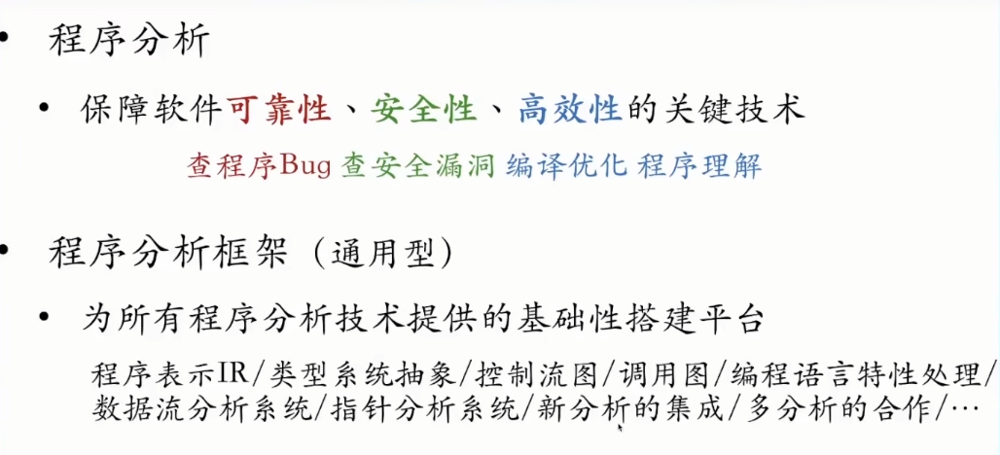

## 2. 经典程序分析框架弊端
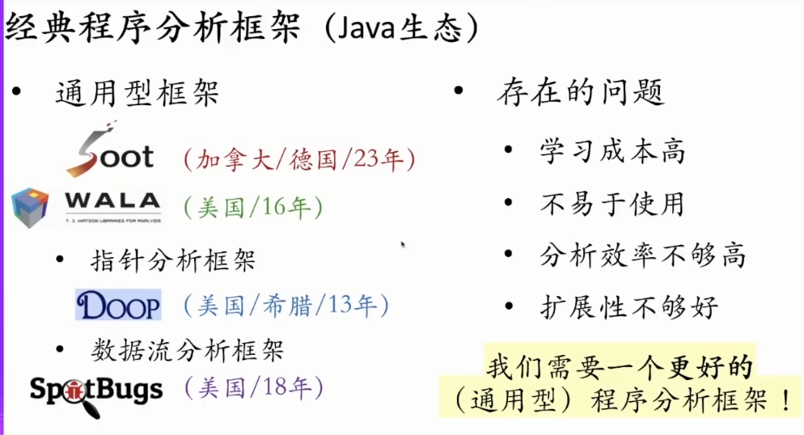

# 二.太阿的设计理念
## 1.太阿的设计理念4E
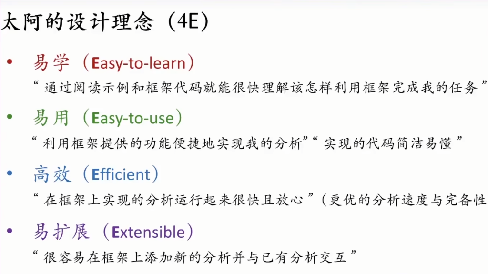

# 三.太阿的设计方法
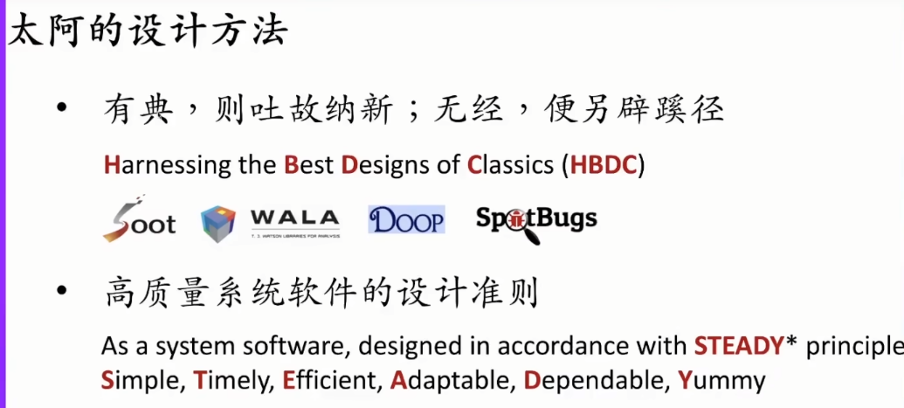

# 四.太阿的核心组成
## 1.太阿的组成框图
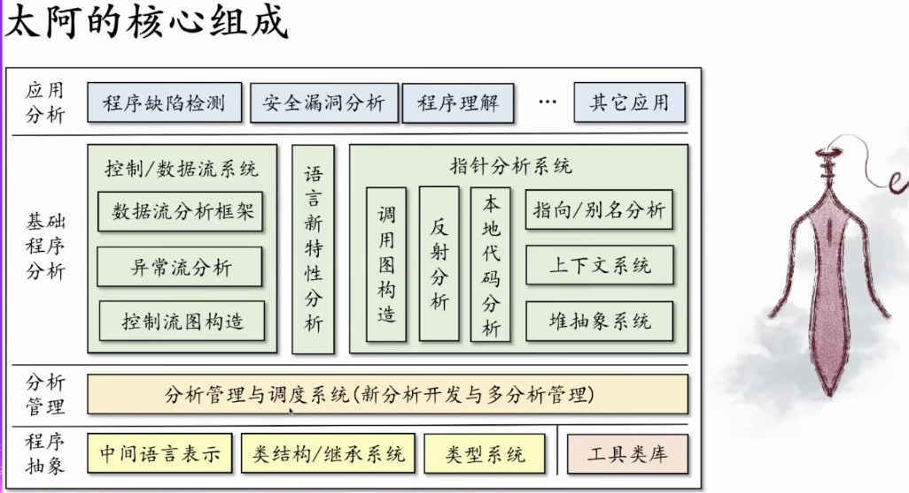

## 2.太阿的IR
### 2.1 二元表达式赋值语句例子
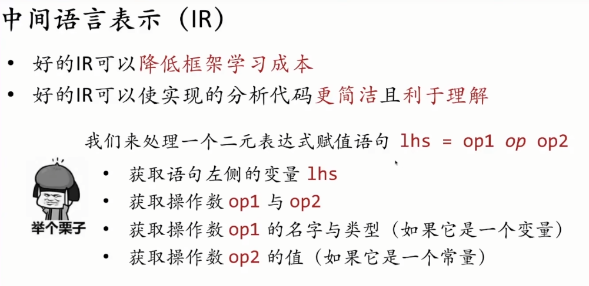

### 2.2 Soot与Tai-e比较
* Soot仅有一个AssignStmt一个接口，没有区分需要类型转换和类型检查等重复操作
* Soot中都是Value类型没有区分还是需要类型转换和类型检查
* Tai-e类型很细代码更简单易懂
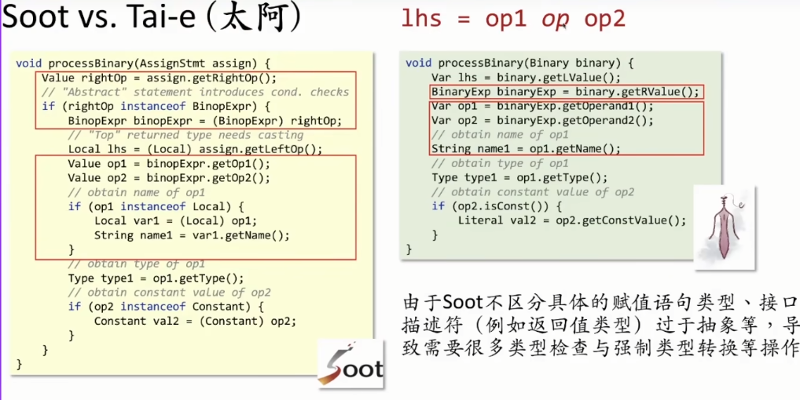

### 2.3 WALA和Tai-e比较
* WALA取操作数则需要先获得int类型的索引值，然后再查表，一步一步查表取值，通过索引查找需要很多接口，调试麻烦
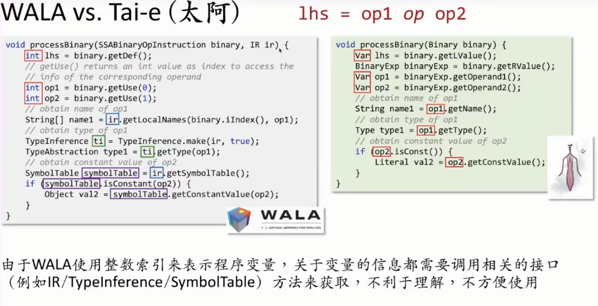

## 3. 指针分析
### 3.1 指针分析介绍
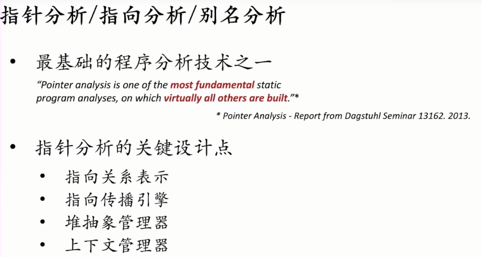

### 3.2 Tai-e指针分析系统实验数据展示
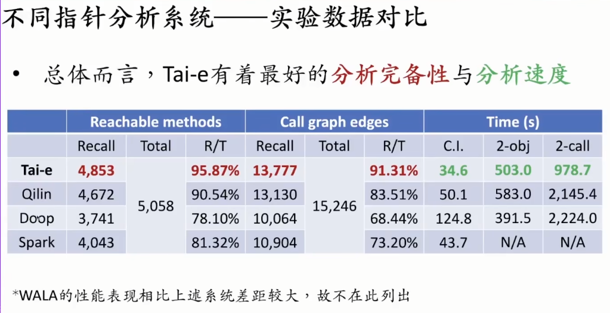

### 3.3 依赖指针分析开发新的分析
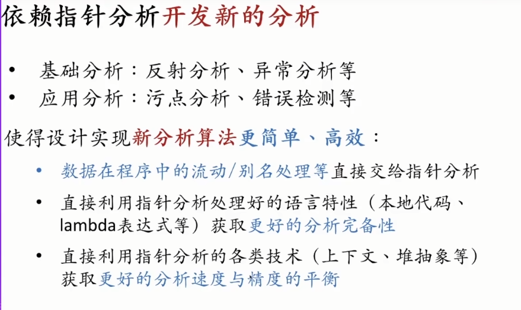

### 3.4 太阿的分析插件系统
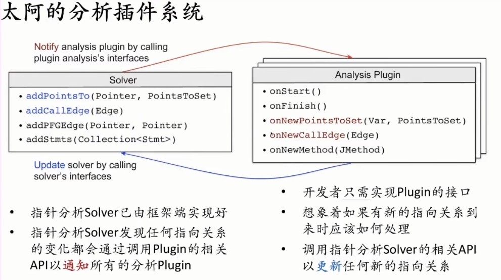

### 3.5 当前已有的分析插件 
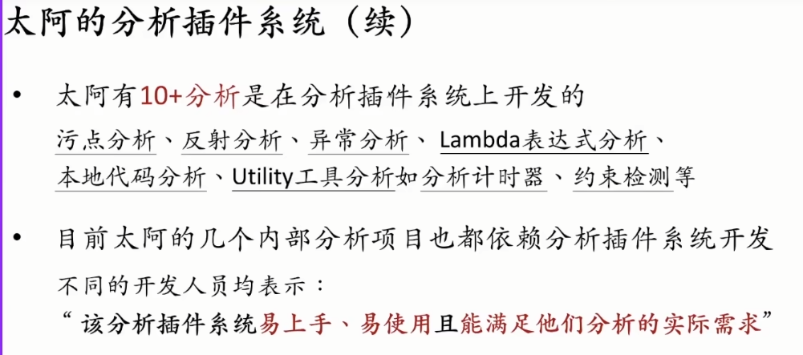

### 3.6 未来太阿的计划
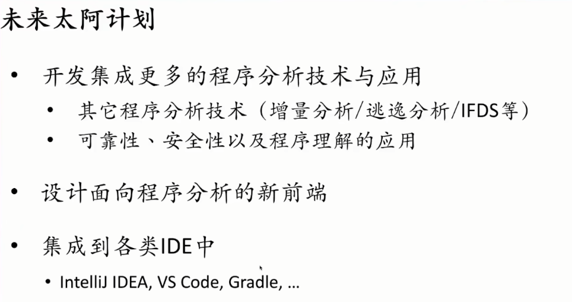

### 3.7 太阿的教育平台
* 科研平台和教育平台：https://tai-e.pascal-lab.net/
* 太阿源代码：https://github.com/pascal-lab/Tai-e
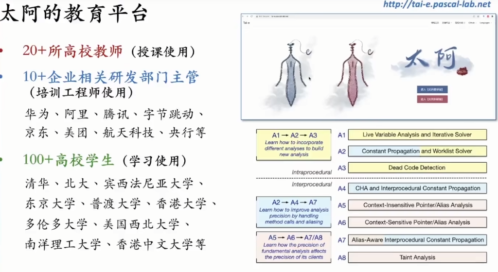