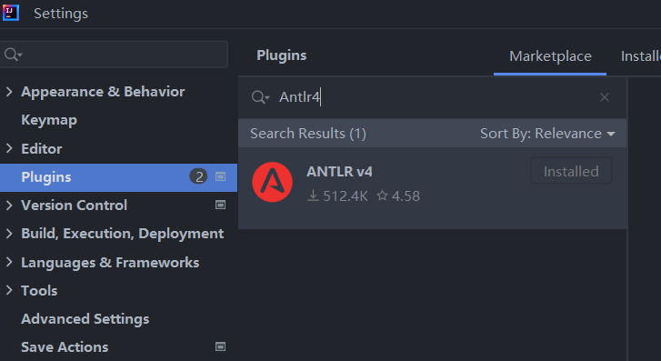
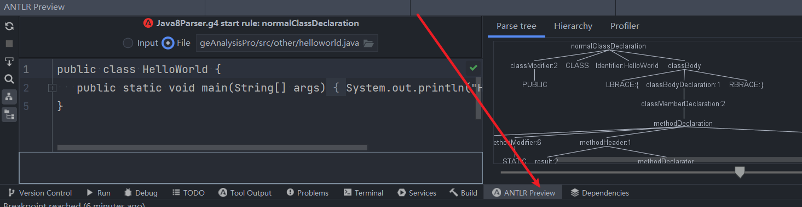
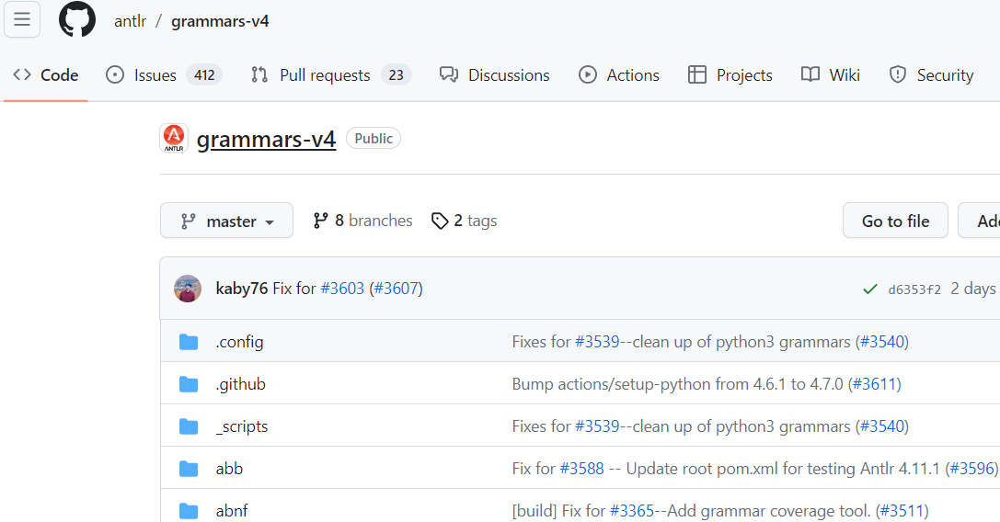
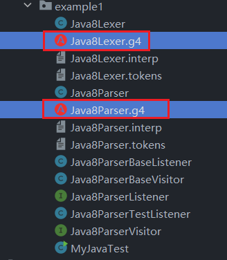
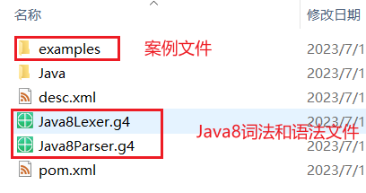
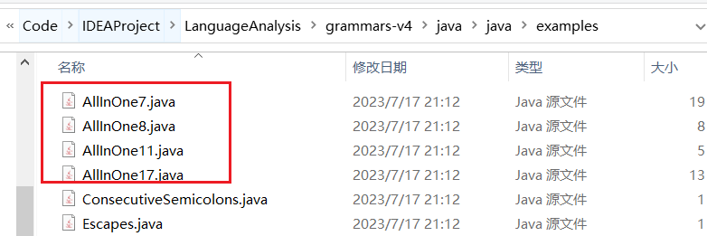
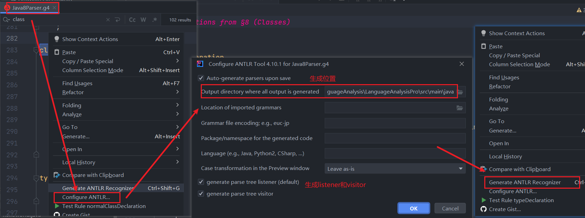
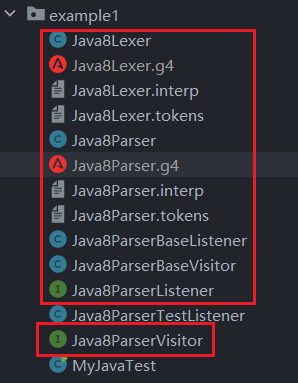
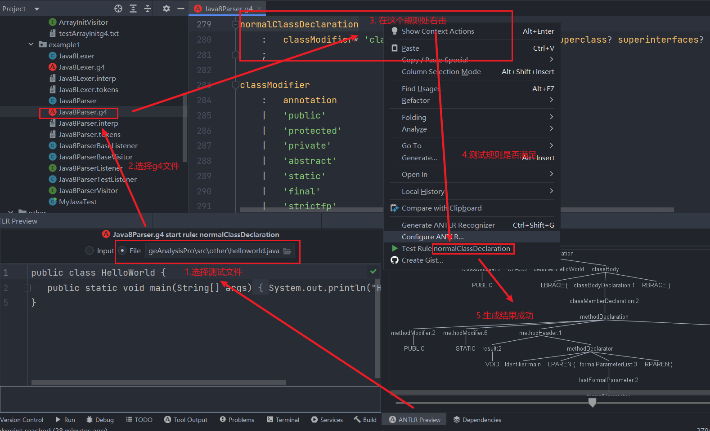

# Antlr4

## 1.IDEA中Antlr4插件安装
### 1.1 插件市场选择Antlr4插件


### 1.2 Antlr4插件安装成功


### 1.3 下载语法文件
#### 1.3.1 语法文件仓库路径
* https://github.com/antlr/grammars-v4


#### 1.3.2 Java项目配置
* 注意选择antlr4版本需要和插件版本一致
* 注意当前是JDK8所以不能选择高版本Antlr4

##### （1）pom.xml配置
```xml
 <properties>
    <maven.compiler.source>1.8</maven.compiler.source>
    <maven.compiler.target>1.8</maven.compiler.target>
    <project.build.sourceEncoding>UTF-8</project.build.sourceEncoding>
    <!-- ANTLR 4 从4.10 版本后最低要求的JDK版本升到了11，所以如果还想在JDK8下运行行ANTLR4可以只能使用4.9.3 -->
    <antlr4.vesion>4.10.1</antlr4.vesion>
    <!-- <antlr4.vesion>4.11.1</antlr4.vesion> -->
  </properties>

  <dependencies>
    <dependency>
      <groupId>junit</groupId>
      <artifactId>junit</artifactId>
      <version>4.13.1</version>
      <scope>test</scope>
    </dependency>
    <!-- 增加antlr4 运行时库依赖 -->
    <dependency>
      <groupId>org.antlr</groupId>
      <artifactId>antlr4-runtime</artifactId>
      <version>${antlr4.vesion}</version>
    </dependency>
  </dependencies>
```

##### （2）选择Java8词法文件和语法文件



##### （3）补充
* 全量Java8语法测试文件


##### （4）配置Antlr插件
* 先配置再生成




#### 1.3.3 使用插件测试



### 1.4 手写测试代码
#### 1.4.1 重写BaseListener获得类的修饰符
```java
public class Java8ParserTestListener extends Java8ParserBaseListener {

    @Override
    public void enterNormalClassDeclaration(Java8Parser.NormalClassDeclarationContext ctx) {
        for (int i = 0; i < ctx.getChildCount(); i++) {
            ParseTree child = ctx.getChild(i);
            if (child instanceof Java8Parser.ClassModifierContext) {
                Java8Parser.ClassModifierContext classModifierContext = (Java8Parser.ClassModifierContext) child;
                for (ParseTree parseTree : classModifierContext.children) {
                    System.out.println(parseTree.getClass());
                    if (parseTree instanceof TerminalNode) {
                        System.out.println(parseTree.getText());
                    }
                }
            }
        }
    }

    @Override
    public void exitNormalClassDeclaration(Java8Parser.NormalClassDeclarationContext ctx) {
    }
}

```

#### 1.4.2 手写主函数
```java
public class MyJavaTest {
    public static void main(String[] args) throws IOException {
        InputStream inputStream = Files.newInputStream(Paths.get(".\\src\\other\\helloworld.java"));
        
        //新建CharStream,从标准输入读取数据
        ANTLRInputStream input = new ANTLRInputStream(inputStream);
        //新建词法分析器,处理输入的CharStream
        Java8Lexer lexer = new Java8Lexer(input);
        //新建词法符号缓冲区,存储词法分析器生成的词法符号
        CommonTokenStream tokens = new CommonTokenStream(lexer);
        //新建语法分析器,处理词法符号缓冲区内容
        Java8Parser parse = new Java8Parser(tokens);
        //针对normalClassDeclaration规则,开始语法分析
        ParseTree tree = parse.normalClassDeclaration();
        //新建一个能够触发回调函数的语法分析树遍历器
        ParseTreeWalker walker = new ParseTreeWalker();
        //遍历语法分析过程中生成的语法分析树,触发回调
        walker.walk(new Java8ParserTestListener(), tree);
        System.out.println();
    }
}
```
