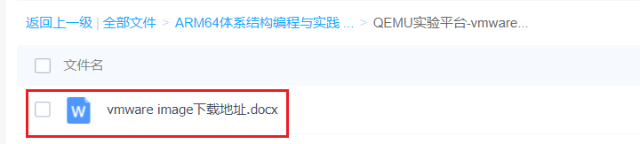
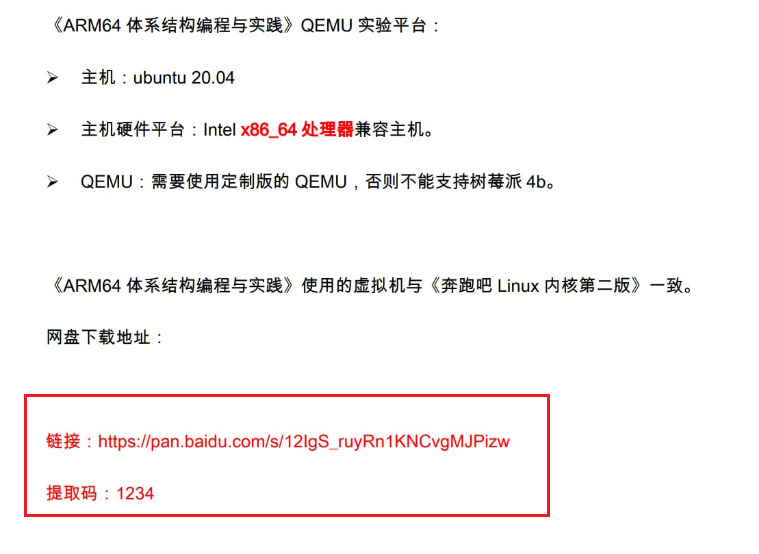
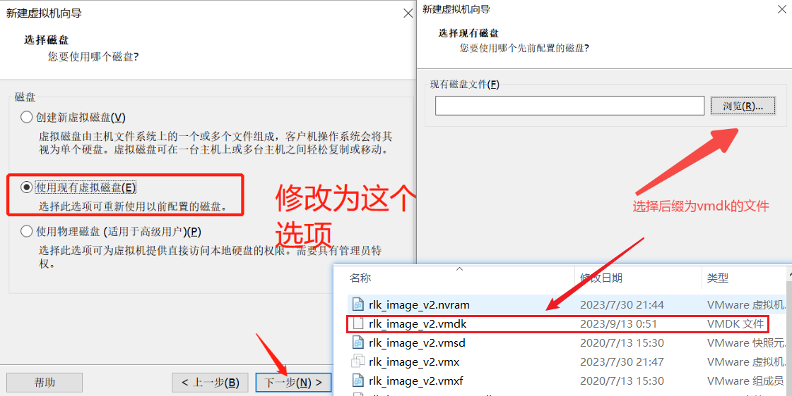
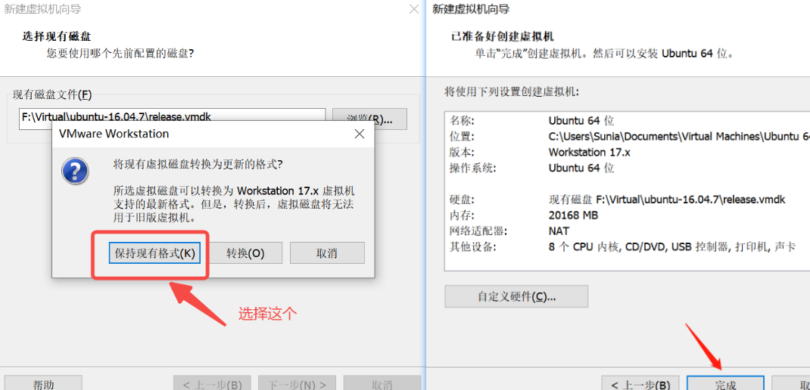
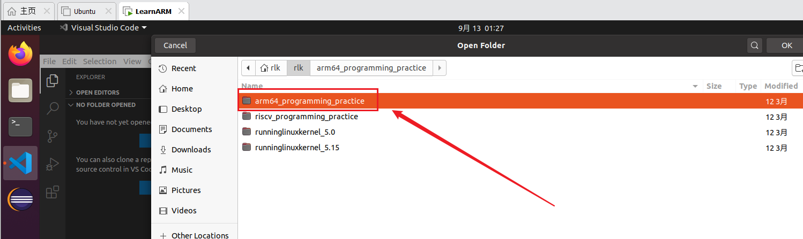
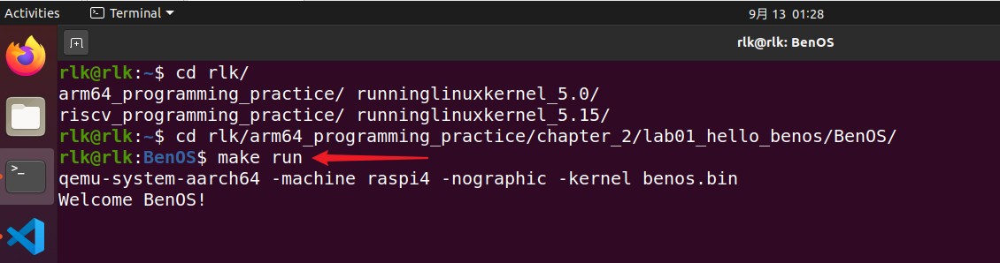

# 环境安装

## 一.实验链接

### 1.环境搭建

#### 1.1 实验环境安装链接
链接：https://pan.baidu.com/s/15SjosVbCzutLeb1ItWoQMw 
密码：1234

#### 1.2 实验虚拟机镜像


#### 1.3 实验虚拟机镜像链接
链接：https://pan.baidu.com/s/12IgS_ruyRn1KNCvgMJPizw 
密码：1234



#### 1.4 实验虚拟机镜像安装教程
##### （1）选择vmdk文件
* 之前流程就是新建虚拟机通用流程




##### （2）安装vmdk文件


## 2. 运行虚拟机
### 2.1 虚拟机密码
虚拟机的用户名：rlk
密码：123
进入root权限：$ sudo su

### 2.2 VSCode打开代码


### 2.3 运行第一个实验
```c
rlk@rlk:~$ cd rlk/arm64_programming_practice/chapter_2/lab01_hello_benos/BenOS/

make run

结束qemu：按住Ctrl + a, 松开后再按x
```



