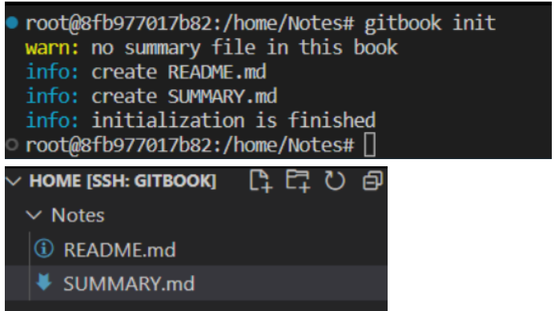
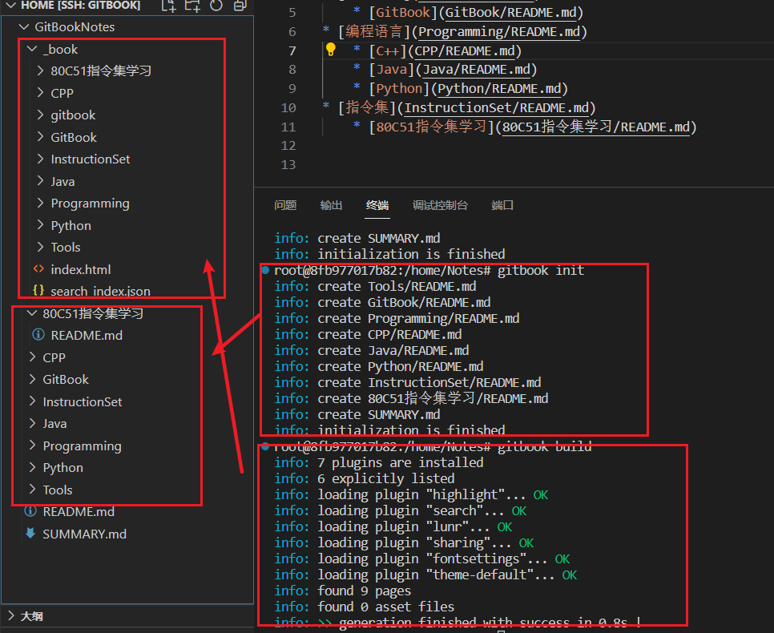
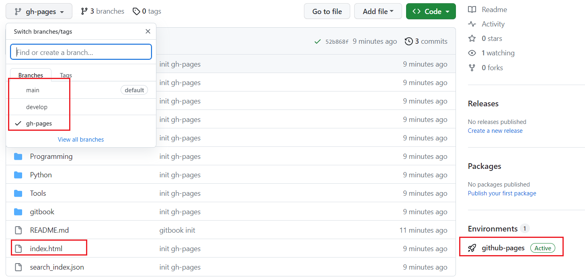
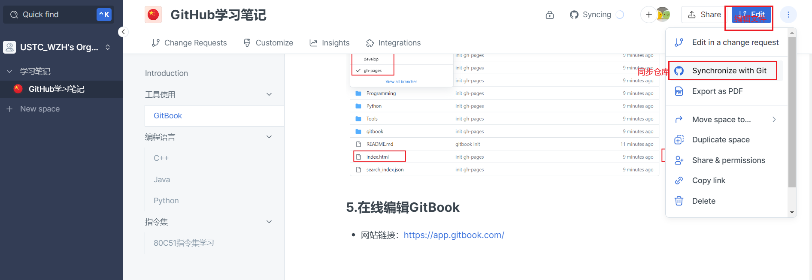

# GitBook

## 1.Node.js安装

```sh
sudo apt update
sudo apt install -y nodejs npm
```

## 2.gitbook安装

```sh
npm install gitbook-cli -g
gitbook -V # (注意V一定要大写 大写 大写)
```

## 3.创建笔记

### 3.1 gitbook初始化

* gitbook init会自动创建README.md和SUMMARY.md

```sh
cd home/Notes
gitbook init
```



### 3.2 修改SUMMARY文件

```markdown
# Summary

* [Introduction](README.md)
* [工具使用](Tools/README.md)
    * [GitBook](GitBook/README.md)
* [编程语言](Programming/README.md)
    * [C++](CPP/README.md)
    * [Java](Java/README.md)
    * [Python](Python/README.md)
* [指令集](InstructionSet/README.md)
    * [80C51指令集学习](80C51指令集学习/README.md)
```

### 3.3 gitbook构建

```Shell
gitbook init #根据Summary.md中创建笔记文件夹
gitbook build #根据创建的文件夹内容生成网页
```



## 4.上传github

### 4.1 创建分支

#### （1）develop分支上存放gitbook的笔记

#### （2）gh-pages分支上存放build生成\_book中的内容

* github会根据gh-pages最外层的index.html创建在线笔记

&#x20;

<figure><figcaption></figcaption></figure>

## 5.在线编辑GitBook

* 网站链接：[https://app.gitbook.com/](https://app.gitbook.com/)

<figure><figcaption><p>编辑在线GitBook</p></figcaption></figure>

<figure><figcaption><p>push到git仓</p></figcaption></figure>
