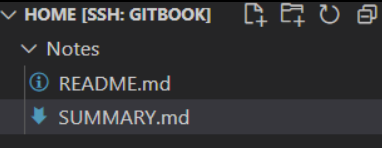

# 一. 安装工具
## 1. Node.js安装
```Shell
sudo apt update
sudo apt install -y nodejs npm
```

## 2. gitbook安装
```Shell
npm install gitbook-cli -g
gitbook -V # (注意V一定要大写 大写 大写)
```
## 3.创建笔记
### （1）gitbook初始化
* gitbook init会自动创建README.md和SUMMARY.md
```Shell
cd home/Notes
gitbook init
```



### （2）修改SUMMARY文件
```markdown
# Summary

* [Introduction](README.md)
* [工具使用](Tools/README.md)
    * [GitBook](GitBook/README.md)
* [编程语言](Programming/README.md)
    * [C++](CPP/README.md)
    * [Java](Java/README.md)
    * [Python](Python/README.md)
* [指令集](InstructionSet/README.md)
    * [80C51指令集学习](80C51指令集学习/README.md)
```

### （3）gitbook构建
```Shell
gitbook init #根据Summary.md中创建笔记文件夹
gitbook build #根据创建的文件夹内容生成网页
```

