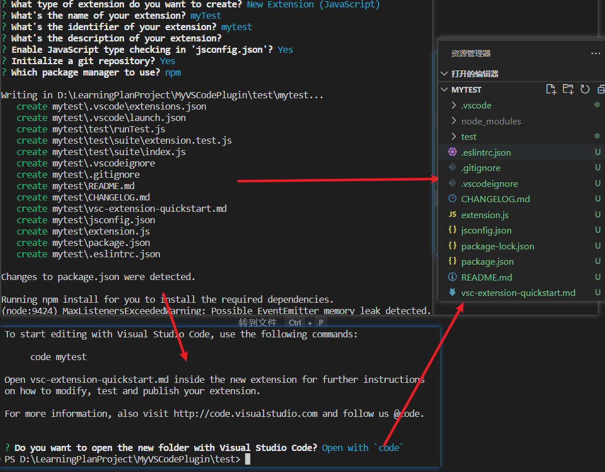
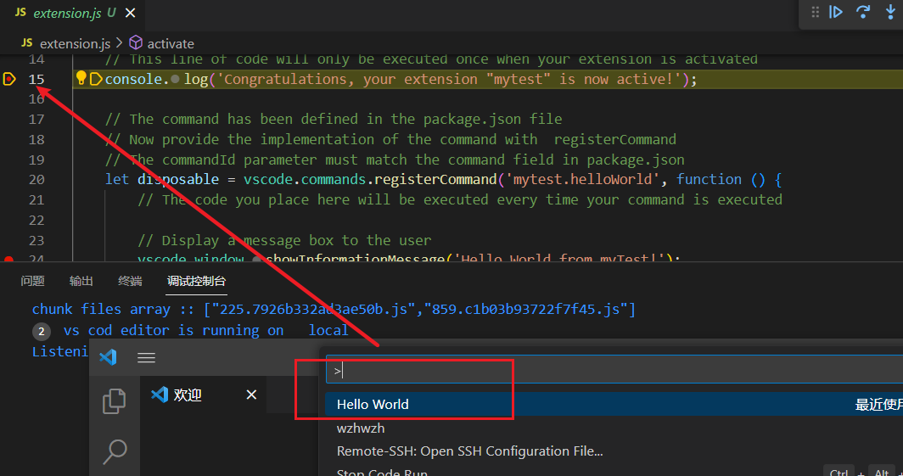
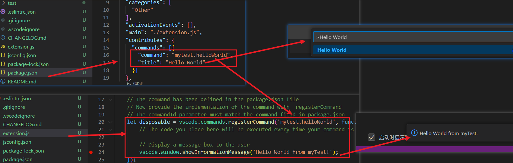
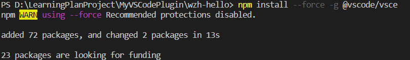
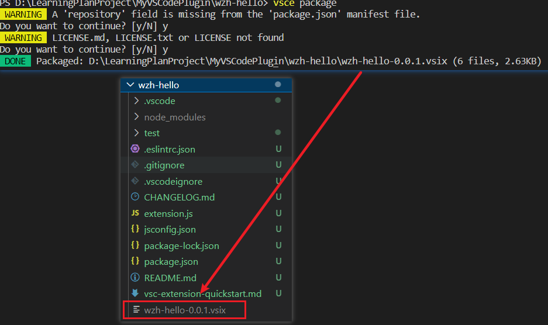
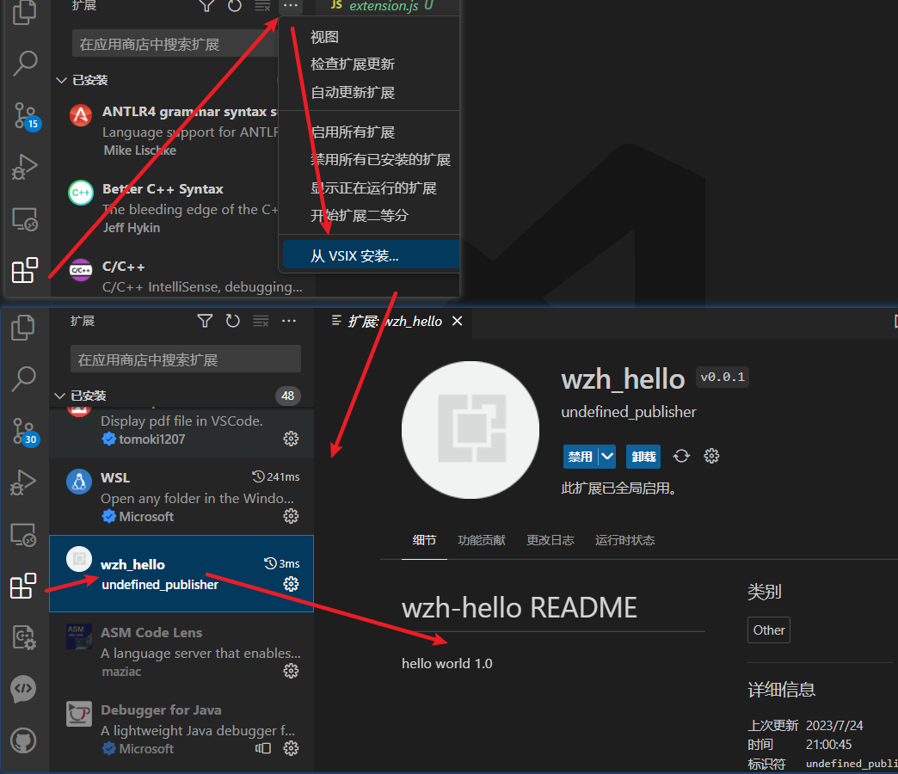

# VSCode插件开发入门

## 0. 相关学习链接
* https://code.visualstudio.com/api
* https://zhaomenghuan.js.org/blog/vscode-custom-development-basic-preparation.html
* https://liiked.github.io/VS-Code-Extension-Doc-ZH/#/get-started/your-first-extension
* https://gitee.com/zmwcodediy/vscode-plugin
* http://www.ayqy.net/blog/vs-code%E6%BA%90%E7%A0%81%E7%AE%80%E6%9E%90/

## 1. 相关环境
### 1.1 初始环境
```shell
vscode编辑器
node.js
npm
```

### 1.2 安装插件开发环境
* Yeoman
* VS Code Extension Generator
```shell
npm install -g yo generator-code
```

## 2 项目配置
### 2.1 生成项目
* 在想要开发代码的目录下终端环境输入下面命令
```shell
yo code
```


### 2.2 项目初始配置
* 开发语言选择：使用上下键选择TypeScript或JavaScript
* 或选择其他选项



### 2.3 调试项目
* 在extension.js文件中打断点
* 按f5：弹出一个新的VS Code窗口标题栏显示[Extesnsion Development Host]表示插件调试界面
* Extesnsion Development Host的VS Code中使用Ctrl+Shift+P命令唤出命令面板
* 命令面板中输入Hello World


### 2.4 效果展示
* 命令面板中输入Hello World后，Extesnsion Development Host的VS Code右下角显示文本


## 3. 插件打包发布与安装
### 3.1 安装插件发布管理工具vsce
```shell
npm install --force -g @vscode/vsce
```


### 3.2 插件打包
* 在开发总目录下，命令行输入命令
* 输入命令前需要修改Readme文件
```shell
vsce package
```


### 3.3 插件导入使用

