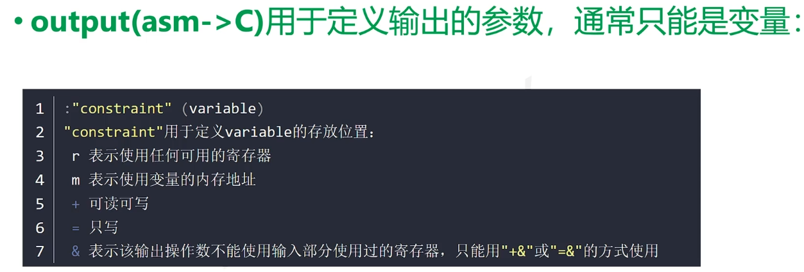
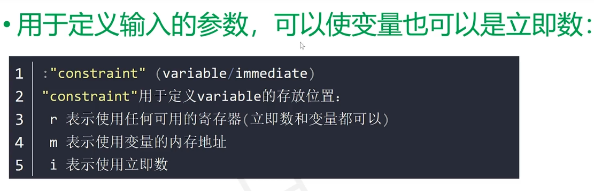
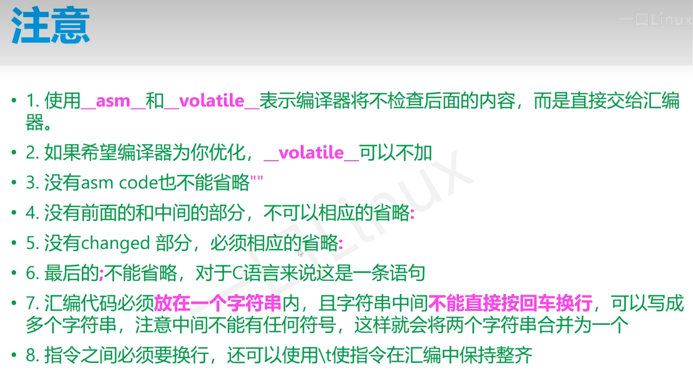
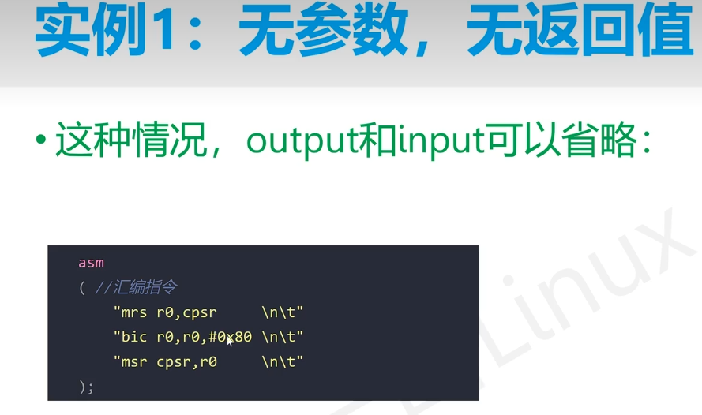
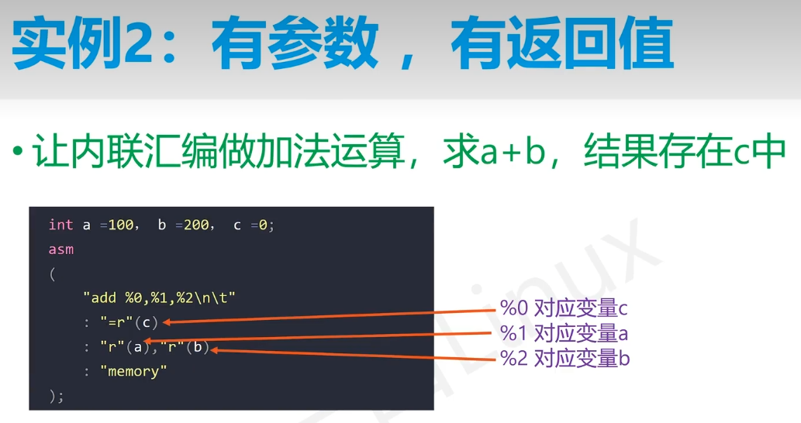
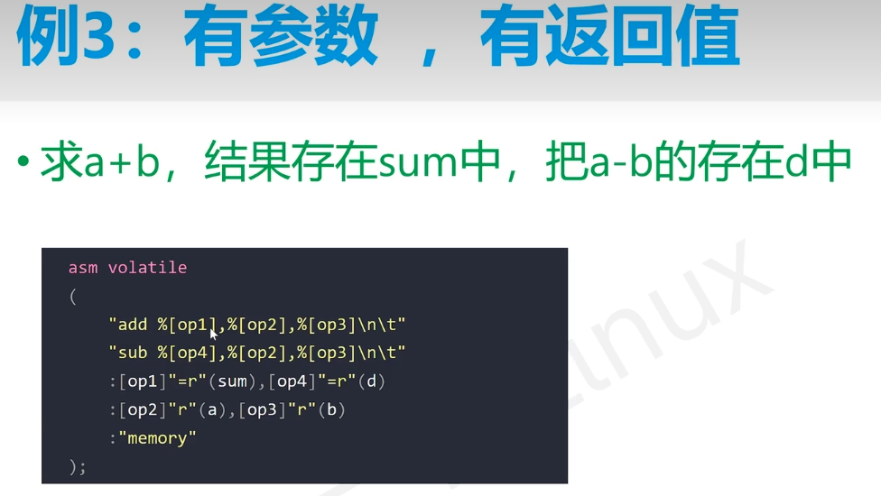

# 内联汇编入门

# GCC内联汇编入门

## 1.入门
### 1.1 相关文档
* https://gcc.gnu.org/onlinedocs/gcc/Using-Assembly-Language-with-C.html
* https://www.ibiblio.org/gferg/ldp/GCC-Inline-Assembly-HOWTO.html
* https://www.linuxprobe.com/gcc-how-to.html

### 1.2 内联汇编介绍
#### 1.2.1 内联汇编是什么
* 我们可以要求编译器将一个函数的代码插入到调用者代码中函数被实际调用的地方。这样的函数就是内联函数。

#### 1.2.1 内联汇编优点
* 这种内联方法可以减少函数调用开销

### 1.3 GCC汇编语法
* Linux上的 GNU C 编译器 GCC ，使用 AT&T / UNIX 汇编语法
* 请看汇编指令集入门章节

## 2.内联汇编
### 2.1 基本内联汇编
#### 2.1.1 基本内联汇编语法格式
##### （1）关键点
* 关键字： `asm 和 __asm__`，建议使用后者
* 内联汇编有多条指令，则每行要加上双引号，并且该行要以\n\t结尾
* 仅有汇编指令

##### （2）示例代码
```assmble
asm("汇编代码");

示例1：
asm("movl %%ecx %%eax"); /* 将 ecx 寄存器的内容移至 eax  */
__asm__("movb %%bh (%%eax)"); /* 将 bh 的一个字节数据 移至 eax 寄存器指向的内存 */

示例2：
__asm__ ( "movl %%eax, %%ebx\n\t"
          "movl $56, %%esi\n\t"
          "movl %%ecx, $label(%%edx,%%ebx,$4)\n\t"
          "movb %%ah, (%%ebx)");
```

##### （3）GCC官方描述
```assmble
1.语法：
    asm asm-qualifiers ( AssemblerInstructions )

2. asm-qualifiers部分：
    volatile：
        这个是无效的，因为基本的asm是隐式volatile的，所以不需要加也是volatile
    inline:
        用于内联，编译器将汇编语句视为最小的大小
3. AssemblerInstructions部分

```

#### 2.1.2 基本内联汇编缺陷
* 编译器注意不到寄存器内容已经被改掉，编译器进行程序优化会导致问题

#### 2.1.3 解决方案：
（1）还原修改过的寄存器内容或不要使用产生附加影响的操作
（2）使用扩展内联汇编

### 2.2 扩展内联汇编
#### 2.2.1 扩展内联汇编语法格式
* 注意：小括号中的每个部分使用冒号隔开
  
```assmble
asm asm-qualifiers ( AssemblerTemplate  /* 汇编模版*/
                 : OutputOperands   /* 输出操作数*/
                 [ : InputOperands  /* 输入操作数*/
                 [ : Clobbers ] ])  /* 破坏和暂存的寄存器列表*/

asm asm-qualifiers ( AssemblerTemplate 
                      : OutputOperands
                      : InputOperands
                      : Clobbers
                      : GotoLabels)
```

#### 2.2.2 例子1
##### （1）解析
* 该内联汇编作用：将a的值赋给b
  * %0：占位符表示b
  * %1：占位符表示a
  * %%eax：表示eax寄存器，使用两个%%与占位符区分
  * "=r"：其中r表示任意一个寄存器存储操作数，=号表示只读的操作数
  * 第三个冒号之后的"%eax"：表示修改的eax寄存器，在处理内联汇编之前编译器现将eax寄存器入栈，执行完内联汇编之后再将值出栈放入eax中，保证程序不会出错。

```assmble
int a=10, b;
asm ("movl %1, %%eax; 
      movl %%eax, %0;"
     :"=r"(b)        /* 输出 */
     :"r"(a)         /* 输入 */
     :"%eax"         /* 破坏和暂存的寄存器列表 */
     ); 
```

#### 2.2.3 汇编模版部分（AssemblerTemplate）
* 每条指令放在一个双引号内，或者将所有的指令都放着一个双引号内。
* 每条指令都要包含一个分隔符。合法的分隔符是换行符(\n)或者分号。用换行符的时候通常后面放一个制表符\t。对此前文已经有所说明。
* 访问C语言变量用%0,%1…等等。

#### 2.2.4 操作数（OutputOperands和InputOperands）
##### （1）语法格式
* 操作数：两部分组成
  * 由双引号包含起来的操作数约束："constraint"
  * 加上一个小括号包起来的C语言表达式：(cvariablename)
* 操作数可以多于一个，每个操作数之间用逗号隔开
* 操作数变量从0到n-1递增
* 输出操作数表达式必须为左值
```assmble
[ [asmSymbolicName] ] constraint (cvariablename)
```

##### （2）例1
* 输入x：放到通用寄存器上，同时%1表示x
* 输出five_times_x：放到通用寄存器上并且只写操作，%0表示five_times_x
* 下面例子表示将x的五次方给five_times_x
```assmble
asm ("leal (%1,%1,4), %0"
     : "=r" (five_times_x)
     : "r" (x) 
     );
```

##### （2）例2
* 下面将输入输出放到同一个通用寄存器中，不指定是哪一个通用寄存器
```assmble
asm ("leal (%0,%0,4), %0"
     : "=r" (five_times_x)
     : "0" (x) 
     );
```

##### （3）例3
* 指定将输入输出放到通用寄存器ecx上
```assmble
asm ("leal (%%ecx,%%ecx,4), %%ecx"
     : "=c" (x)
     : "c" (x) 
     );
```

##### （4）注意
* 上述三个例子中并没有将ecx放到破坏和暂存的寄存器列表中
  * 由于前两个例子GCC自己决定寄存器，则它知道修改的寄存器是哪一个，这样它自己压栈和出栈还原
  * 第三个例子中输入和输出指定了ecx寄存器，GCC知道ecx寄存器的作用表示x，则它自己压栈和出栈还原


#### 2.2.5 破坏和暂存的寄存器列表（Clobbers）
* 由于指令会修改寄存器内容则需要使用破坏和暂存寄存器列表
  * 该列表：不包含输入和输出约束里面的寄存器
  * 如果指令修改条件码寄存器cc，则需要将cc放入沥表中
  * 如果指令修改内存，则需要将memory放入寄存器列表中
  * 如果影响的内存不再汇编的输入和输出列表中，我们要在开始处添加volatile关键字

```assmble
asm ("movl %0,%%eax;
      movl %1,%%ecx;
      call _foo"
     : /* no outputs */
     : "g" (from), "g" (to)
     : "eax", "ecx"
     );
```

## 3.约束详解
### 3.1 常用约束
#### 3.1.1 寄存器约束
* 用任意通用寄存器xxx保存myval内存地址
* 将eax寄存器值写到通用寄存器中xxx
* 最后将xxx寄存器值写到myval的内存中
```assmble
asm ("movl %%eax, %0/n" :"=r"(myval));
```
##### （1）通用寄存器
|r  | Register(s) |
| :-----| :------- |
| a |   %eax, %ax, %al   |
| b |   %ebx, %bx, %bl   |
| c |   %ecx, %cx, %cl   |
| d |   %edx, %dx, %dl   |
| S |   %esi, %si        |
| D |   %edi, %di        |


#### 3.1.2 内存操作数约束
* 可用于将寄存器中值写到内存中
* 例子：将IDTR 寄存器的值存储于内存位置 loc 处
```assmble
asm("sidt %0/n" : :"m"(loc));
```

#### 3.1.3 匹配（数字）约束
* 在某些情况下，一个变量可能既充当输入操作数，也充当输出操作数
* 使用场景
  * 在输入从变量读取或变量修改后且修改被写回同一变量的情况
  * 在不需要将输入操作数实例和输出操作数实例分开的情况
  * 使用匹配约束最重要的意义在于它们可以有效地使用可用寄存器
 
##### （1）例1
*将输入var自增1，再写回到var中。
  * 其中输入约束"0"表示与第0个输出变量相同约束
```assmble
asm ("incl %0" :"=a"(var):"0"(var));
```

#### 3.1.4 其他约束
```assmble
"m" : 允许一个内存操作数，可以使用机器普遍支持的任一种地址。
"o" : 允许一个内存操作数，但只有当地址是可偏移的。即，该地址加上一个小的偏移量可以得到一个有效地址。
"V" : 一个不允许偏移的内存操作数。换言之，任何适合 "m" 约束而不适合 "o" 约束的操作数。
"i" : 允许一个（带有常量）的立即整形操作数。这包括其值仅在汇编时期知道的符号常量。
"n" : 允许一个带有已知数字的立即整形操作数。许多系统不支持汇编时期的常量，因为操作数少于一个字宽。对于此种操作数，约束应该使用 'n' 而不是'i'。
"g" : 允许任一寄存器、内存或者立即整形操作数，不包括通用寄存器之外的寄存器。


以下约束为 x86 特有：
    "r" : 寄存器操作数约束，查看上面给定的表格。
    "q" : 寄存器 a、b、c 或者 d。
    "I" : 范围从 0 到 31 的常量（对于 32 位移位）。
    "J" : 范围从 0 到 63 的常量（对于 64 位移位）。
    "K" : 0xff。
    "L" : 0xffff。
    "M" : 0、1、2 或 3 （lea 指令的移位）。
    "N" : 范围从 0 到 255 的常量（对于 out 指令）。
    "f" : 浮点寄存器
    "t" : 第一个（栈顶）浮点寄存器
    "u" : 第二个浮点寄存器
    "A" : 指定 "a" 或 "d" 寄存器。这主要用于想要返回 64 位整形数，使用 "d" 寄存器保存最高有效位和 "a" 寄存器保存最低有效位。
```

## 4.总结
#### 4.1 输出部分（asm给C的值）


#### 4.2 输入部分（C给asm的值）


#### 4.3 注意


#### 4.4 例子





