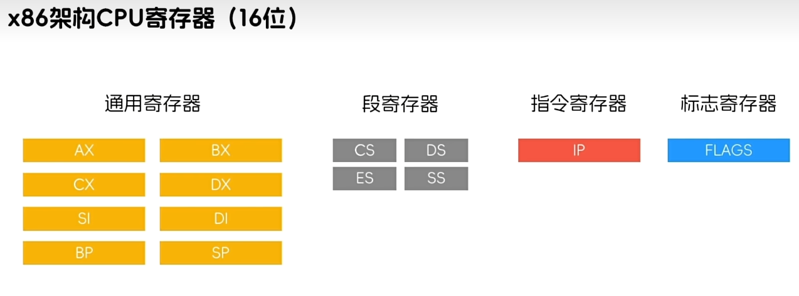
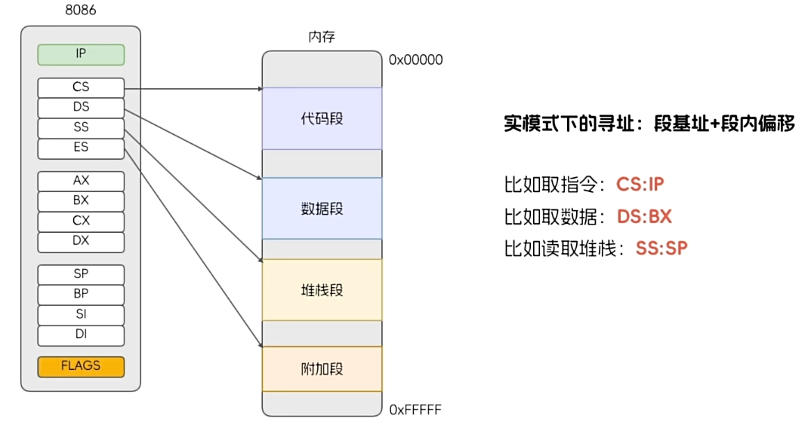
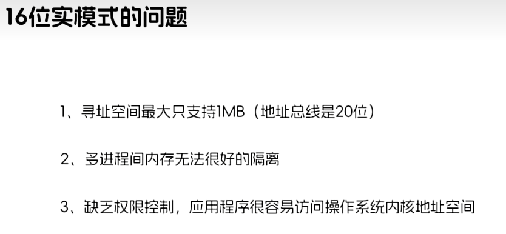
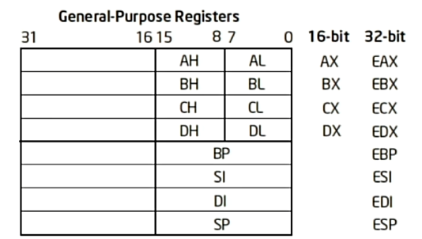
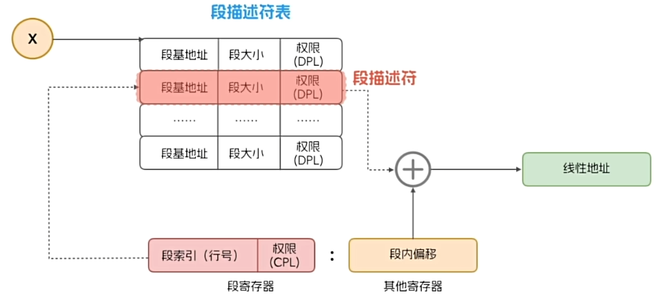
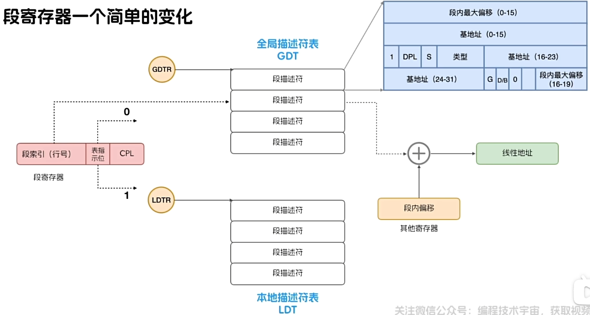

# 操作系统琐碎知识学习

## 1.x86架构CPU寄存器（16位）

## 2.实模式寻址

### 2.1 实模式寻址解决的问题
* 划分段，将代码、数据和堆栈都分离访问

### 2.2 实模式寻址存在的问题

## 3. 保护模式下分段式内存管理

### 3.1 保护模式下分段式内存管理解决的问题
* 分段式内存管理解决了**内存访问权限**的问题

### 3.2 保护模式下分段式内存管理存在的问题
* 分段式内存管理存在**内存空间隔离**的问题