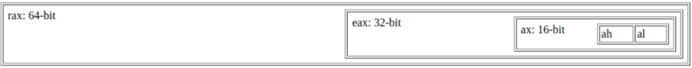
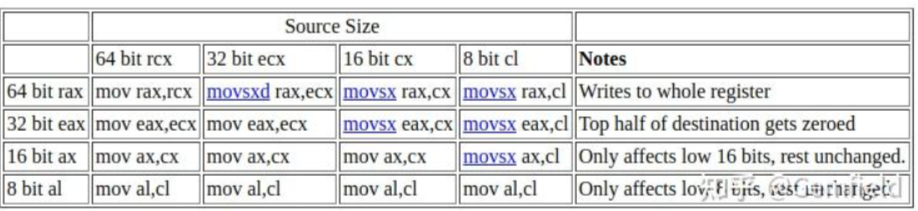
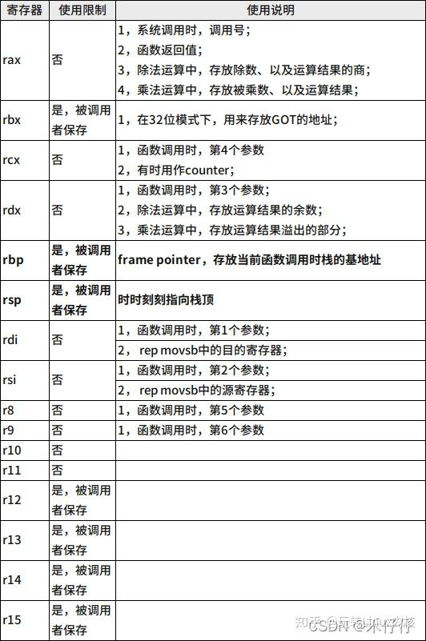
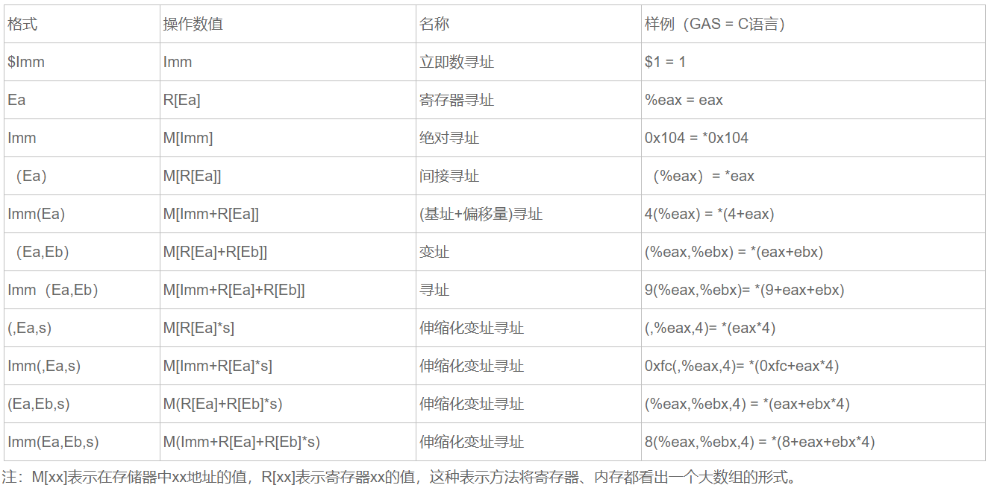
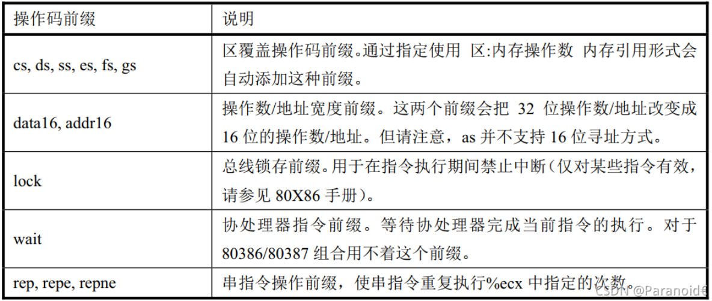

# 汇编指令集入门

## 1. x86汇编
### 1.1 x86汇编种类
* 主要有两种：Intel和AT&T
* GAS (GNU Assembler)以及LLVM生成的汇编都是AT&T的格式
* DOS、Windows使用Intel汇编，而Unix、Linux、MacOS使用AT&T汇编
* 书籍：《CSAPP》中为 AT&T 格式，《汇编语言 王爽》中为 Intel 格式

### 1.2 AT&T语法与Intel语法区别
#### 1.2.1 源/目的操作数顺序
| AT&T            | Intel        | 说明 |
| :-----          | :----        | :---- |
| movl %eax, %ebx | mov ebx, eax | Intel的目的操作数在前,源操作数在后 |

#### 1.2.2 寄存器格式
| AT&T  | Intel | 说明 |
| :-----| :---- | :---- |
| %eax  | eax   | Intel的不带百分号 |
		
#### 1.2.3 立即数的格式
| AT&T              | Intel          | 说明 |
| :-----            | :----          | :---- |
| movl $_value,%ebx | mov eax,_value | Intel的立即数前面不带\$符号 |
| movl $0xd00d,%ebx | mov ebx,0xd00d | 规则同样适用于16进制的立即数 |

#### 1.2.4 内存寻址格式
* AT&T使用小括号()，Intel语法使用中括号[]
  * 两种寻址的实际结果都应该是:imm32 + basepointer + indexpointer*indexscale

| AT&T         | Intel     | 
| :-----       | :----     | 
| imm32(basepointer,indexpointer,indexscale) | [basepointer + indexpointer*indexscale + imm32) | 

#### 1.2.5 操作数长度标识
| AT&T         | Intel     | 说明 |
| :-----       | :----     | :---- |
| movw %ax,%bx | mov bx,ax | Intel的汇编中, 操作数的长度并不通过指令符号来标识 |

```assmble
在AT&T的格式中, 每个操作都有一个字符后缀, 表明操作数的大小. 
例如:mov指令有三种形式:
movb  传送字节
movw  传送字
movl   传送双字

因为在许多机器上, 32位数都称为长字(long word), 这是沿用以16位字为标准的时代的历史习惯造成的.
果没有指定操作数长度的话，编译器将按照目标操作数的长度来设置。比如指令“mov %ax, %bx”，由于目标操作数bx的长度为word，那么编译器将把此指令等同于“movw %ax, %bx”。同样道理，指令“mov $4, %ebx”等同于指令“movl $4, %ebx”，“push %al”等同于“pushb %al”。对于没有指定操作数长度，但编译器又无法猜测的指令，编译器将会报错，比如指令“push $4”。
```

#### 1.2.6 跳转方式
##### （1）AT&T
* jmp *%eax 用寄存器%eax中的值作为跳转目标
* jmp *(%eax) 以%eax中的值作为读入的地址, 从存储器中读出跳转目标

##### （2）Intel
* jmp %eax 
* jmp (%eax)

##### （3）区别
* 在 AT&T 汇编格式中，绝对转移和调用指令（jump/call）的操作数前要加上'*'作为前缀
* 而在 Intel 格式中则不需要。

#### 1.2.7 远程转移指令和远程子调用指令的操作码
##### （1）AT&T 
* ljump $section, $offset
* lcall $section, $offset


##### （2）Intel
* jmp far section:offset
* call far section:offset

##### （3）区别
* 在 AT&T 汇编格式中为 "ljump" 和 "lcall"
* 而在 Intel 汇编格式中则为 "jmp far" 和 "call far"

## 2. AT&T语法格式
### 2.1 寄存器
#### 2.1.1 寄存器介绍
##### （1）寄存器大小与名称
* 同一个寄存器，我们可以使用其中的8bit、16bit、32bit、64bit，以ax寄存器为例，分别是ah/al、ax、eax、rax


##### （2）寄存器大小赋值
* 从大的寄存器上往小的寄存器上mov没有问题，而从小的寄存器往大的寄存器上mov就需要使用movsxd或者movsx指令


#### 2.1.2 寄存器功能
```assmble
以E开头的寄存器为32位
EAX（累加器，是算术运算的主要寄存器）
EBX（基址寄存器，在内存中寻址时存放基址）
ECX（计数器）
EDX（数据寄存器）
ESI（源变址）
EDI（目标变址）
ESP（堆栈指针）
EBP（基址指针）
EIP（程序计数器，存储的是将要执行的下一条指令放在内存中的地址）
EFLAGS（保存的是根据运算得到的结果设置的条件码ZF，CF，SF，OF）

段寄存器：
CS：代码段寄存器
SS：堆栈段寄存器
DS：数据段寄存器
ES、FS、GS：附加数据段寄存器
```


#### 2.1.3 寄存器种类
```assmble
8个32-bit寄存器 %eax，%ebx，%ecx，%edx，%edi，%esi，%ebp，%esp

8个16-bit寄存器 它们事实上是上面8个32-bit寄存器的低16位：
%ax，%bx，%cx，%dx，%di，%si，%bp，%sp

8个8-bit寄存器  %ah，%al，%bh，%bl，%ch，%cl，%dh，%dl
它们事实上是寄存器%ax，%bx，%cx，%dx的高8位和低8位

6个段寄存器   %cs(code)，%ds(data)，%ss(stack), %es，%fs，%gs

3个控制寄存器 %cr0，%cr2，%cr3； 

6个debug寄存器  %db0，%db1，%db2，%db3，%db6，%db7；
 
2个测试寄存器  %tr6，%tr7； 

8个浮点寄存器栈 %st(0)，%st(1)，%st(2)，%st(3)，%st(4)，%st(5)，%st(6)，%st(7)
```

### 2.2 指令的长度后缀
* 在指令后面加上后缀表示长度，根据操作的是1字节、2字节、4字节、8字节，分别对应后缀b, w, l, q
```assmble
movq $1, %rax
```

### 2.3 操作数顺序
* 操作数排列是从源（左）到目的（右）
```assmble
movl %eax（源）, %ebx（目的）  ; (ebx) = (eax)
```

### 2.4 立即数
* 在数前面加符号$
```assmble
movl $0x04, %ebx
pushl $1
```

### 2.5 注释
* 注释既可以使用" ;"，也可以使用" ! "

### 2.6 符号常数
#### 2.6.1 指令执行的结果是将常数0x12a3f2de装入寄存器ebx
```assmble
value: .long 0x12a3f2de 
    movl value , %ebx 
```
* 引用符号地址在符号前加符号\$, 如“movl $value, % ebx”则是将符号value的地址装入寄存器ebx

### 2.7 调用和跳转指令
#### 2.7.1 段间与段内条数
* 段内调用和跳转指令为"call"，“ret"和"jmp”，段间调用和跳转指令为"lcall"，"lret"和"ljmp"


#### 2.7.2 段间调用和跳转指令的格式
```assmble
lcall/ljmp $SECTION, $OFFSET
```

#### 2.7.3 段间返回指令
```assmble
lret $STACK-ADJUST
```

#### 2.7.4 jmp, jcc, call指令跳转
* 寄存器：如果想要跳到寄存器%rax内容对应的地址，不是写成jmpq %rax，而是写成jmpq *%rax
* 立即数：如上表所示，不用加*号
* 内存：如果想要跳转到%rip + 0x10对应的地址，不是写成jmpq 0x10(%rip)，而是写成jmpq *0x10(%rip)

### 2.8 数据声明
* 格式：命令 数据类型
```assmble
.ascii 文本字符串
.asciz 以空字符串结尾的文本字符串
.byte  字节值
.double       双精度浮点数
.float 单精度浮点数
.int    32位整数
.long 32位整数（同32）
.octa  16字节整数
.quad 8字节整数
.short 16位整数
.single        单精度浮点数（和.float同）
两个命令声明缓冲：
命令 描述
.comm        声明未初始化的数据的通用内存区域

.lcomm       声明未初始化的数据的本地通用内存区域
```

### 2.9 寻址方式
```assmble
1.直接寻址
把某个地址上的值放到寄存器中
movl 0x8000, %eax  # 把地址0x8000上的值放到eax中

2. 间址寻址
把寄存器上的值所代表的地址所指向的值放到寄存器中
movl $0x8000, %ebx  
movl %ebx, %eax  # 间址寻址, 把地址0x8000（在寄存器ebx中）上的值放到eax中

3. 基址寻址
以寄存器里的数值作为基址，加上一个常数得到最终地址，把地址上的值放到寄存器中
movl $0x8000, %eax  
movl 4(%eax), %ebx  #基址寻址, 把地址0x8004（0x8000+4）上的值放到eax中

4. 变址寻址
以两个寄存器里的数值之和加上一个常数得到最终地址，把地址上的值放到寄存器中
movl $0x8000, %eax   
movl $0x4, %ebx   
movl （%eax，%ebx）, %ecx   #变址寻址, 把地址0x8004（0x8000+4）上的值放到ecx中

movl  4（%eax，%ebx）, %ecx   #变址寻址, 把地址0x8008（0x8000+4+4）上的值放到ecx中


5. 比例变址寻址
以一个寄存器里的数值加上另一个寄存器里的数字 乘以一个比例因子（1,2,4,8）再加上一个常数得到最终地址，把地址上的值放到寄存器中
movl $0x2000, %eax   
movl $0x2, %ebx   
movl （，%eax，4）, %ecx   #比例变址寻址, 把地址0x8000（0x2000 *4）上的值放到ecx中

movl  6（，%eax，4）, %ecx   #比例变址寻址, 把地址0x8006（0x2000 *4+6）上的值放到ecx中

movl  （%ebx，%eax，4）, %ecx   #变址寻址, 把地址0x8002（0x2000*4+2）上的值放到ecx中

movl  6（%ebx，%eax，4）, %ecx   #变址寻址, 把地址0x8008（0x2000*4+2+6）上的值放到ecx中
```



### 2.10 文件组成
```assmble
.text：存放代码对应的指令 正文段

.bss：存放未初始化的全局和静态变量，在运行时该区域初始是全0

.rodata：存放只读数据和变量，例如字符串字面量

.data：存放余下的数据和变量，可读可写 数据段

.ascii：定义一个字符串并且用双引号包含

.byte: 定义一个字符用单引号

.org:定义当前的汇编的位置

伪操作符语句是汇编器使用的指示符，它通常并不会产生任何代码，它由伪操作码和0个或多个操作数组成。每个操作码都是由一个一个点字符’.'开始，表示编译过程中的位置计数器。其值是点符号出现机器指令第一个字节的地址。
```

### 2.11 编译
#### 2.11.1 as命令
* 使用as命令对汇编文件进行汇编生成目标文件：as xxx.s -o xxx.o

#### 2.11.2 ld命令
* 使用ld命令对目标文件进行链接生成可执行文件：ld xxx.o -o xxx
* 注意：ld命令进行链接要求目标文件的.text段必须有一个入口点，ld默认认为_start标签对应的代码是入口点

#### 2.12 操作码前缀
* 用于修饰随后的代码



