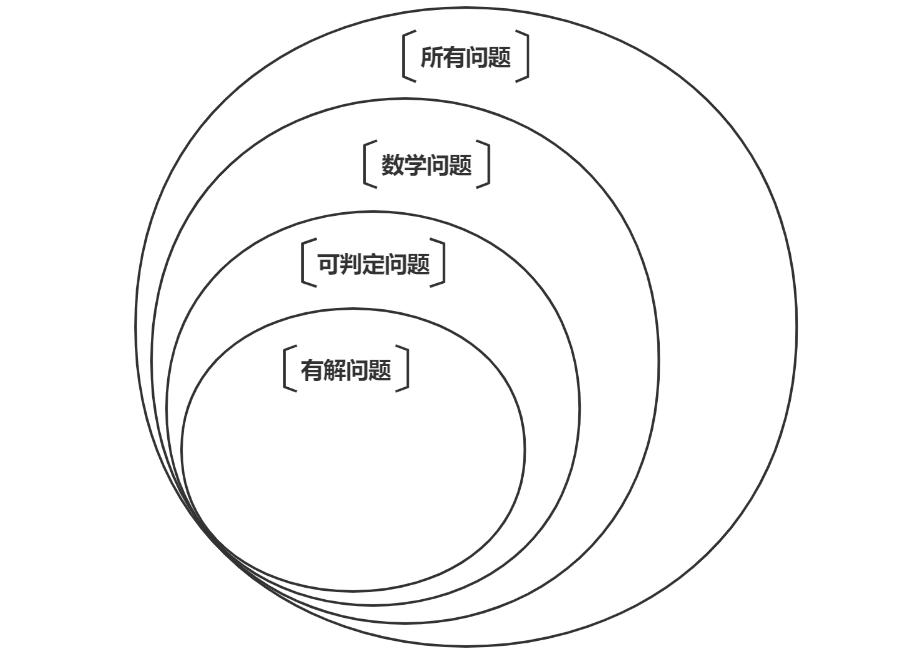
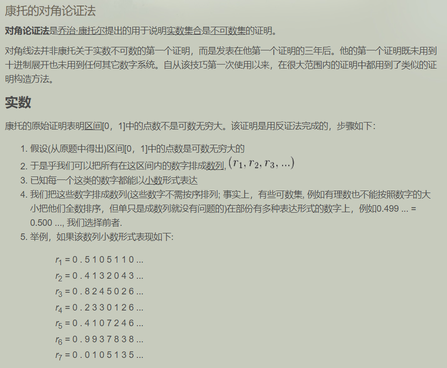
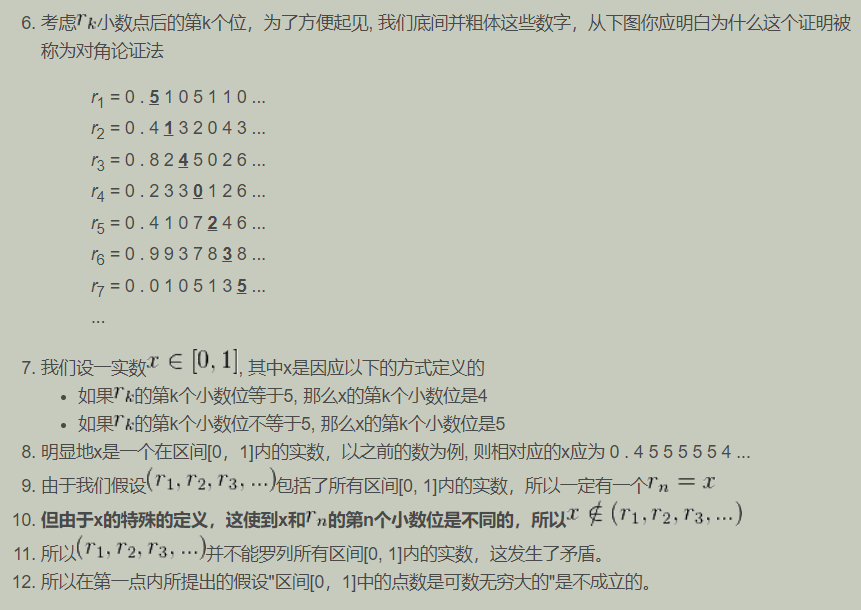
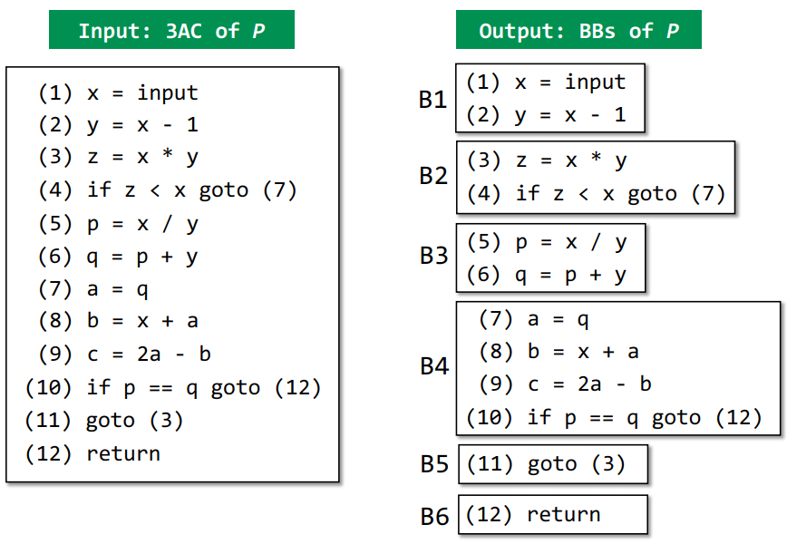
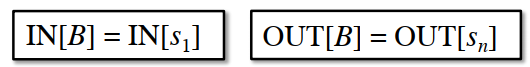

# 程序分析基础知识学习

# 一. 从有意思的程序开始

## 1. 计算机停机问题

前提假设：

* 我们有一个检测计算机是否停机的程序 `F`，入参为程序 `Q`以及 `Q`的入参 `P`
  * 如果 `F(Q, P)`返回 `true`，则我们判定 `Q`程序可以停止
  * 如果 `F(Q, P)`返回 `false`，则我们判定 `Q`程序不可以停止

设计 `Q`函数：

```cpp
Q(P):
    While(F(Q,P)){}
    return 
```

分析：

* 当 `Q`函数可以停止，则代码中 `F(Q, P)`为 `true`导致 `Q`函数不可以停止
* 当 `Q`函数不可以停止，则代码中 `F(Q, P)`为 `false`导致 `Q`函数停止

结论：

* 分析产生悖论，我们无法写出一个函数来判定程序是否可以停止

## 2.检查程序是否有内存泄漏

前提假设：

* 我们有一个检测程序是否有内存泄漏的程序 `F`，入参为程序 `Q`以及 `Q`的入参 `P`
  * 如果 `F(Q, P)`返回 `true`，则我们判定 `Q`程序有内存泄漏
  * 如果 `F(Q, P)`返回 `false`，则我们判定 `Q`程序无内存泄漏

设计 `Q`函数：

```cpp
Q(P):
    int a = malloc();
    if (F(Q,P)) {free(a);}
    else return;
```

分析：

* 当 `Q`函数有内存泄漏，则代码中 `F(Q, P)`为 `true`导致 `Q`函数无内存泄漏
* 当 `Q`函数无内存泄漏，则代码中 `F(Q, P)`为 `false`导致 `Q`函数有内存泄漏

结论：

* 分析产生悖论，我们无法写出一个函数来判定程序是否有内存泄漏

## 3. 相关集合论的悖论

### （1） 理发师问题

* 理发师只给从来不给自己理发的人理发。那么他给自己理发吗？

### （2）书目问题

* 一个图书馆编纂了一本书名词典，它列出这个图书馆里所有不列出自己书名的书。那么它列不列出自己的书名？

### （3）罗素悖论

* 𝑅 = {𝑋 | 𝑋 ∉ 𝑋} , 𝑅 ∈ 𝑅

## 4. 判定性问题

* 判定性问题：分为可判定性问题和不可判定性问题，其中计算机停机问题、检查内存是否泄漏程序等就是不可判定性问题
* 图灵机只能处理任何可以通过有限步逻辑和数学运算解决的问题，即可计算问题
* 延伸阅读
  * 复杂性理论和可计算性理论、形式语言与自动机理论
  * 希尔伯特第十问：**不定方程的可解性（所有数学问题是否都有解）**
  * 哥德尔不完备定理：****包含自然数和基本算术运算（如四则运算）的**一致系统一定不完备，即包含一个无法证明的定理******
    * 完备性：所有真命题都可以被证明
    * 一致性：一个定理要么为真要么为假任何理论体系都包含了既不能证明为真，也不能证明为假的命题
  * 图灵论文：**《论可计算数及其在判定性问题上的应用》**



## 5. 近似求解判定问题

* 对于判定问题不精确的答案就是不知道

### （1）两种近似方法

* **must分析**：若正确答案为集合S，must分析得到S的子集
* **may分析**：若正确答案为集合S，may分析得到S的超集

### （2）must分析

* 所有路径都需要满足才能确定是正确值
* 存在漏报
* 常量传播算法：判断当前变量V是否为常量值，为了保证得到正确答案，如果从输入路径可能有是也可能不是，那么V就不是常量
* 案例：
  * 常量折叠算法：将代码中的常量直接运算得到结果不用运行时计算

### （3）may分析

* 至少一条路径满足就可以确定是正确值
* 存在误报
* 可达赋值分析（Reaching Definitions analysis）：当前程序点P处能够知道哪些变量被赋值了，如果输入路径有一条被赋值，该变量就是被赋值了。
* 存活变量分析算法（Live Variables Analysis）：在程序点 p 处变量 v 的值会不会在之后被使用，如果变量在程序点之后直到程序结束的某一条路径上，先是被重新赋值，然后再被使用，那么显而易见，在 p 处变量 v 是死亡的。
* 案例：
  * 内存泄漏检查算法：使用new赋值的变量，获取该变量V所有可达的程序点，判断是否存在一条路径上有delete语句，如果有至少一条我们就不会认为变量V有内存泄漏，如果一条都没有就认为变量V存在内存泄漏，存在误报可能。
  * 寄存器分配：当判断变量存活，则保存变量的寄存器不会被换出。

## 补充. 有意思的集合论

### （1）可数集和不可数集

* 可数集：每个元素都能与自然数集N的每个元素之间能建立一一对应的集合
* 不可数集：不是可数集的集合

### （2）相关例子

* 可数集：自然数集、整数集、有理数集合(化为分数再使用整数集与整数集的笛卡尔积)
* 不可数集：无理数集合、正整数数列集合、函数集合

### （3）推论

* 可数集的子集是至多可数的
* 有限多个可数集的并集是可数的
* 在承认可数选择公理的前提下，可数多个可数集的并集是可数的
* 有限多个可数集的笛卡尔积是可数的

### （4）康托尔对角论证法





### （5）证明一下有理数集合为可数集合

有理数集合用分数表示：

    ｛r1 = a1/b1, r2 = a2/b2, ...｝

* 我们只能通过给分母或分子加1构建新的有理数，例如rx = (ai + 1)/ bi 或 rx = ai / (bi + 1) 或 rx = (ai + 1)/ (bi + 1)，这个数已经在有理数集合中了，则有理数为可数集合

### （6）证明一下无理数集合为不可数集合

无理数集合用分数表示：

    r1 = 0.234246513...

    r2 = 0.897967645...

    .....

* 我们可以构造这么一个rx，其中rx的第一位为r1的小数第一位+1，第二位为r2的小数第二位+1，以此类推（如果超过10，则变为0），那么我们新构造的数必定不在集合中，因为rx与任意一个数都不同。

# 二. 从一个简单程序来学习程序分析

## 1.一个简单程序

```cpp
    x = p + 1;
    y = q + 2;
    do
    {
        m = k;
        y = q - 1;
        if (...) {
            x = 4;
            z = 5;
        } else {
            x = m - 3;
            break;
        }
    } while (...);
    z = 2 * p;
```

* 三地址码表示：

```cpp
1.   x = p + 1
2.   y = q + 2
3.   m = k
4.   y = q - 1
5.   if ... goto 7
6.   goto 11
7.   x = 4
8.   z = 5
9.   if ... goto 3
10.  goto 14
11.  x = m - 3
12.  if ... goto 3
13.  goto 14
14.  z = 2 * p
```

# 2.三地址码

* **优点：平台无关的中间代码，便于阅读和优化**

### （1）何为三地址码

* **三地址码的一般形式**：`A = B op C`
  * A、B、C：程序员定义的名称、常量、编译生成的临时名称
  * op：表示操作
  * 由于这种形式一行最多需要三个地址表示，则称为三地址码
* 三地址码由七类语句构建而成
  1. 二元操作：`x = y op z`
  2. 一元操作：`x = op z`
  3. 赋值：`x = z`
  4. 条件转移：`if x relop y goto L`
  5. 无条件转移：`goto L`
  6. 数组赋值：

     ```cpp
     A[i] = x 
     y = A[i]
     ```
  7. 指针操作：

     ```cpp
     p = addr x 
     y = *p  
     *p = z
     ```

### （2）案例

#### 案例一：`(a+b)*(a+b+c)`

```cpp
t1=a+b
t2=t1+c
t3=t1*t2
```

#### 案例二：`while E do S`

```cpp
L:if(E==0) goto L1
  S
  goto L
L1:end
```

#### 案例三：`for(E1;E2;E3) do S`

```cpp
E1
L:if(E2) goto L1
  goto L2
L1:S
L2:end

```

#### 案例四：

```cpp
switch(E){
case 1: S1
        break;
case 2: S2
        break;
default: S3
}
```

```cpp
t=E
  goto test
L1:S1
  goto Last
L2:S2
   goto Last
L3:S3
   goto Last
test: if(E==1) goto L1
      if(E==2) goto L2
      goto L3
Last:end
```

#### （3）补充：静态单赋值形式SSA

### 3. 控制流分析

* **目标：通过控制流分析构建控制流图，进而对控制流图的节点进行数据流分析**

#### （1）基础块（Basic Block）

* 最大的一块三地址码指令，且满足如下性质
  * 只有一个入口，该入口必须是第一条指令
  * 只有一个出口，该出口必须是最后一条指令

### （2）案例



### （3）构建基础块算法

```
输入：一个三地址码序列P
输出：P的一系列Basic Block
算法：
1.获取P的所有入口：
    P的第一句是一个入口
    任何跳转的目标是一个入口
    任何跳转的下一句是一个入口
2.构建BB：
    每个入口到下一个入口之间就是一个BB
```

### （4）控制流图

* 图的基础是节点和边，其中节点为基础块，我们只需构建边即可
* 构建边的算法：

```
1.如果一个基本块 A 的最后一条语句为跳转语句，并且该跳转语句指向另一个基本块 B 的第一条语句，那么，存在一条边从基本块 A 指向基本块 B 。
2.如果一个基本块 A 的最后一条语句不是无条件跳转语句，而 B 是紧接着 A 的下一个基本块，那么，存在一条边从基本块 A 指向基本块 B 。
```


## 4. 数据流分析

* 数据流分析就是**关注的数据**在通过**节点处理**后在**边上流动**
  * 关注的数据：抽象表示（将数据进行抽象，之后讲解）
  * 节点处理：转移函数
  * 边上流动：控制流

* 一句话总结：**数据流分析就是通过控制流图让数据经过每个节点处理后在边上流动。**

### （1）数据的输入和输出

* 输入：IN
* S1、S2、S3：一条三地址码
* 输出：OUT
* 数据合并：可以是并、交等其他合并规则


### （2）分析的方向

* 正向和反向分析


### （3）控制流中数据传递约束


* **基础块内的数据流**：


* **基础块间的数据流**：

