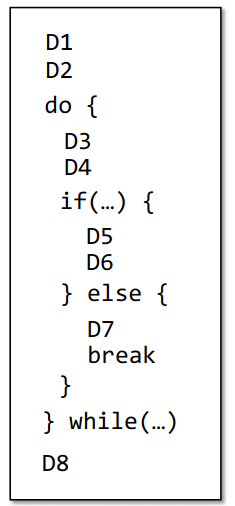
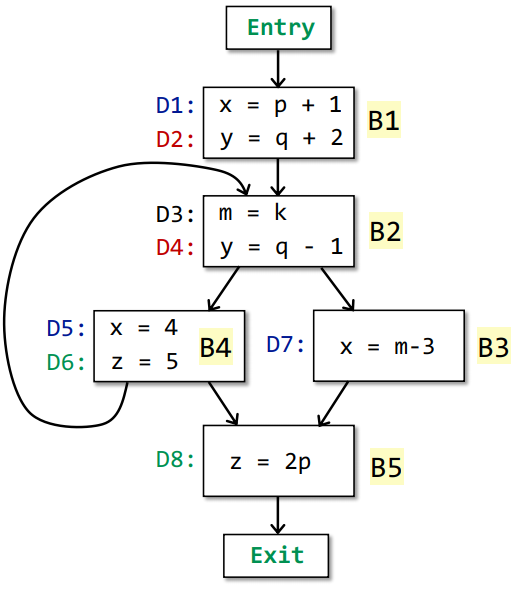
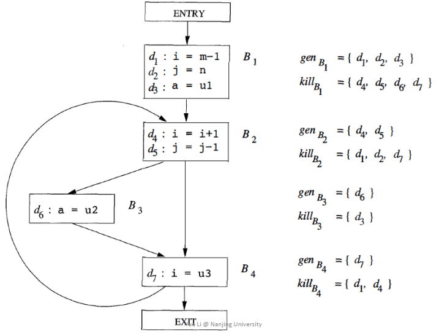

# 可达赋值分析（Reaching Definitions analysis）

## 1. 问题抽象

* 程序中变量的当前赋值语句都能到达哪些程序点

### （1）一个例子

```cpp
1. x = 1
2. y = 2
3. z = 3
4. x = 11
5. y = 22
```

分析：

* `x = 1`能到达位置 3
* `y = 2`能到达位置 5
* `z = 3、x = 11、y = 22`能到达程序结束

### （2）数据抽象

* 赋值语句数据能到达设置为1，不能到达设置为0
* 下图为每一条数据赋值语句进行编号D1,D2,...,D8
* **在控制流图边上节点处理的数据和流动的数据就是D1~D8，使用8个bit表示**



## 2. 数据的输入和输出转移函数

### （1）输入

* 当前块的输入：可以到达哪些变量的赋值编号
  * 所有前项块的输出，通过自定义的合并函数进行合并后的结果
  * 此分析为并集操作的结果

```
IN[B] = U OUT[P] （P是B一个前项节点）
```

### （2）输出

* 当前块的输入是
  * IN[B]：传入可到达的赋值编号
  * kill(B)：删除当前块赋值的变量对应编号
  * gen(B)：加入当前块赋值编号

```
OUT[B] = gen(B) U (IN[B] - kill(B)) 
```

### （3）例子



## 3. 可达赋值分析算法

```
输入：CFG图，包含了gen集合和kill集合
输出：每一个基础块的IN集合和OUT集合
算法：
    OUT[entry] = 空集                                     将初始输出置空，得到第一个基础块输入就是空
    for 基础块B的集合                                     将每一个基础块的输出置空，得到下一个基础块的输入都是空
	OUT[B] = 空集
    while OUT有变化                                       判断所有输出集合，只要输出集合中的一个有变化则继续  
        for 基础块B的集合                                 循环每个基础块执行转移函数
             IN[B] = U OUT[P] （P是B一个前项节点）
             OUT[B] = gen(B) U (IN[B] - kill(B))
```

## 4. 执行展示

### （1）初始化

* 初始状态设置D1到D8全零，表示没有可以到达的变量赋值

### （2）迭代

| 第一次迭代     | 基础块 | IN                      | OUT       | 解释                         |
| -------------- | ------ | ----------------------- | --------- | ---------------------------- |
|                | B1     | 0000 0000               | 1100 0000 | 开始时输出全零，此处输出变化 |
|                | B2     | 1100 0000               | 1011 0000 | 开始时输出全零，此处输出变化 |
|                | B3     | 1011 0000               | 0011 0010 | 开始时输出全零，此处输出变化 |
|                | B4     | 1011 0000               | 0011 1100 | 开始时输出全零，此处输出变化 |
|                | B5     | 0011 0010 U 0011 1100   | 0011 1011 | 开始时输出全零，此处输出变化 |
|                |        |                         |           |                              |
| 第二次迭代     | 基础块 | IN                      | OUT       |                              |
|                | B1     | 0000 0000               | 1100 0000 |                              |
|                | B2     | 1100 0000 U  0011 1100 | 1011 1100 | 此处输出变化                 |
|                | B3     | 1011 1100               | 0011 0110 | 此处输出变化                 |
|                | B4     | 1011 1100               | 0011 1100 |                              |
|                | B5     | 0011 0110 U 0011 1100   | 0011 1011 |                              |
|                |        |                         |           |                              |
| 第三次迭代     | 基础块 | IN                      | OUT       |                              |
|                | B1     | 0000 0000               | 1100 0000 |                              |
|                | B2     | 1100 0000 U 0011 1100   | 1011 1100 |                              |
|                | B3     | 1011 1100               | 0011 0110 |                              |
|                | B4     | 1011 1100               | 0011 1100 |                              |
|                | B5     | 0011 0110 U 0011 1100   | 0011 1011 |                              |
|                |        |                         |           |                              |
| 无变化迭代停止 |        |                         |           |                              |

### （3）使用WorkList算法优化当前算法

* 思路：用一个集合保存变化的OUT，然后只处理变换OUT的相关块即可

### （4）算法正确性解读

* 此算法是may分析，由于只要有一条路径可达就可达，则存在误报可能存在一些不可达的也被包含到结果集合中。
* 例如前面说过的内存泄漏检查算法，我们可以说每个new出来的变量都可以到达delete语句，这样不会修改原来程序保证了原来程序的语义，此算法正确