# 程序分析理论讲解

# 一.从算法中思考相关问题

## 1.三个问题

* **算法能够保证一定会停止吗或者一定能够达到不动点吗？即迭代算法真的能产生一个解决方案吗？迭代一定会停止吗？**
* **如果问题1的回答是肯定的话，那是否只有一个不动点或一个解决方案？如果解决方案多于一个的话，迭代算法得到的会是最优的吗？**
* **什么时候迭代算法能够达到不动点，即什么时候能够得到解决方案？**

## 2.先给结论：

* 算法一定能够到达不动点，迭代一定会停止。
* 问题可以有多个不动点，迭代算法一定得到最优的。
* 做多执行h * k次，h为格的高度，k为控制流图节点个数

# 二. 格理论基础

* 参考离散数学中数理逻辑、集合论以及代数结构相关章节
* 格理论表明了数据之间的关系以及相关性质，正是利用这些关系和性质猜得到上述问题的结论

## 1. 二元关系

* 有序对和二元关系定义
* 二元关系R可能存在的5个性质，以及使用三种方式表示

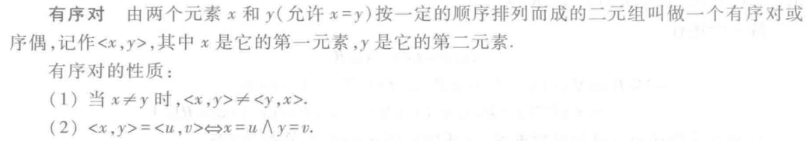

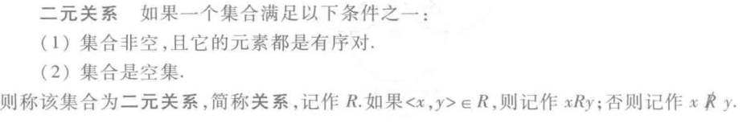

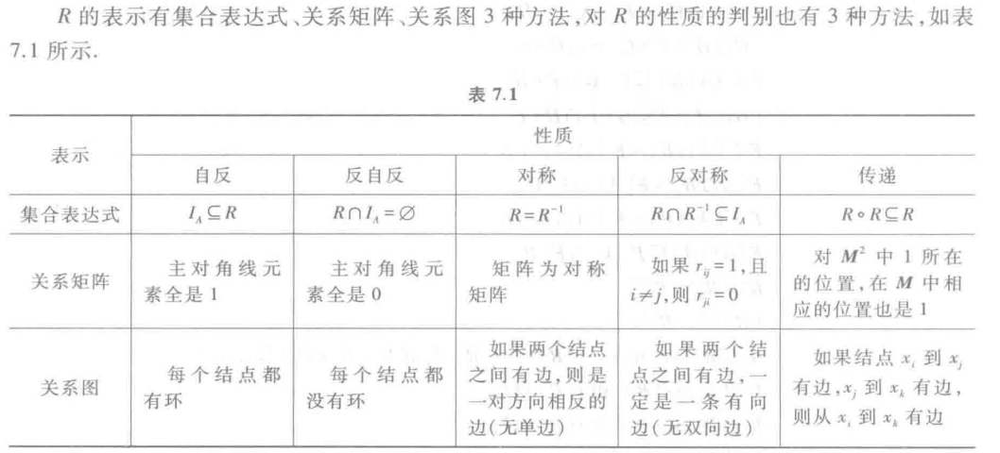

## 2. 偏序关系

### （1）偏序关系、偏序集以及哈斯图画法

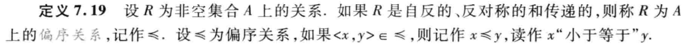

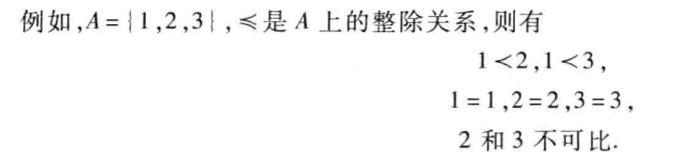

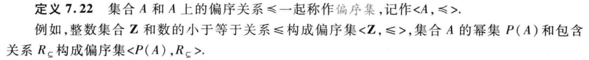

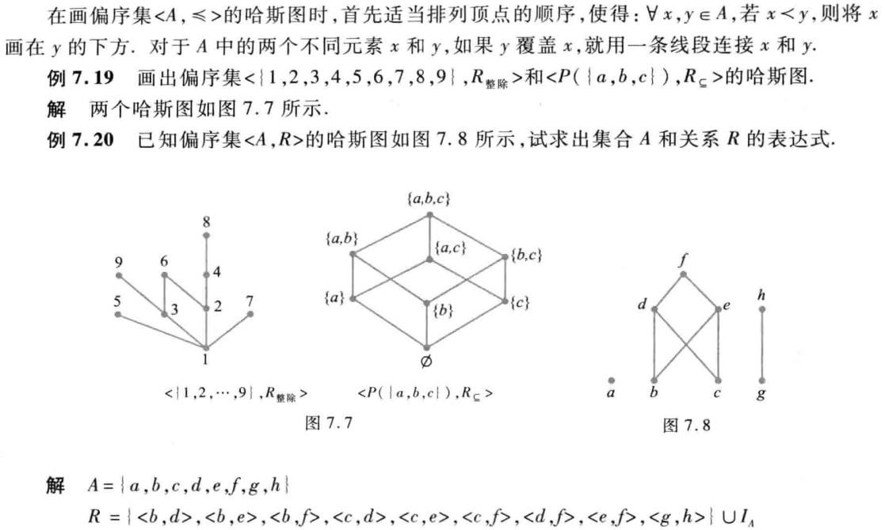

#### 例子：

```
1.当 P 为整数集合，⊑ 为小于等于关系时。(P, ⊑) 是一个偏序集。
2.当 P 为整数集合，⊑ 为小于关系时。(P, ⊑) 不是一个偏序集。因为不满足自反性。
3.当 P 为英文单词集合，⊑ 为一个单词是另一个单词的子串关系时（比如 a ⊑ b ,意味着单词 a 是单词 b 的子串）。(P, ⊑) 是一个偏序集。

```

### （2）元与界

* glb：最大下界
* lub：最小上界
* ⊥：最小元
* T：最大元

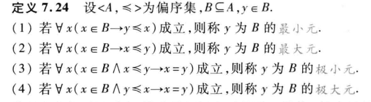

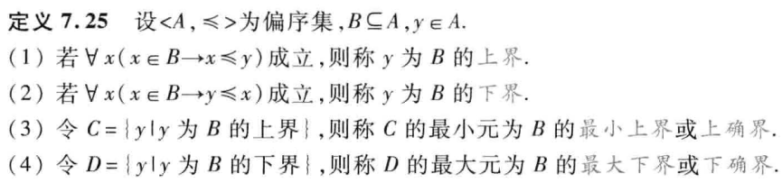

#### 补充

```
命题逻辑的基本概念
联结词： ¬ ∧ ∨ → ↔
1.¬p：符号¬称作否定联结词。规定¬p为真当且仅当p为假。
2.p∧q：∧称作合取联结词。规定p∧q为真当且仅当p与q同时为真。
3.p∨q：∨称作析取联结词。规定p∨q为假当且仅当p与q同时为假。
4.p→q：称p是蕴涵式的前件，q为蕴涵式的后件，→称作蕴涵联结词，并规定p→q为假当且仅当p为真q为假。
5.p ↔ q：↔称作等价联结词，规定p↔q当且仅当p与q同时为真或同时为假
```

#### 例子

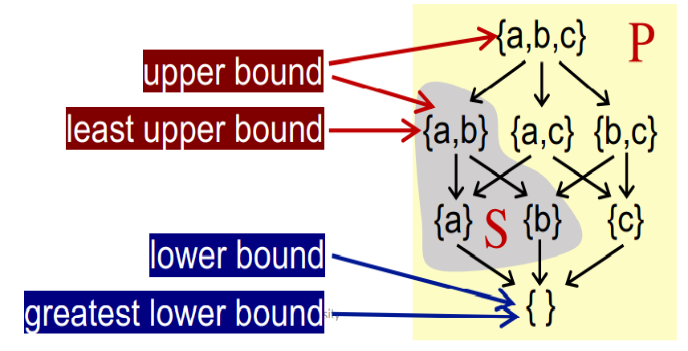

## 3. 格与布尔代数

* 为什么叫格：我的理解是像一个菱形的晶格

### （1）格（Lattice）

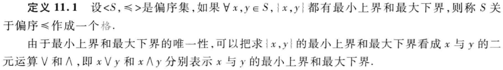

### （2）半格（Semilattice）

* 要么仅有最小上界，要么仅有最大下界

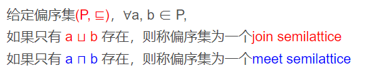

### （3）完全格（完备格 Complete Lattice）

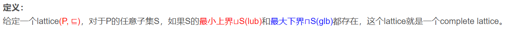

```
例子：
1.如果P是正整数集，偏序符号代表小于等于，由于任意两个数之间都有lub和glb，因此是lattice；但是由于存在无穷大，也就没有最小上界lub了，因此不是完全格。
2.幂集的例子如下：
```

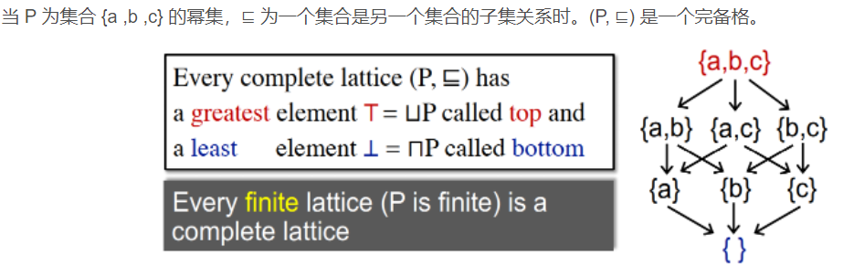

### （4）乘积格（Product Lattice）

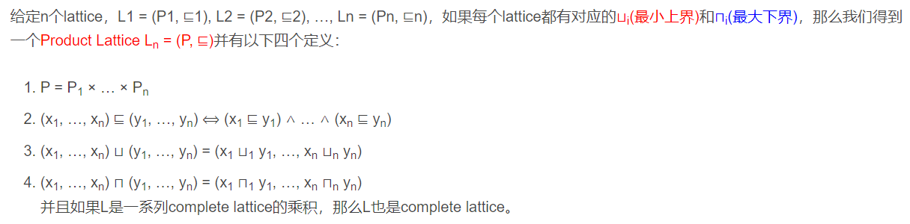

# 五.格理论应用到数据流中

## 1. 利用格的数据流分析框架

```
一个数据流分析框架(D, L, F)包含:

D：数据流的方向，前向或者后向
L：包含数值作用域V和操作符meet ⊓ 或 join ⊔ 的lattice
F：一系列V to V的传递函数
```

## 2. 单调性与不动点定理

### （1）单调性

```
定义：
    在格上函数的单调性定义：A function f: L → L (L is a lattice) is monotonic if ∀x, y ∈ L, x ⊑ y ⟹ f(x) ⊑ f(y) 。
解释：
    如果从格L中取出两个元素x,y，当x与y具有关系⊑，则通过函数f映射后f(x)与f(y)也具有关系⊑
    则认为格L上的函数映射f，将格L通过f映射到格L是具有单调性的。
```

### （2）不动点定理

```
定义：
   给一个完全格(L, ⊑)，以及格L上的函数映射f，将格L通过f映射到格L是具有单调性的。
   则
     1.通过不断迭代f(⊥), f(f(⊥)), …, f^k(⊥)，能够找到最小不动点。
     2.通过不断迭代 f(T), f(f(T)), …, f^k(T) ，能够找到最大不动点
```

### （3）不动点定理证明

* 下面是最小不动点证明，同理也可证明最大不动点
* `⊥ ⊑ f(⊥) ⊑ f(f(⊥)) ⊑ … ⊑ f^i(⊥)，此为上升链，f为Widening加宽算子`
* `T ⊑' f(T) ⊑' f(f(T)) ⊑' … ⊑' f^i(T)，其中`⊑'`与`⊑`含义相反，此为下降链，f为Narrowing收窄算子`

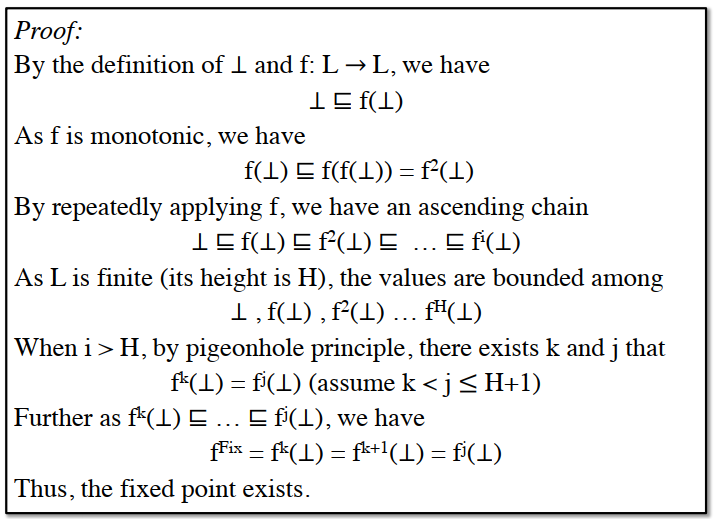

## 3. 问题结论

### （1）问题一：**算法能够保证一定会停止吗或者一定能够达到不动点吗？即迭代算法真的能产生一个解决方案吗？迭代一定会停止吗？**

* 算法一定能够到达不动点，迭代一定会停止

```
算法都在幂集上，则在完全格上运算且有如下性质：
    由于may分析使用并，则只要有1就变为1，则单调递增，上界为 T （全1）
    由于must分析使用交，则只要有0就变为，则单调递减，下界为 ⊥（全0）
证明分两步：1.是完全格，2.有单调性
```
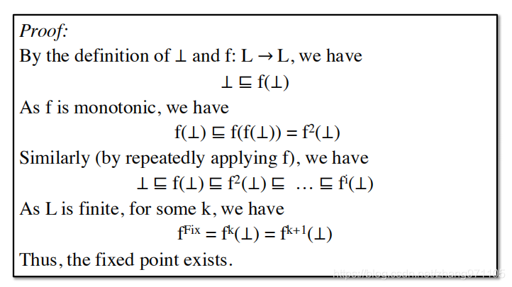

### **（2）如果问题1的回答是肯定的话，那是否只有一个不动点或一个解决方案？如果解决方案多于一个的话，迭代算法得到的会是最优的吗？**

* 问题可以有多个不动点，迭代算法一定得到最优的。

```
由问题一得到存在不动点，但是不动点不唯一
证明迭代算法得到的不动点最优如下（以may分析为例）：
    由于迭代算法使用下界⊥出发的，则数学归纳法得到最优
    因为是x为不动点所以在证明中f^i(x) = x成立，得到结论：k 次迭代得到的不动点小于任意存在的一个不动点
```

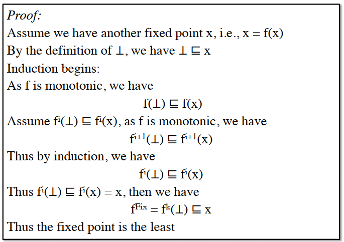

### **（3）什么时候迭代算法能够达到不动点，即什么时候能够得到解决方案？**

* 做多执行h * k次，h为格的高度，k为控制流图节点个数

```
以may分析为例：
    1.由于数据流满足完全格的要求，则当基础块节点的OUT变化时，OUT对应哈斯图节点不断上移，直到OUT不变化则停止，最多上升到最大上界 T （全1）
    2.由于基础块节点有k个（v1,...,vk），并且从最小下界⊥（全0）开始，如果每次迭代仅变化一个基础块节点且仅在哈斯图上上移1位，则当所有基础块节点到达T （全1）时，需要执行h * k次迭代。
得出结论：最多迭代h * k次
```

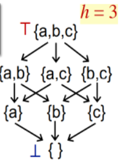

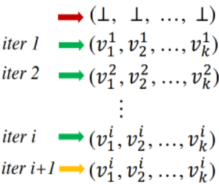

