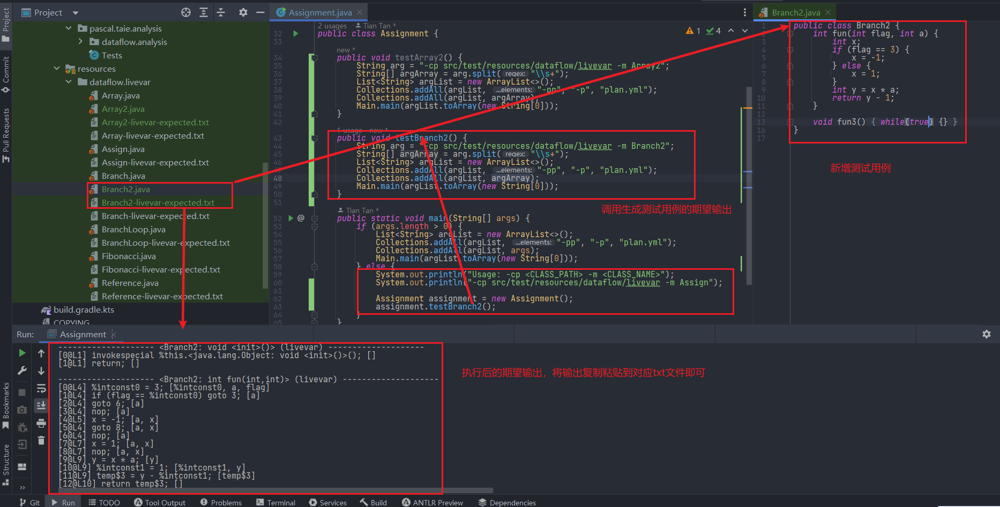
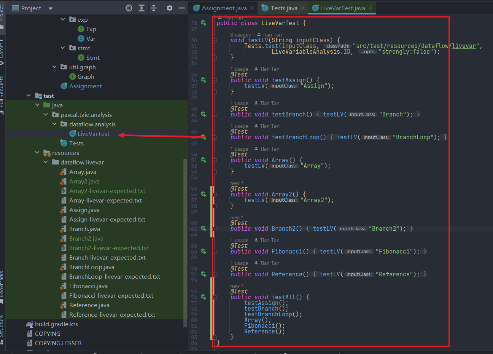

# 程序分析实战入门

## 1. 实验资料来源
* 实验手册：https://tai-e.pascal-lab.net/lectures.html
* 实验OJ：https://oj.pascal-lab.net/problem
* 参考实验作业：https://github.com/ikitsuchi/tai-e-programming-assignments

## 2.实验环境搭建
* 按照手册配置搭建即可：https://tai-e.pascal-lab.net/intro/setup.html

## 3.自制测试用例
### 3.1 总览


### 3.2 修改Assigment源码
```java
public class Assignment {

    // 自定义测试用例
    public void testArray2() {
        String arg = "-cp src/test/resources/dataflow/livevar -m Array2";
        String[] argArray = arg.split("\\s+");
        List<String> argList = new ArrayList<>();
        Collections.addAll(argList, "-pp", "-p", "plan.yml");
        Collections.addAll(argList, argArray);
        Main.main(argList.toArray(new String[0]));
    }

    // 自定义测试用例
    public void testBranch2() {
        String arg = "-cp src/test/resources/dataflow/livevar -m Branch2";
        String[] argArray = arg.split("\\s+");
        List<String> argList = new ArrayList<>();
        Collections.addAll(argList, "-pp", "-p", "plan.yml");
        Collections.addAll(argList, argArray);
        Main.main(argList.toArray(new String[0]));
    }

    public static void main(String[] args) {
        if (args.length > 0) {
            List<String> argList = new ArrayList<>();
            Collections.addAll(argList, "-pp", "-p", "plan.yml");
            Collections.addAll(argList, args);
            Main.main(argList.toArray(new String[0]));
        } else {
            System.out.println("Usage: -cp <CLASS_PATH> -m <CLASS_NAME>");
            System.out.println("-cp src/test/resources/dataflow/livevar -m Assign");

            Assignment assignment = new Assignment();
            assignment.testBranch2();
        }
    }
}
```
### 3.3 测试代码
```java
public class Branch2 {
    int fun(int flag, int a) {
        int x;
        if (flag == 3) {
            x = -1;
        } else {
            x = 1;
        }
        int y = x * a;
        return y - 1;
    }

    void fun3() {
        while(true) {}
    }
}

```

### 3.4 执行结果
```shell
Usage: -cp <CLASS_PATH> -m <CLASS_NAME>
-cp src/test/resources/dataflow/livevar -m Assign
Tai-e starts ...
Writing options to output\options.yml
WorldBuilder starts ...
Warning: main class 'Branch2' does not have main(String[]) method!
9840 classes with 97790 methods in the world
WorldBuilder finishes, elapsed time: 4.92s
throw starts ...
1 classes in scope (app) of class analyses
3 methods in scope (app) of method analyses
throw finishes, elapsed time: 0.06s
cfg starts ...
cfg finishes, elapsed time: 0.04s
livevar starts ...
livevar finishes, elapsed time: 0.01s
process-result starts ...
-------------------- <Branch2: void <init>()> (livevar) --------------------
[0@L1] invokespecial %this.<java.lang.Object: void <init>()>(); []
[1@L1] return; []

-------------------- <Branch2: int fun(int,int)> (livevar) --------------------
[0@L4] %intconst0 = 3; [%intconst0, a, flag]
[1@L4] if (flag == %intconst0) goto 3; [a]
[2@L4] goto 6; [a]
[3@L4] nop; [a]
[4@L5] x = -1; [a, x]
[5@L4] goto 8; [a, x]
[6@L4] nop; [a]
[7@L7] x = 1; [a, x]
[8@L7] nop; [a, x]
[9@L9] y = x * a; [y]
[10@L9] %intconst1 = 1; [%intconst1, y]
[11@L9] temp$3 = y - %intconst1; [temp$3]
[12@L10] return temp$3; []

-------------------- <Branch2: void fun3()> (livevar) --------------------
[0@L13] nop; []
[1@L14] goto 2; []
[2@L14] nop; []
[3@L14] goto 0; []
[4@L14] return; []

process-result finishes, elapsed time: 0.02s
Tai-e finishes, elapsed time: 5.35s

Process finished with exit code 0
```

## 4.单元测试
### 4.1 单元测试总览


### 4.2 单元测试代码
* 直接执行testAll测试所有用例

```java
public class LiveVarTest {

    void testLV(String inputClass) {
        Tests.test(inputClass, "src/test/resources/dataflow/livevar",
                LiveVariableAnalysis.ID, "strongly:false");
    }

    @Test
    public void testAssign() {
        testLV("Assign");
    }

    @Test
    public void testBranch() {
        testLV("Branch");
    }

    @Test
    public void testBranchLoop() {
        testLV("BranchLoop");
    }

    @Test
    public void Array() {
        testLV("Array");
    }

    @Test
    public void Array2() {
        testLV("Array2");
    }

    @Test
    public void Branch2() {
        testLV("Branch2");
    }

    @Test
    public void Fibonacci() {
        testLV("Fibonacci");
    }

    @Test
    public void Reference() {
        testLV("Reference");
    }

    @Test
    public void testAll() {
        testAssign();
        testBranch();
        testBranchLoop();
        Array();
        Fibonacci();
        Reference();
    }
}
```