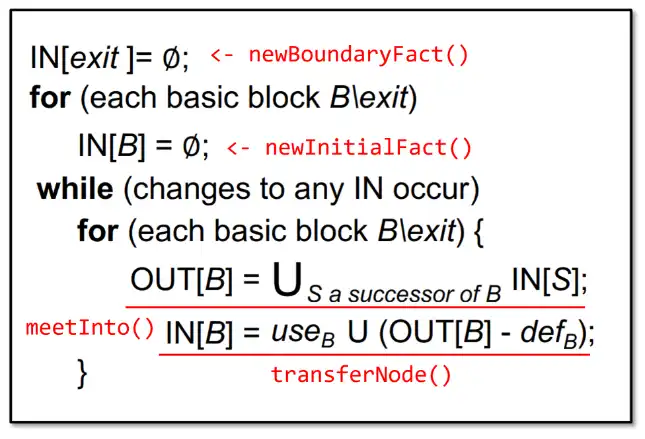

# 程序分析实战实验篇初步

## 1. 实验篇初步总览
### 1.1 包含实验项
* 作业 1：活跃变量分析和迭代求解器
* 作业 2：常量传播和 Worklist 求解器
* 作业 3：死代码检测
* 作业 4：类层次结构分析与过程间常量传播

## 2.作业 1：活跃变量分析和迭代求解器
### 2.1 算法介绍


### 2.2 需要实现的API
#### 2.2.1 LiveVariableAnalysis.java
* 任意边界边的数据：newBoundaryFact
* 任意内部边初始化数据：newInitialFact
* 节点所有入边数据聚合算法：meetInto
* 节点数据处理函数：transferNode

```java
SetFact newBoundaryFact(CFG)
SetFact newInitialFact()
void meetInto(SetFact,SetFact)
boolean transferNode(Stmt,SetFact,SetFact)
```

#### 2.2.2 Solver.java
* 初始化反向数据流所有边的数据：initializeBackward

```java
void initializeBackward(CFG<Node> cfg, DataflowResult<Node, Fact> result)
```

#### 2.2.3 IterativeSolver.java
* 迭代反向处理控制流图上所有节点和边数据直到到达固定点不变化：doSolveBackward

```java
void doSolveBackward(CFG<Node> cfg, DataflowResult<Node, Fact> result)
```

### 2.3 实现代码
#### 2.3.1 LiveVariableAnalysis.java
```java
@Override
public SetFact<Var> newBoundaryFact(CFG<Stmt> cfg) {
    // TODO - finish me
    return new SetFact<>();
}

@Override
public SetFact<Var> newInitialFact() {
    // TODO - finish me
    return new SetFact<>();
}

/**
 * 将前一个合并到后一个集合中
 *
 * @param fact
 * @param target
 */
@Override
public void meetInto(SetFact<Var> fact, SetFact<Var> target) {
    // TODO - finish me
    // 将所有后继的IN合入当前节点的OUT
    target.union(fact);
}

/**
 * @param stmt
 * @param in
 * @param out
 * @return
 */
@Override
public boolean transferNode(Stmt stmt, SetFact<Var> in, SetFact<Var> out) {
    // TODO - finish me
    Optional<LValue> def = stmt.getDef();
    List<RValue> uses = stmt.getUses();
    SetFact<Var> inCopy = in.copy();


    // 当前节点的OUT拷贝一份防止修改
    SetFact<Var> outCopy = out.copy();

    // 当前节点OUTCopy先删除重定义的变量
    def.ifPresent(lValue -> {
        if (lValue instanceof Var) {
            outCopy.remove(((Var) lValue));
        }
    });


    // 当前节点OUTCopy再加入使用的变量
    for (RValue use : uses) {
        if (use instanceof Var) {
            outCopy.add((Var) use);
        }
    }

    // 清空IN，放入计算后的OUT
    in.clear();
    in.union(outCopy);

    // 如果原来的INCopy和当前的IN不一致，则有改动需要继续循环
    return !inCopy.equals(in);
}
```

#### 2.3.2 Solver.java
```java
protected void initializeBackward(CFG<Node> cfg, DataflowResult<Node, Fact> result) {
    // TODO - finish me
    result.setInFact(cfg.getExit(), this.analysis.newBoundaryFact(cfg));

    for (Node node : cfg) {
        if(node != cfg.getExit()) {
            result.setInFact(node, this.analysis.newInitialFact());
        }
    }
}
```

#### 2.3.2 IterativeSolver.java
```java
@Override
protected void doSolveBackward(CFG<Node> cfg, DataflowResult<Node, Fact> result) {
    // TODO - finish me
    boolean changeFlag;

    // 循环判断有IN改变则继续
    do {
        changeFlag = false;

        for (Node node : cfg) {
            // 排除exit节点的循环
            if (node != cfg.getExit()) {

                // 获取当前节点所有后继结点，将它们的IN合并
                Fact outFact = this.analysis.newInitialFact();
                for (Node sucNode : cfg.getSuccsOf(node)) {
                    this.analysis.meetInto(result.getInFact(sucNode), outFact);
                }
                result.setOutFact(node, outFact);

                // 计算当前节点IN，并且如果改变则需要继续计算
                if (this.analysis.transferNode(node, result.getInFact(node), result.getOutFact(node))) {
                    changeFlag = true;
                }
            }
        }

    } while (changeFlag);

}
```