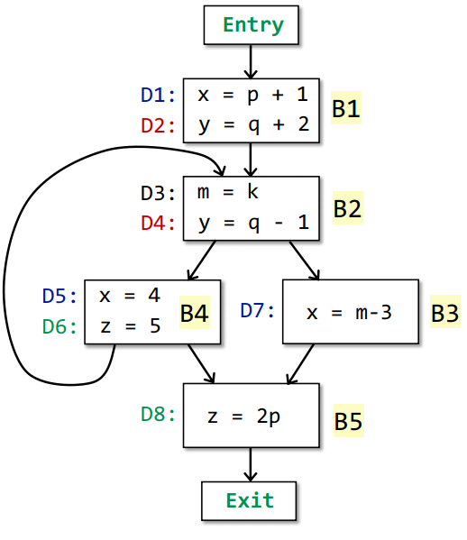
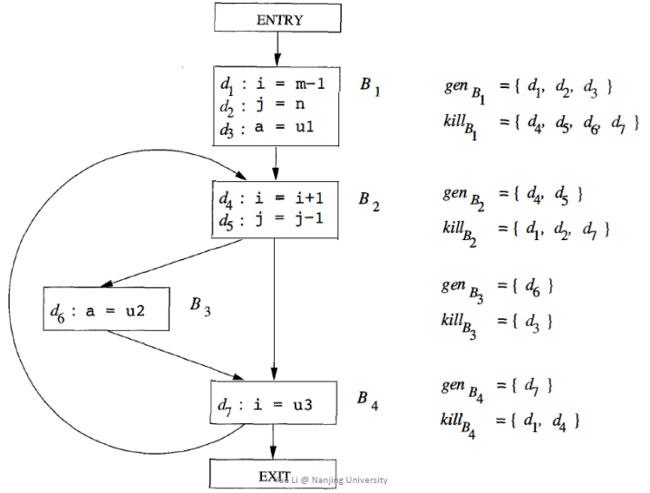
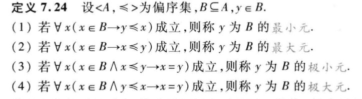
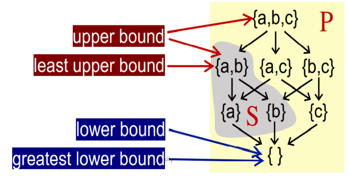
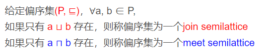
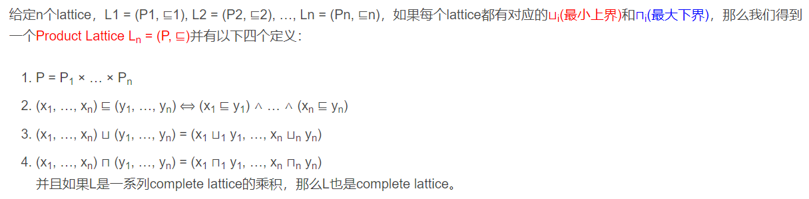
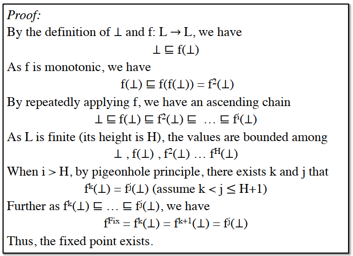
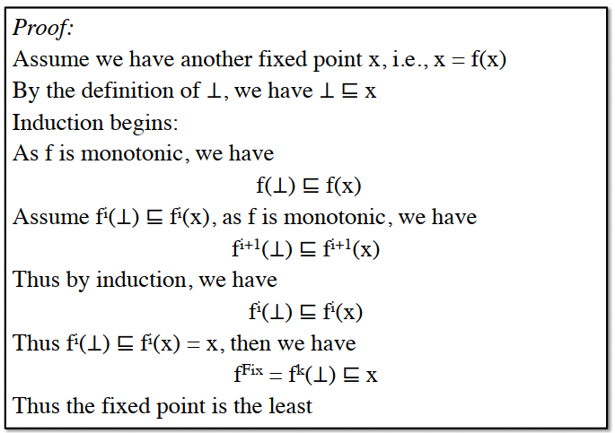
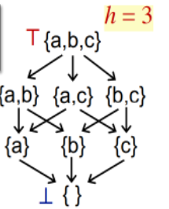

# 程序分析入门

# 一. 从有意思的程序开始

## 1. 计算机停机问题

前提假设：

* 我们有一个检测计算机是否停机的程序 `F`，入参为程序 `Q`以及 `Q`的入参 `P`
  * 如果 `F(Q, P)`返回 `true`，则我们判定 `Q`程序可以停止
  * 如果 `F(Q, P)`返回 `false`，则我们判定 `Q`程序不可以停止

设计 `Q`函数：

```cpp
Q(P):
    While(F(Q,P)){}
    return 
```

分析：

* 当 `Q`函数可以停止，则代码中 `F(Q, P)`为 `true`导致 `Q`函数不可以停止
* 当 `Q`函数不可以停止，则代码中 `F(Q, P)`为 `false`导致 `Q`函数停止

结论：

* 分析产生悖论，我们无法写出一个函数来判定程序是否可以停止

## 2.检查程序是否有内存泄漏

前提假设：

* 我们有一个检测程序是否有内存泄漏的程序 `F`，入参为程序 `Q`以及 `Q`的入参 `P`
  * 如果 `F(Q, P)`返回 `true`，则我们判定 `Q`程序有内存泄漏
  * 如果 `F(Q, P)`返回 `false`，则我们判定 `Q`程序无内存泄漏

设计 `Q`函数：

```cpp
Q(P):
    int a = malloc();
    if (F(Q,P)) {free(a);}
    else return;
```

分析：

* 当 `Q`函数有内存泄漏，则代码中 `F(Q, P)`为 `true`导致 `Q`函数无内存泄漏
* 当 `Q`函数无内存泄漏，则代码中 `F(Q, P)`为 `false`导致 `Q`函数有内存泄漏

结论：

* 分析产生悖论，我们无法写出一个函数来判定程序是否有内存泄漏

## 3. 相关集合论的悖论

### （1） 理发师问题

* 理发师只给从来不给自己理发的人理发。那么他给自己理发吗？

### （2）书目问题

* 一个图书馆编纂了一本书名词典，它列出这个图书馆里所有不列出自己书名的书。那么它列不列出自己的书名？

### （3）罗素悖论

* 𝑅 = {𝑋 | 𝑋 ∉ 𝑋} , 𝑅 ∈ 𝑅

## 4. 判定性问题

* 判定性问题：分为可判定性问题和不可判定性问题，其中计算机停机问题、检查内存是否泄漏程序等就是不可判定性问题
* 图灵机只能处理任何可以通过有限步逻辑和数学运算解决的问题，即可计算问题
* 延伸阅读
  * 复杂性理论和可计算性理论、形式语言与自动机理论
  * 希尔伯特第十问：**不定方程的可解性（所有数学问题是否都有解）**
  * 哥德尔不完备定理：****包含自然数和基本算术运算（如四则运算）的**一致系统一定不完备，即包含一个无法证明的定理******
    * 完备性：所有真命题都可以被证明
    * 一致性：一个定理要么为真要么为假任何理论体系都包含了既不能证明为真，也不能证明为假的命题
  * 图灵论文：**《论可计算数及其在判定性问题上的应用》**


## 5. 近似求解判定问题

* 对于判定问题不精确的答案就是不知道

### （1）两种近似方法

* **must分析**：若正确答案为集合S，must分析得到S的子集
* **may分析**：若正确答案为集合S，may分析得到S的超集

### （2）must分析

* 所有路径都需要满足才能确定是正确值
* 存在漏报
* 常量传播算法：判断当前变量V是否为常量值，为了保证得到正确答案，如果从输入路径可能有是也可能不是，那么V就不是常量
* 案例：
  * 常量折叠算法：将代码中的常量直接运算得到结果不用运行时计算

### （3）may分析

* 至少一条路径满足就可以确定是正确值
* 存在误报
* 可达赋值分析（Reaching Definitions analysis）：当前程序点P处能够知道哪些变量被赋值了，如果输入路径有一条被赋值，该变量就是被赋值了。
* 存活变量分析算法（Live Variables Analysis）：在程序点 p 处变量 v 的值会不会在之后被使用，如果变量在程序点之后直到程序结束的某一条路径上，先是被重新赋值，然后再被使用，那么显而易见，在 p 处变量 v 是死亡的。
* 案例：
  * 内存泄漏检查算法：使用new赋值的变量，获取该变量V所有可达的程序点，判断是否存在一条路径上有delete语句，如果有至少一条我们就不会认为变量V有内存泄漏，如果一条都没有就认为变量V存在内存泄漏，存在误报可能。
  * 寄存器分配：当判断变量存活，则保存变量的寄存器不会被换出。

## 补充. 有意思的集合论

### （1）可数集和不可数集

* 可数集：每个元素都能与自然数集N的每个元素之间能建立一一对应的集合
* 不可数集：不是可数集的集合

### （2）相关例子

* 可数集：自然数集、整数集、有理数集合(化为分数再使用整数集与整数集的笛卡尔积)
* 不可数集：无理数集合、正整数数列集合、函数集合

### （3）推论

* 可数集的子集是至多可数的
* 有限多个可数集的并集是可数的
* 在承认可数选择公理的前提下，可数多个可数集的并集是可数的
* 有限多个可数集的笛卡尔积是可数的

### （4）康托尔对角论证法


### （5）证明一下有理数集合为可数集合

有理数集合用分数表示：

    ｛r1 = a1/b1, r2 = a2/b2, ...｝

* 我们只能通过给分母或分子加1构建新的有理数，例如rx = (ai + 1)/ bi 或 rx = ai / (bi + 1) 或 rx = (ai + 1)/ (bi + 1)，这个数已经在有理数集合中了，则有理数为可数集合

### （6）证明一下无理数集合为不可数集合

无理数集合用分数表示：

    r1 = 0.234246513...

    r2 = 0.897967645...

    .....

* 我们可以构造这么一个rx，其中rx的第一位为r1的小数第一位+1，第二位为r2的小数第二位+1，以此类推（如果超过10，则变为0），那么我们新构造的数必定不在集合中，因为rx与任意一个数都不同。

# 二. 从一个简单程序来学习程序分析

## 1.一个简单程序

```cpp
    x = p + 1;
    y = q + 2;
    do
    {
        m = k;
        y = q - 1;
        if (...) {
            x = 4;
            z = 5;
        } else {
            x = m - 3;
            break;
        }
    } while (...);
    z = 2 * p;
```

* 三地址码表示：

```cpp
1.   x = p + 1
2.   y = q + 2
3.   m = k
4.   y = q - 1
5.   if ... goto 7
6.   goto 11
7.   x = 4
8.   z = 5
9.   if ... goto 3
10.  goto 14
11.  x = m - 3
12.  if ... goto 3
13.  goto 14
14.  z = 2 * p
```

# 2.三地址码

* **优点：平台无关的中间代码，便于阅读和优化**

### （1）何为三地址码

* **三地址码的一般形式**：`A = B op C`
  * A、B、C：程序员定义的名称、常量、编译生成的临时名称
  * op：表示操作
  * 由于这种形式一行最多需要三个地址表示，则称为三地址码
* 三地址码由七类语句构建而成
  1. 二元操作：`x = y op z`
  2. 一元操作：`x = op z`
  3. 赋值：`x = z`
  4. 条件转移：`if x relop y goto L`
  5. 无条件转移：`goto L`
  6. 数组赋值：

     ```cpp
     A[i] = x 
     y = A[i]
     ```
  7. 指针操作：

     ```cpp
     p = addr x 
     y = *p  
     *p = z
     ```

### （2）案例

#### 案例一：`(a+b)*(a+b+c)`

```cpp
t1=a+b
t2=t1+c
t3=t1*t2
```

#### 案例二：`while E do S`

```cpp
L:if(E==0) goto L1
  S
  goto L
L1:end
```

#### 案例三：`for(E1;E2;E3) do S`

```cpp
E1
L:if(E2) goto L1
  goto L2
L1:S
L2:end

```

#### 案例四：

```cpp
switch(E){
case 1: S1
        break;
case 2: S2
        break;
default: S3
}
```

```cpp
t=E
  goto test
L1:S1
  goto Last
L2:S2
   goto Last
L3:S3
   goto Last
test: if(E==1) goto L1
      if(E==2) goto L2
      goto L3
Last:end
```

#### （3）补充：静态单赋值形式SSA

### 3. 控制流分析

* **目标：通过控制流分析构建控制流图，进而对控制流图的节点进行数据流分析**

#### （1）基础块（Basic Block）

* 最大的一块三地址码指令，且满足如下性质
  * 只有一个入口，该入口必须是第一条指令
  * 只有一个出口，该出口必须是最后一条指令

### （2）案例


### （3）构建基础块算法

```
输入：一个三地址码序列P
输出：P的一系列Basic Block
算法：
1.获取P的所有入口：
    P的第一句是一个入口
    任何跳转的目标是一个入口
    任何跳转的下一句是一个入口
2.构建BB：
    每个入口到下一个入口之间就是一个BB
```

### （4）控制流图

* 图的基础是节点和边，其中节点为基础块，我们只需构建边即可
* 构建边的算法：

```
1.如果一个基本块 A 的最后一条语句为跳转语句，并且该跳转语句指向另一个基本块 B 的第一条语句，那么，存在一条边从基本块 A 指向基本块 B 。
2.如果一个基本块 A 的最后一条语句不是无条件跳转语句，而 B 是紧接着 A 的下一个基本块，那么，存在一条边从基本块 A 指向基本块 B 。
```


## 4. 数据流分析

* 数据流分析就是**关注的数据**在通过**节点处理**后在**边上流动**
  * 关注的数据：抽象表示（将数据进行抽象，之后讲解）
  * 节点处理：转移函数
  * 边上流动：控制流

### （1）数据的输入和输出

* 输入：IN
* S1、S2、S3：一条三地址码
* 输出：OUT
* 数据合并：可以是并、交等其他合并规则


### （2）分析的方向

* 正向和反向分析


### （3）控制流中数据传递约束


* **基础块内的数据流**：


* **基础块间的数据流**：


# 三.可达赋值分析（Reaching Definitions analysis）

## 1. 问题抽象

* 程序中变量的当前赋值语句都能到达哪些程序点

### （1）一个例子

```cpp
1. x = 1
2. y = 2
3. z = 3
4. x = 11
5. y = 22
```

分析：

* `x = 1`能到达位置 3
* `y = 2`能到达位置 5
* `z = 3、x = 11、y = 22`能到达程序结束

### （2）数据抽象

* 赋值语句数据能到达设置为1，不能到达设置为0
* 下图为每一条数据赋值语句进行编号D1,D2,...,D8



## 2. 数据的输入和输出转移函数

### （1）输入

* 当前块的输入：可以到达哪些变量的赋值编号
  * 所有前项块的输出，通过自定义的合并函数进行合并后的结果
  * 此分析为并集操作的结果

```
IN[B] = U OUT[P] （P是B一个前项节点）
```

### （2）输出

* 当前块的输入是
  * IN[B]：传入可到达的赋值编号
  * kill(B)：删除当前块赋值的变量对应编号
  * gen(B)：加入当前块赋值编号

```
OUT[B] = gen(B) U (IN[B] - kill(B)) 
```

### （3）例子



## 3. 可达赋值分析算法

```
输入：CFG图，包含了gen集合和kill集合
输出：每一个基础块的IN集合和OUT集合
算法：
    OUT[entry] = 空集                                     将初始输出置空，得到第一个基础块输入就是空
    for 基础块B的集合                                     将每一个基础块的输出置空，得到下一个基础块的输入都是空
	OUT[B] = 空集
    while OUT有变化                                       判断所有输出集合，只要输出集合中的一个有变化则继续  
        for 基础块B的集合                                 循环每个基础块执行转移函数
             IN[B] = U OUT[P] （P是B一个前项节点）
             OUT[B] = gen(B) U (IN[B] - kill(B))
```

## 4. 执行展示

### （1）初始化

* 初始状态设置D1到D8全零，表示没有可以到达的变量赋值

### （2）迭代

| 第一次迭代     | 基础块 | IN                      | OUT       | 解释                         |
| -------------- | ------ | ----------------------- | --------- | ---------------------------- |
|                | B1     | 0000 0000               | 1100 0000 | 开始时输出全零，此处输出变化 |
|                | B2     | 1100 0000               | 1011 0000 | 开始时输出全零，此处输出变化 |
|                | B3     | 1011 0000               | 0011 0010 | 开始时输出全零，此处输出变化 |
|                | B4     | 1011 0000               | 0011 1100 | 开始时输出全零，此处输出变化 |
|                | B5     | 0011 0010 U 0011 1100   | 0011 1011 | 开始时输出全零，此处输出变化 |
|                |        |                         |           |                              |
| 第二次迭代     | 基础块 | IN                      | OUT       |                              |
|                | B1     | 0000 0000               | 1100 0000 |                              |
|                | B2     | 1100 0000 U  0011 1100 | 1011 1100 | 此处输出变化                 |
|                | B3     | 1011 1100               | 0011 0110 | 此处输出变化                 |
|                | B4     | 1011 1100               | 0011 1100 |                              |
|                | B5     | 0011 0110 U 0011 1100   | 0011 1011 |                              |
|                |        |                         |           |                              |
| 第三次迭代     | 基础块 | IN                      | OUT       |                              |
|                | B1     | 0000 0000               | 1100 0000 |                              |
|                | B2     | 1100 0000 U 0011 1100   | 1011 1100 |                              |
|                | B3     | 1011 1100               | 0011 0110 |                              |
|                | B4     | 1011 1100               | 0011 1100 |                              |
|                | B5     | 0011 0110 U 0011 1100   | 0011 1011 |                              |
|                |        |                         |           |                              |
| 无变化迭代停止 |        |                         |           |                              |

### （3）使用WorkList算法优化当前算法

* 思路：用一个集合保存变化的OUT，然后只处理变换OUT的相关块即可

### （4）算法正确性解读

* 此算法是may分析，由于只要有一条路径可达就可达，则存在误报可能存在一些不可达的也被包含到结果集合中。
* 例如前面说过的内存泄漏检查算法，我们可以说每个new出来的变量都可以到达delete语句，这样不会修改原来程序保证了原来程序的语义，此算法正确

## 5 . 从算法中思考相关问题

## （1）三个问题

* **算法能够保证一定会停止吗或者一定能够达到不动点吗？即迭代算法真的能产生一个解决方案吗？迭代一定会停止吗？**
* **如果问题1的回答是肯定的话，那是否只有一个不动点或一个解决方案？如果解决方案多于一个的话，迭代算法得到的会是最优的吗？**
* **什么时候迭代算法能够达到不动点，即什么时候能够得到解决方案？**

先给结论：

* 算法一定能够到达不动点，迭代一定会停止。
* 问题可以有多个不动点，迭代算法一定得到最优的。
* 做多执行h * k次，h为格的高度，k为控制流图节点个数

# 四. 格理论基础

* 参考离散数学中数理逻辑、集合论以及代数结构相关章节
* 格理论表明了数据之间的关系以及相关性质，正是利用这些关系和性质猜得到上述问题的结论

## 1. 二元关系

* 有序对和二元关系定义
* 二元关系R可能存在的5个性质，以及使用三种方式表示


## 2. 偏序关系

### （1）偏序关系、偏序集以及哈斯图画法


#### 例子：

```
1.当 P 为整数集合，⊑ 为小于等于关系时。(P, ⊑) 是一个偏序集。
2.当 P 为整数集合，⊑ 为小于关系时。(P, ⊑) 不是一个偏序集。因为不满足自反性。
3.当 P 为英文单词集合，⊑ 为一个单词是另一个单词的子串关系时（比如 a ⊑ b ,意味着单词 a 是单词 b 的子串）。(P, ⊑) 是一个偏序集。

```

### （2）元与界

* glb：最大下界
* lub：最小上界
* ⊥：最小元
* T：最大元




#### 补充

```
命题逻辑的基本概念
联结词： ¬ ∧ ∨ → ↔
1.¬p：符号¬称作否定联结词。规定¬p为真当且仅当p为假。
2.p∧q：∧称作合取联结词。规定p∧q为真当且仅当p与q同时为真。
3.p∨q：∨称作析取联结词。规定p∨q为假当且仅当p与q同时为假。
4.p→q：称p是蕴涵式的前件，q为蕴涵式的后件，→称作蕴涵联结词，并规定p→q为假当且仅当p为真q为假。
5.p ↔ q：↔称作等价联结词，规定p↔q当且仅当p与q同时为真或同时为假
```

#### 例子



## 3. 格与布尔代数

* 为什么叫格：我的理解是像一个菱形的晶格

### （1）格（Lattice）


### （2）半格（Semilattice）

* 要么仅有最小上界，要么仅有最大下界



### （3）完全格（完备格 Complete Lattice）


```
例子：
1.如果P是正整数集，偏序符号代表小于等于，由于任意两个数之间都有lub和glb，因此是lattice；但是由于存在无穷大，也就没有最小上界lub了，因此不是完全格。
2.幂集的例子如下：
```


### （4）乘积格（Product Lattice）



# 五.格理论应用到数据流中

## 1. 利用格的数据流分析框架

```
一个数据流分析框架(D, L, F)包含:

D：数据流的方向，前向或者后向
L：包含数值作用域V和操作符meet ⊓ 或 join ⊔ 的lattice
F：一系列V to V的传递函数
```

## 2. 单调性与不动点定理

### （1）单调性

```
定义：
    在格上函数的单调性定义：A function f: L → L (L is a lattice) is monotonic if ∀x, y ∈ L, x ⊑ y ⟹ f(x) ⊑ f(y) 。
解释：
    如果从格L中取出两个元素x,y，当x与y具有关系⊑，则通过函数f映射后f(x)与f(y)也具有关系⊑
    则认为格L上的函数映射f，将格L通过f映射到格L是具有单调性的。
```

### （2）不动点定理

```
定义：
   给一个完全格(L, ⊑)，以及格L上的函数映射f，将格L通过f映射到格L是具有单调性的。
   则
     1.通过不断迭代f(⊥), f(f(⊥)), …, f^k(⊥)，能够找到最小不动点。
     2.通过不断迭代 f(T), f(f(T)), …, f^k(T) ，能够找到最大不动点
```

### （3）不动点定理证明

* 下面是最小不动点证明，同理也可证明最大不动点
* `⊥ ⊑ f(⊥) ⊑ f(f(⊥)) ⊑ … ⊑ f^i(⊥)，此为上升链，f为Widening加宽算子`
* `T ⊑' f(T) ⊑' f(f(T)) ⊑' … ⊑' f^i(T)，其中`⊑'`与`⊑`含义相反，此为下降链，f为Narrowing收窄算子`



## 3. 问题结论

### （1）问题一：**算法能够保证一定会停止吗或者一定能够达到不动点吗？即迭代算法真的能产生一个解决方案吗？迭代一定会停止吗？**

* 算法一定能够到达不动点，迭代一定会停止

```
算法都在幂集上，则在完全格上运算且有如下性质：
    由于may分析使用并，则只要有1就变为1，则单调递增，上界为 T （全1）
    由于must分析使用交，则只要有0就变为，则单调递减，下界为 ⊥（全0）
证明分两步：1.是完全格，2.有单调性
```


### **（2）如果问题1的回答是肯定的话，那是否只有一个不动点或一个解决方案？如果解决方案多于一个的话，迭代算法得到的会是最优的吗？**

* 问题可以有多个不动点，迭代算法一定得到最优的。

```
由问题一得到存在不动点，但是不动点不唯一
证明迭代算法得到的不动点最优如下（以may分析为例）：
    由于迭代算法使用下界⊥出发的，则数学归纳法得到最优
    因为是x为不动点所以在证明中f^i(x) = x成立，得到结论：k 次迭代得到的不动点小于任意存在的一个不动点
```



### **（3）什么时候迭代算法能够达到不动点，即什么时候能够得到解决方案？**

* 做多执行h * k次，h为格的高度，k为控制流图节点个数

```
以may分析为例：
    1.由于数据流满足完全格的要求，则当基础块节点的OUT变化时，OUT对应哈斯图节点不断上移，直到OUT不变化则停止，最多上升到最大上界 T （全1）
    2.由于基础块节点有k个（v1,...,vk)，并且从最小下界⊥（全0）开始，如果每次迭代仅变化一个基础块节点且仅在哈斯图上上移1位，则当所有基础块节点到达T （全1）时，需要执行h * k次迭代。
得出结论：最多迭代h * k次
```




