# 时间复杂度

## 一.基本概念
### 1.五个基本概念
```c
Ο，读音：big-oh；表示上界，小于等于。

Ω，读音：big omega、欧米伽；表示下界，大于等于。

Θ，读音：theta、西塔；既是上界也是下界，称为确界，等于。

ο，读音：small-oh；表示上界，小于。

ω，读音：small omega；表示下界，大于。

Ο是渐进上界，Ω是渐进下界。Θ需同时满足大Ο和Ω，故称为确界。Ο极其有用，因为它表示了最差性能。
```

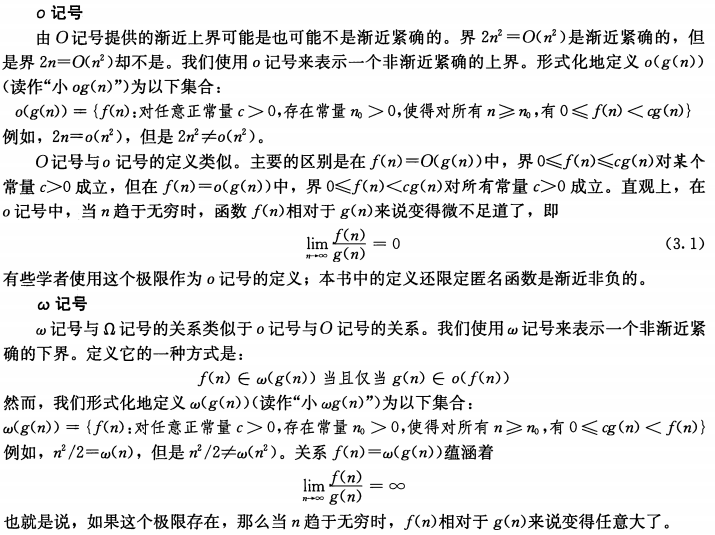


### 2.大O表示法
#### 2.1 定义
```c
f(x) = O(g(x)) 表示的含义是f(x)以g(x)为上界
```

#### 2.2 解释
```c
当函数的大小只有上界，没有明确下界的时候，则可以使用大O表示法，该渐进描述符一般用于描述算法的 最坏复杂度。

f(x) = O(g(x))正式的数学定义：存在正常数c、n、n0，当 n>n0 的时，任意的 f(n) 符合 0 <= f(n) <= c.g(n)。如下图所示
```

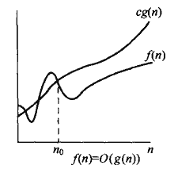

### 3.大Ω表示法
#### 3.1 定义
```c
f(x) = Ω(g(x)) 表示的含义是f(x)以g(x)为下界
```

### 4.时间复杂度计算方式定义
* 我们通常计算其中关键步骤的执行次数作为此算法的时间复杂度

#### 4.1 时间复杂度排序表
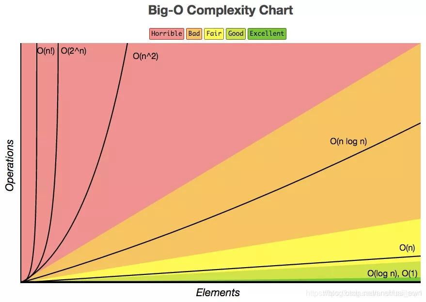

## 二.时间复杂度计算
### 1. 计算方式列举
* 简单场景列举循环次数，找到时间复杂度
* 复杂场景
  * 用代入法求解递归式
  * 使用递归树求解（解决代入法的难以猜测解的问题）
  * 使用主定理求解

### 2.简单场景时间复杂度计算
#### 2.1 一重循环时间复杂度计算
##### （1）例1
```c
int i = 1;
while (i < n) {
    i = i * 2;
}
```


##### （2）例2
```c
int i = 1;
while (i * i < n) {
    i++;
}
```
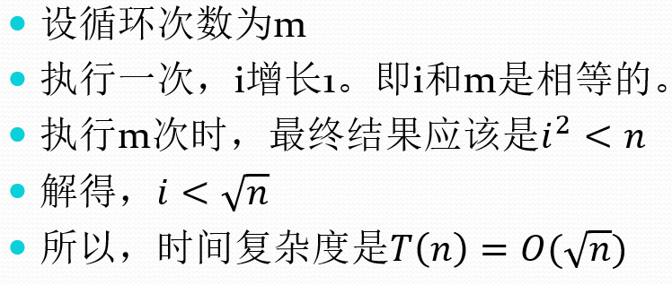


#### 2.2 二重循环时间复杂度计算
##### （1）例1
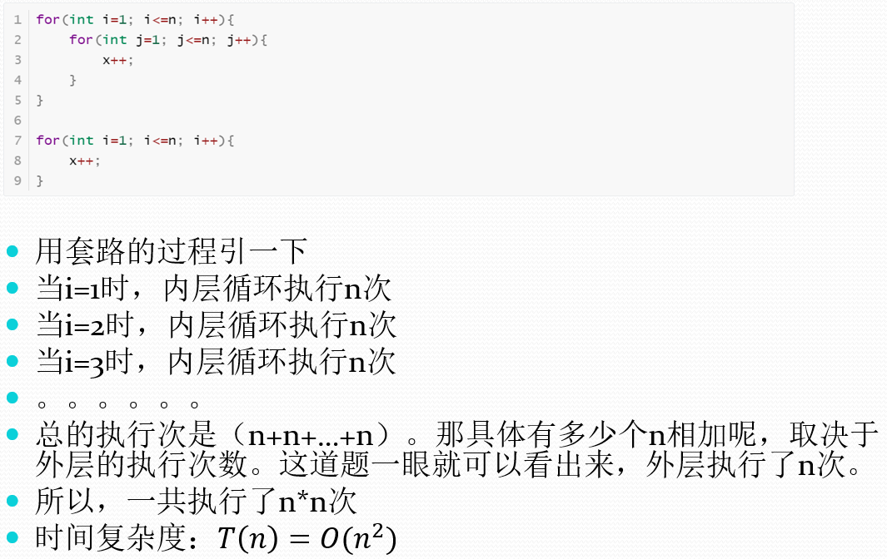

##### （2）例2
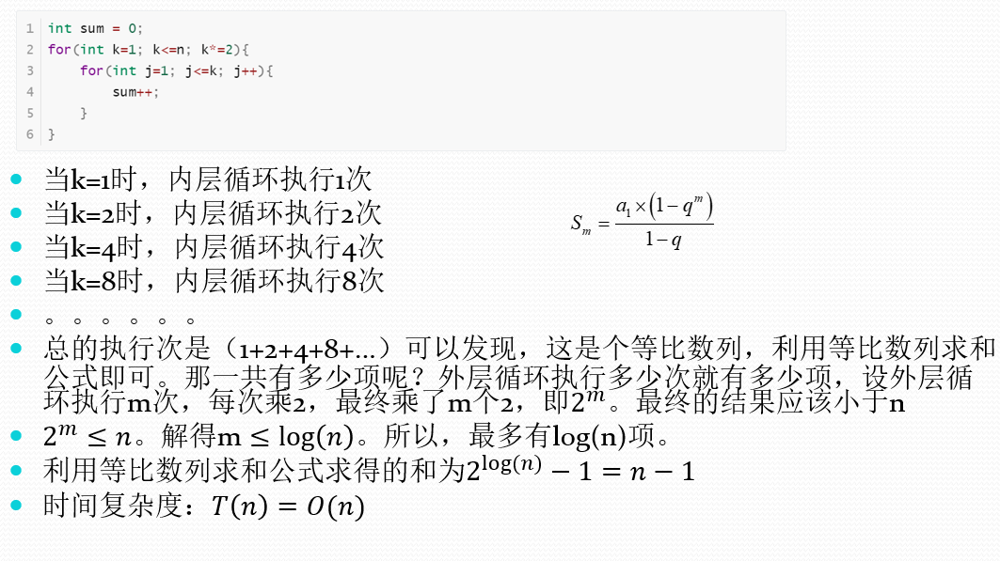

##### （3）例3
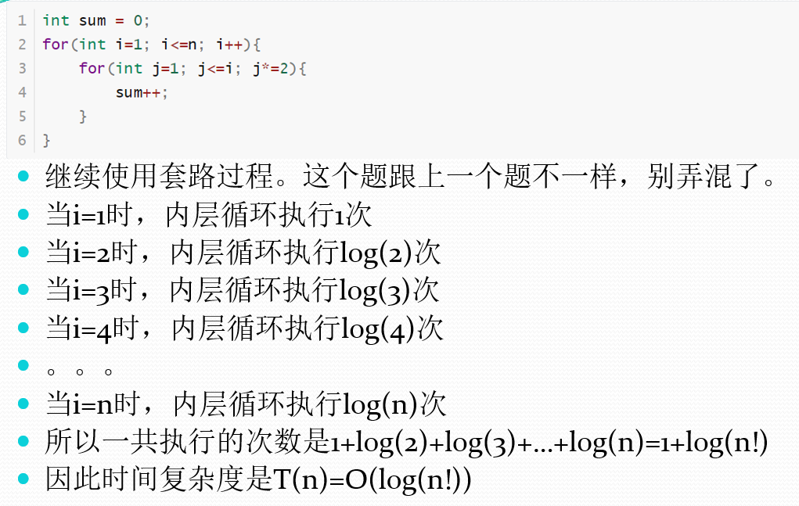

##### （4）例4
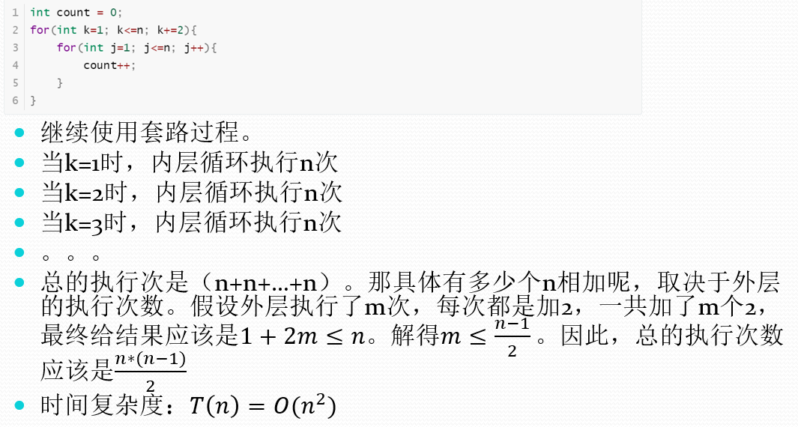

### 3.复杂场景时间复杂度计算
#### 3.1 代入法求解递推式
##### （1）操作步骤
```c
1.猜测解的形式。
2.用数学归纳法求出解中的常数，并证明解是正确的。
```

##### （2）例子
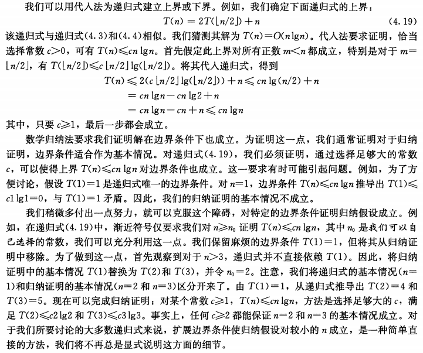

#### 3.3 递归树求解递推式
##### 3.3.1 方法概念介绍
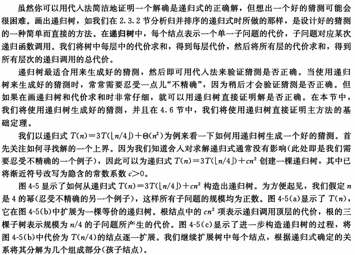

##### 3.3.2 操作方式介绍
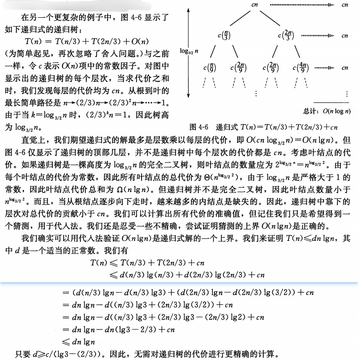

##### 3.3.3 例1
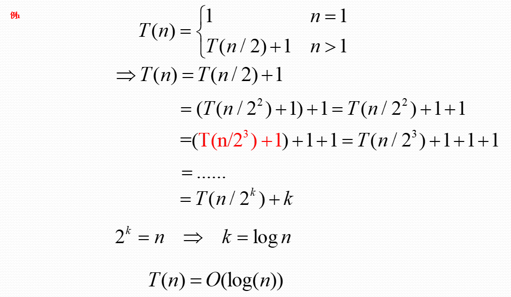

##### 3.3.4 例2
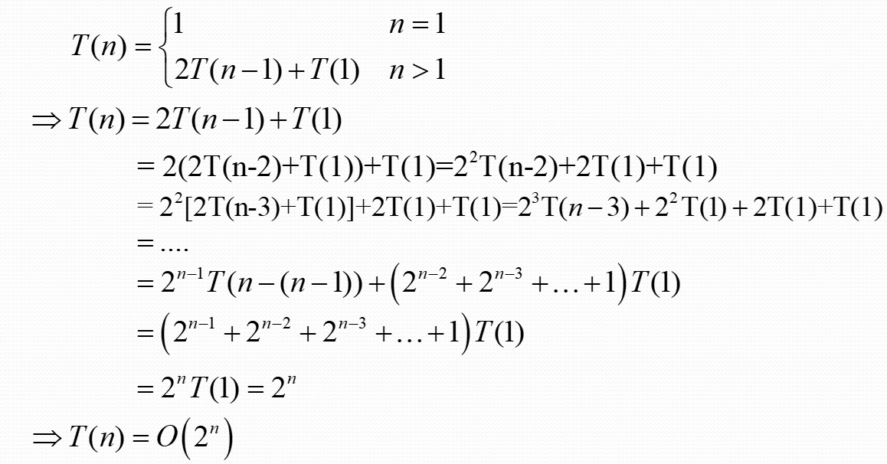

##### 3.3.5 例3
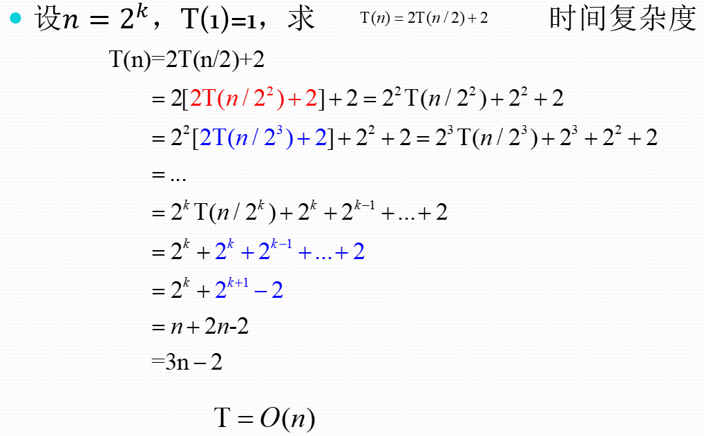

#### 3.4 主定理计算时间复杂度
##### 3.4.1 严格定义
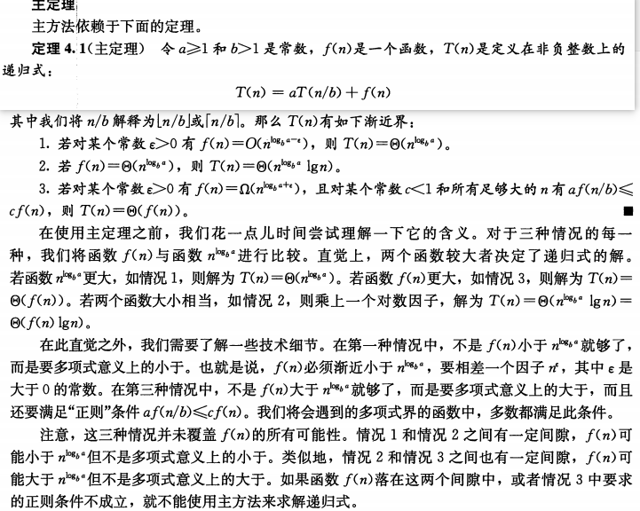

##### 3.4.2 通俗定义
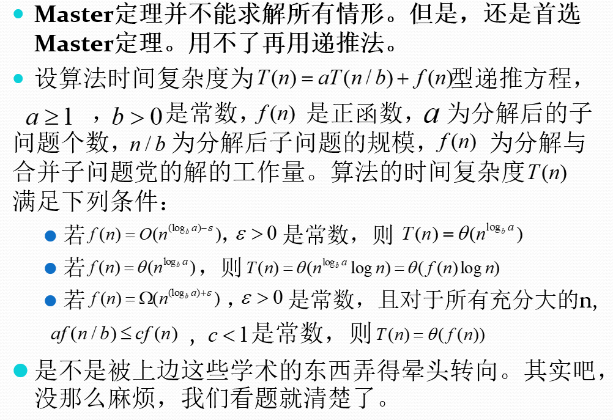

##### 3.4.3 例1
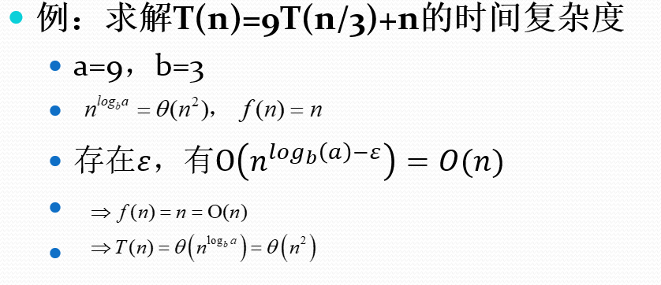

##### 3.4.4 例2
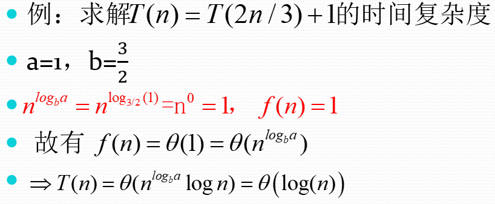

##### 3.4.5 例3
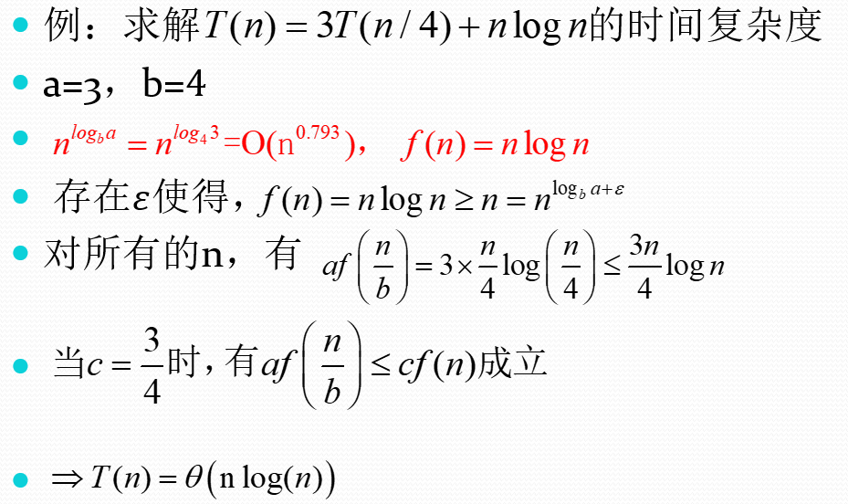

##### 3.4.6 例4
* 解不了，则使用通用做法：递归树+代入法

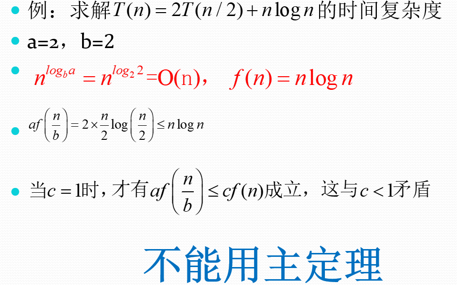