# Java

## 1.Optional使用
### 1.1 基本使用
#### （1）空Optional和判断存在和判断为空
* 空Optional：Optional.empty()
* 判断存在：isPresent()
* 判断为空：isEmpty()

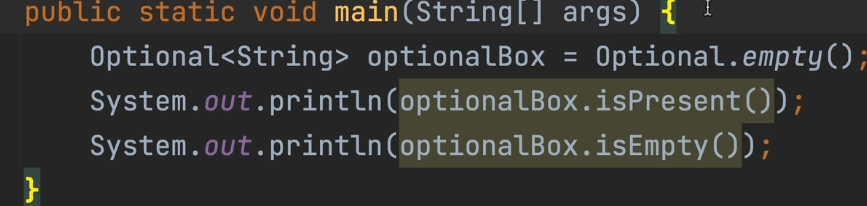

#### （2）创建和获取Optional对象
* 创建Optional对象（入参不可以为null，入参为null抛空指针异常）: Optional.of(xx)
* 创建Optional对象（入参可以为null）：Optional.ofNullable(xx)
* 获取Optional包含的数据：get()，如果拿不到值则跑出NoSuchElementException异常

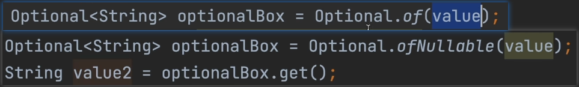

#### （3）获取Optional对象为空处理orElse和orElseGet
* 如果Optional内部值不为空则返回，为空则使用orElse入参值
* 如果Optional内部值不为空则返回，为空则使用orElseGet入参值
* 两者区别，orElse入参一定会创建增加开销，orElseGet入参是lambda表达式使用懒加载，如果原来就有值就不创建节省开销

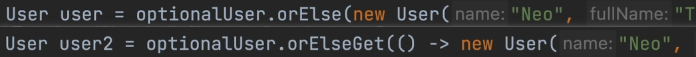

#### （4）获取Optional对象为空指定设置异常抛出
* 如果Optional内部值为空：
  * orElseThrow()：抛出NoSuchElementException异常
  * orElseThrow(xxx)：指定异常抛出
  
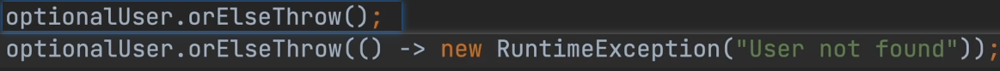

#### （5）指定Optional内部值不为空和值为空操作
* 如果Optional内部值不为空执行操作：ifPresent(xx)
* 同时指定Optional内部值不为空和值为空操作：ifPresent(xx1,xx2)
  * xx1为值不为空操作
  * xx2为值为空操作

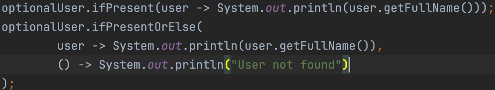

#### （6）过滤Optional内部值
* 过滤Optional内部值，如果满足条件返回含有值的Optional对象否则返回不含有值的Optional对象：filter(xx)，满足xx要求则保留

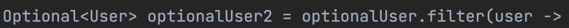

#### （7）Optioanl的流操作
* Optional转换为另一种Optional：map(xx)
* 嵌套Optional平坦化：flatMap(xx)
* 流操作：stream()

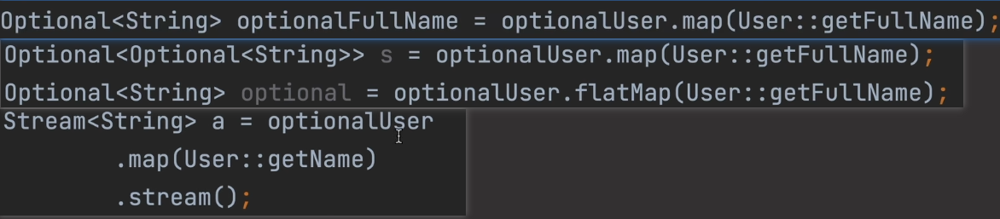

### 1.2 建议使用Optional的好处
#### （1）Optional可以与Lambda表达式和Stream API结合使用，不用大量的判空 

#### （2）Optional可以告诉使用者返回值可能不存在
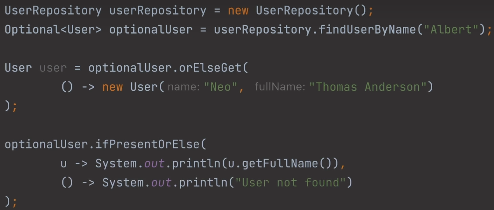

### 1.3 不建议使用Optional场景
#### （1）Optional不要做类的字段
* 会增加内存消耗
* 对象序列化复杂

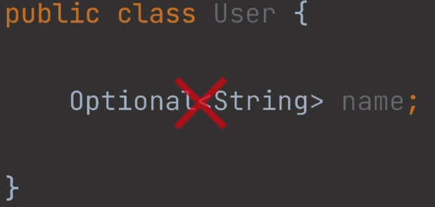

#### （2）Optional不要做方法入参
* 会使得方法的使用和理解变得复杂
  
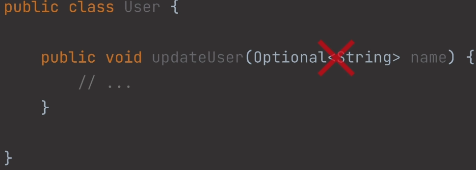

* 替代方案：使用重载方法代替Optional不要做方法入参

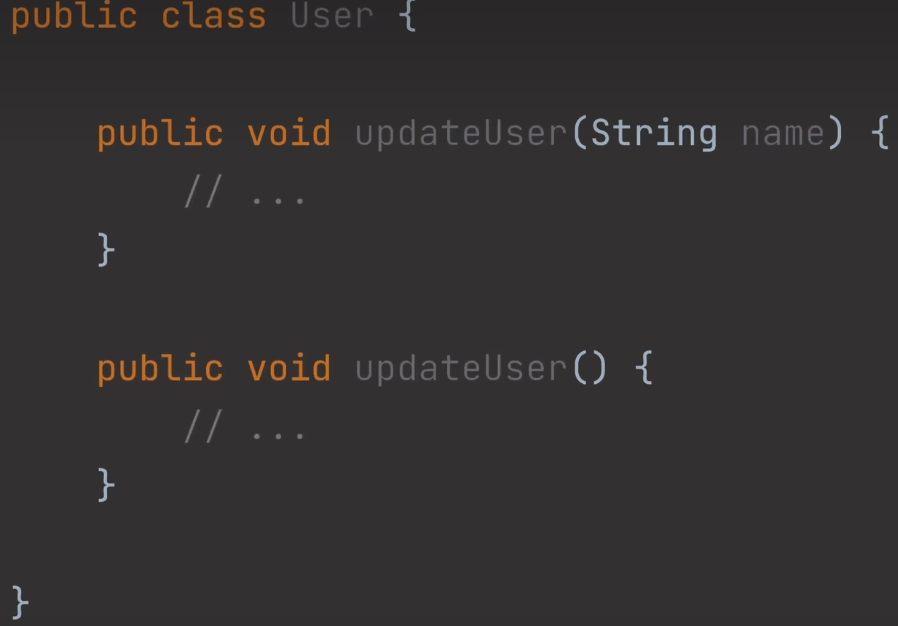

#### （3）Optional不要做构造器入参
* 会迫使调用者构建Optional实例
* 替代方案使用构造器重载

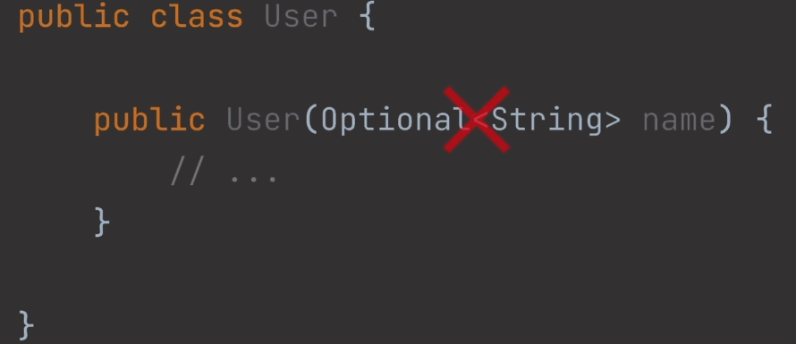

#### （4）Optional不要使用集合作为泛型模版
* 集合已经可以很好处理空

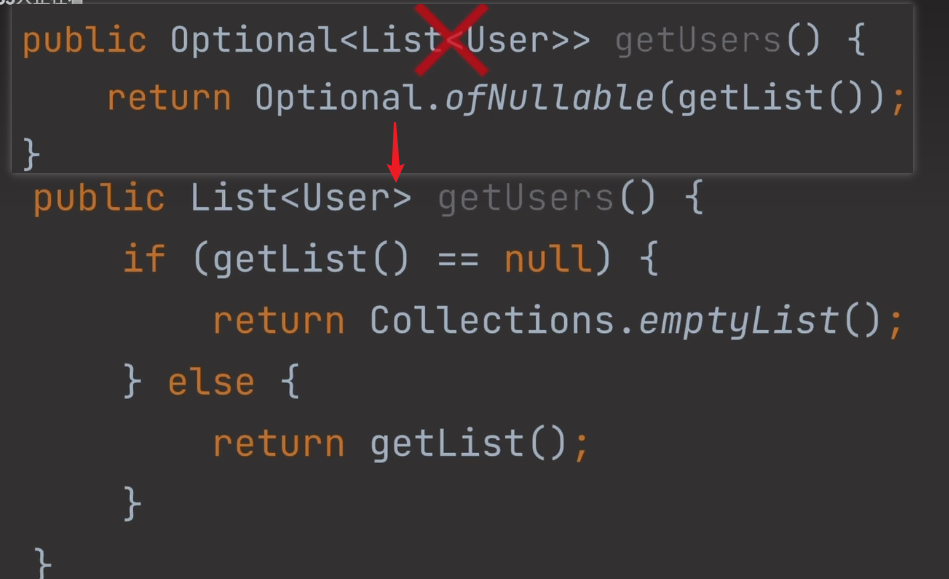

#### （5）Optional不要使用get或isPresent方法获取值或判空
* 直接调用get方法可能会产生NoSuchElementException
* 使用isPresent方法判空和判断是否为null相同都是显示的检查

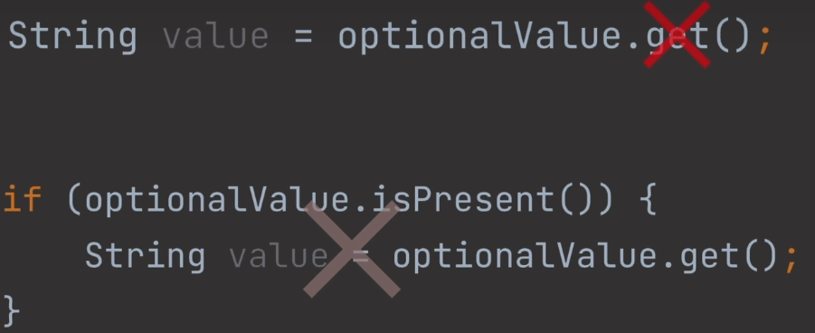

* 替代方案：使用ifPresent或orElse或orElseGet或orElseThrow

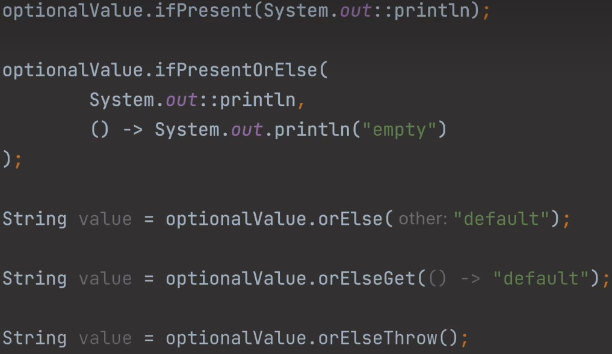