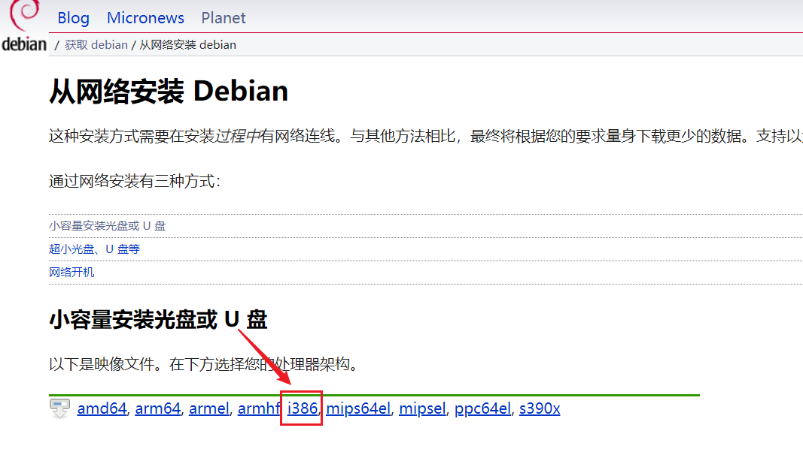
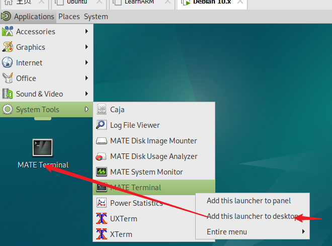
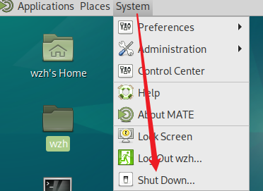
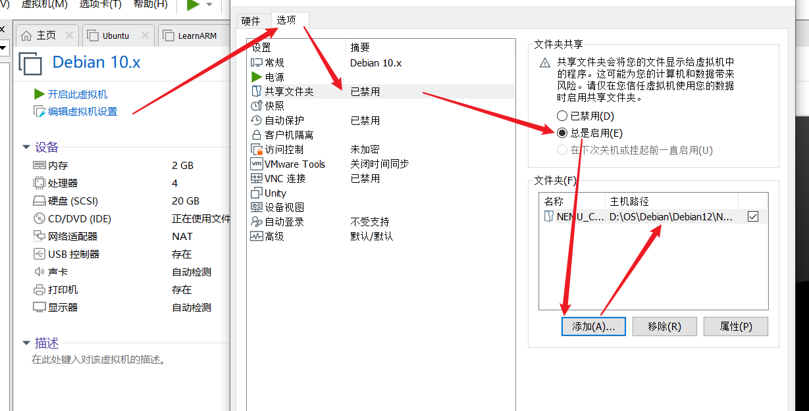
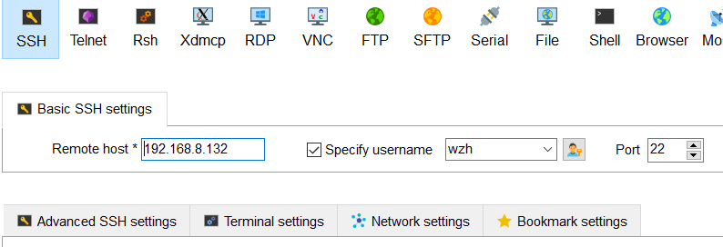
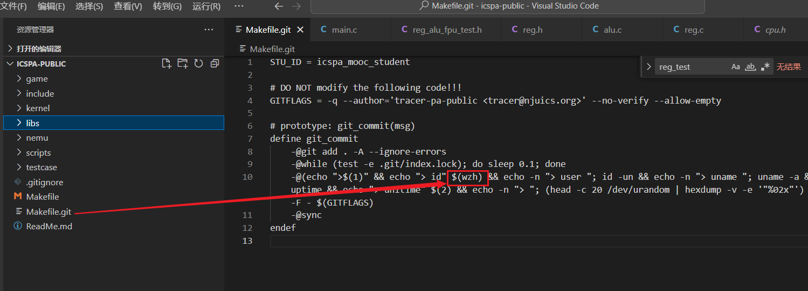
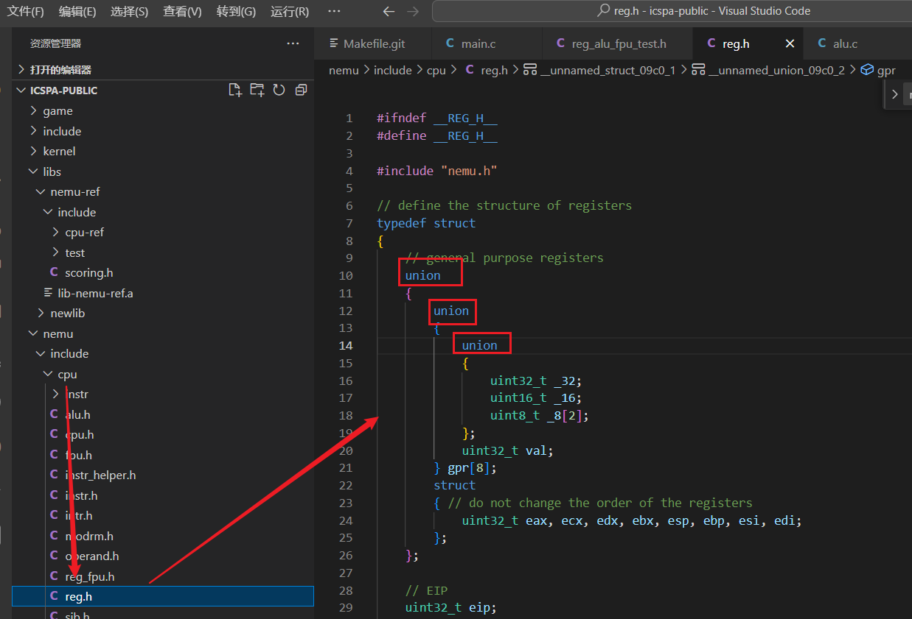
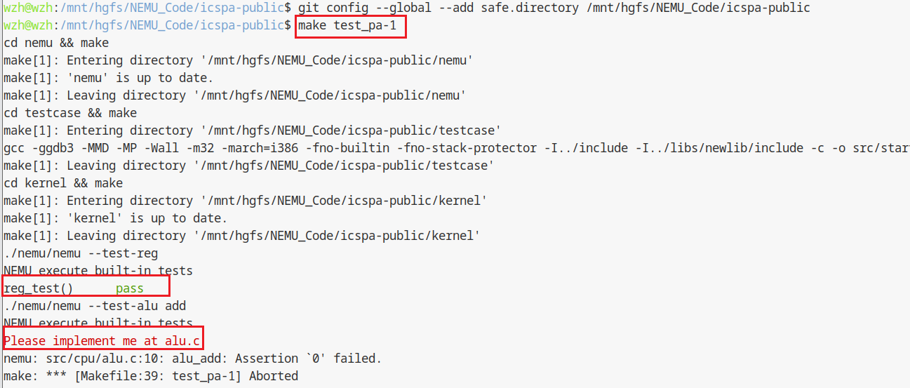

# NEMU实验

## 1.安装Debian系统

### 1.1 Debian系统安装
* 安装操作按照手册指导

Debian系统下载链接：https://www.debian.org/distrib/netinst



### 1.2 Debian系统操作
#### （1）打开中断窗口
在系统运行GUI的环境下，按下```Ctrl+Alt+T```组合键，打开一个终端窗口。


#### （2）添加命令行到桌面


#### （3）关机


#### （4）添加共享目录



#### （5）VMWare共享文件夹操作
https://blog.csdn.net/qq_45043734/article/details/127447361

#### （6）MobaXterm远程连接



### 1.3 完成实验pa-1
#### （1）本地打开代码完成pa-1




#### （2）虚拟机中运行测试pa-1
```shell
make clean
make 
make test_pa-1
```
